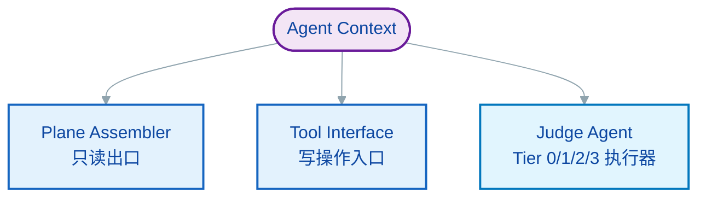
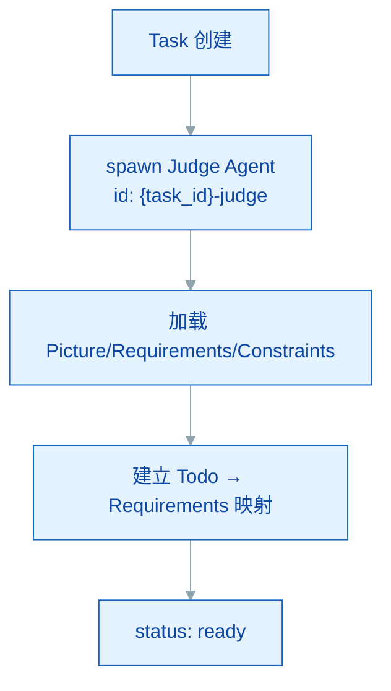
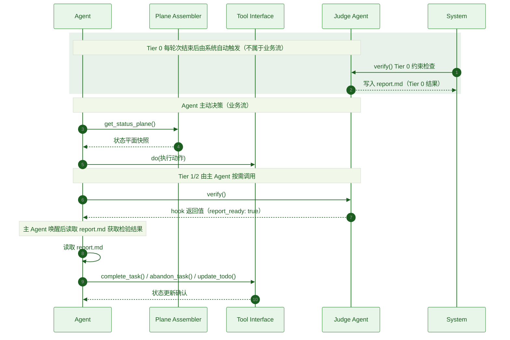

# mem0ress 架构设计

> **与规范的关系：** 本文档是 spec.md 的实现承接文档。规范定义接口语义（做什么），本文档描述实现方案（如何做）。规范不引用本文档，依赖方向单一。

## 1. 概述

mem0ress 是认知对齐平面，以**认知中间件**的形式注入到 Agent 的执行循环中。它专注于认知状态管理，不执行工具或做决策。

### 1.1 注入模式

mem0ress 必须参与 Event Loop 的关键节点，通过生命周期钩子实现自动化：

1. **Before Turn（投射）：** 在 Agent 思考前，将最新的状态平面注入上下文
2. **After Turn（快照）：** 在 Agent 响应后，自动对比数据平面变化并记录 Session 序列

### 1.2 非编排原则

mem0ress 不决定 Agent 下一步该调用哪个 API，也不负责复杂的 ReAct 推理逻辑。

---

## 2. 模块架构

mem0ress 内部划分为三个职责分明的模块，共同构成认知网关。

### 2.1 模块划分



### 2.2 Plane Assembler（平面组装器）

**职责：** 认知构建的执行单元。实时编译当前任务的状态平面。

**行为：**
- 每次 Agent 调用 `get_status_plane()` 时，直接扫描文件系统
- 聚合所有 Task 节点的 Manifest 和 Session，写入状态平面输出
- 只输出当前状态——不缓存、不诊断、不决策
- 只做文件系统扫描和文本聚合

### 2.3 Tool Interface（工具接口）

**职责：** 认知操作的写入入口。

**行为：**
- 暴露一组有限的任务操作工具（`create_task`、`complete_task`、`abandon_task`、`update_todo` 等）
- 只管理认知状态的写入，不执行业务逻辑
- **Upsert 语义：** `update_task` 在任务不存在时自动创建

### 2.4 Judge Agent（Tier 0/1/2/3 执行器）

**职责**：执行 Tier 0/1/2/3 检验，只读数据。检验完成后，将结果写入 `report.md`，通过 hook 返回值通知主 Agent。

**与 Task 的关系**：
- 每个 Task 伴生一个 Judge Agent
- 生命周期同步：Task 创建 → Judge Agent 创建；Task 完成/废弃 → Judge Agent 销毁
- Judge Agent 读取 Task 文件系统，不依赖主 Agent 的上下文

**文件存储**：

```text
.mem0ress/tasks/{task_id}/
├── index.md                    # Task Manifest
├── session.md                  # Task Session
├── data-plane/refs.md          # Data Plane
├── gotchas/{timestamp}.md      # Gotcha 记录
├── report.md                   # 本轮次检验报告（每轮覆写）
└── {task_id}-judge.md         # Judge Agent Manifest（平铺）
```

Judge Agent 不创建独立目录。Manifest 和 Session（验证历史追加到 Manifest 的 `verification_history` 字段）都平铺在 Task 目录下。

**初始化流程**：



**交互接口**：

| 接口 | 说明 |
|------|------|
| `verify()` | 执行 Tier 0 → 1 → 2 → 3 完整检验链路，写入 `report.md` |
| 返回 | 写入 `report.md`，通过 hook 返回值通知主 Agent |

**状态变化**：

```
created → ready → verifying → completed → destroyed
```

| 状态 | 含义 |
|------|------|
| `created` | 刚创建，三要素未加载 |
| `ready` | 三要素已加载，等待检验 |
| `verifying` | 执行检验中 |
| `error` | 检验执行异常 |
| `destroyed` | Task 结束，Judge Agent 销毁 |

**Tier 执行内容**：

| Tier | 检查内容 | 输入来源 |
|------|---------|---------|
| Tier 0 | Constraints 违反检查 | Constraints（Manifest）、当前代码状态（文件系统） |
| Tier 1 | Todo 完成 + 子任务关闭 | todos（Manifest）、Session 当前快照、子任务 Manifest |
| Tier 2 | Requirements 满足检查 | Requirements（Manifest）、实际产出（文件系统） |
| Tier 3 | 语义对齐判断 | Picture（Manifest）、实际产出（文件系统） |

Judge Agent 在每次检验时实时读取上述信息，不在内存中维护中间状态。`verification_history` 字段记录检验历史摘要，供追溯使用。

### 2.5 模块边界

| 模块 | 类型 | 职责 |
|------|------|------|
| Plane Assembler | 只读出口 | 状态平面编译与展示 |
| Tool Interface | 写操作入口 | 认知状态写入 |
| Judge Agent | 验证执行器 | Tier 0/1/2/3 检验执行 |

三者共同构成认知网关，无跨越自身职责范围的操作。

---

## 3. 核心机制设计

### 3.1 引用展开机制

解析清单时，ref: 指针不默认加载。Agent 需主动调用工具将其展开并挂载到 Data Plane 中。

**设计意图：** 按需加载，避免不必要的上下文膨胀。

### 3.2 原生 Git 数据回溯

检验失败且路径报废时，Agent 调用工具回退数据平面，同时在状态平面生成 Gotcha 记录偏差经验，保持时间向前。

**设计意图：** 利用 Git 的原生版本控制能力实现无痕回退，Gotcha 记录经验而非状态。

### 3.3 带外约束检验

Tier 3 的语义对齐与执行态 Agent 上下文隔离，避免检验过程污染任务执行。

**设计意图：** Tier 3 执行语义对齐判断时，读取 Picture 与实际产出，结论返回给 Agent——此过程不污染 Agent 的执行上下文。

---

## 4. 技术流程

### 4.1 Agent 驱动的业务闭环

mem0ress 的核心业务流由 Agent 的三个主动决策构成：

1. **认知构建：** Agent 调用 `get_status_plane()`，了解当前状态（任务树、TODO 进度、任务状态、Gotchas、Session 指针）。Picture/Requirements/Constraints 从 Manifest 按需读取，不在状态平面中展开。
2. **任务检验：** Agent 调用 `verify()`，驱动 Judge Agent 执行 Tier 0/1/2/3 检验，生成一次性报告。Tier 0 在每轮次结束后由系统自动触发，独立于 `verify()`
3. **状态更新：** Agent 根据检验结果决策后续行动——更新 Todo、调用 `complete_task()` 标记完成、`abandon_task()` 标记废弃、或继续执行。状态更新通过 Tool Interface 执行写操作，支持 `complete_task`、`abandon_task`、`update_todo` 等。Gotcha 作为带外偏差记录，不影响状态，不阻断执行。

**系统自动机制（不属于业务流）：**

每轮次结束时，系统自动触发 Session 快照，记录本轮状态变化，供后续追溯使用。Agent 无需显式调用 `snapshot_session()`。



---

## 5. 接口语义对照

规范（spec.md）中的接口定义与本文档模块的对应关系：

| 规范接口 | arch 模块 | 说明 |
|----------|-----------|------|
| `get_status_plane` | Plane Assembler | 状态平面只读查询 |
| `create_task` / `update_task` / `complete_task` / `abandon_task` | Tool Interface | 认知状态写操作 |
| `add_todo` / `update_todo` / `remove_todo` | Tool Interface | Todo 写操作 |
| `add_gotcha` | Tool Interface | 偏差记录写操作 |
|| `verify()` | Judge Agent | 执行 Tier 0/1/2/3 完整链路检验，写入 report.md |
| Tier 0 自动检查 | Judge Agent | after-turn 系统自动触发 |
| Tier 1/2/3 检查 | Judge Agent | Agent 按需调用 |
| `snapshot_session` | — | after-turn 宿主调用触发，mem0ress 内部自动追加 |

---

## 6. 文档结构与触发机制

### 6.1 文档结构

mem0ress 使用文件树表达认知的从属关系与上下文边界，对应 spec.md 6.1 文档结构。

**文件树：**

```plaintext
.mem0ress/
└── tasks/
    └── {task_id}/
        ├── index.md              # Manifest（Picture/Requirements/Constraints/Todo）
        ├── session.md            # 轮次快照序列
        ├── data-plane/
        │   └── refs.md         # 仓库 → commit ID 映射
        ├── gotchas/
        │   └── {timestamp}.md   # 偏差记录
        └── {task_id}-judge.md  # Judge Agent Manifest（平铺）
```

**模块职责映射：**

| 物理组件 | 维护模块 |
|----------|----------|
| `index.md` | Tool Interface |
| `session.md` | mem0ress 暴露接口，被调用时自动写入 |
| `data-plane/refs.md` | Tool Interface（`link_data_plane`） |
| `gotchas/` | Tool Interface（`add_gotcha`） |
| `{task_id}-judge.md` | Judge Agent（验证历史追加） |

### 6.2 Session 快照

**触发链路：** mem0ress 在每轮次结束时暴露 Session 快照接口，被调用时自动追加记录到 session.md。写入内容由 spec.md B.1 Session 模板定义。

### 6.3 Gotcha 偏差记录

**触发链路：** Agent 确认偏差后，通过 Tool Interface 的 `add_gotcha()` 写入 `gotchas/{timestamp}.md`。写入内容由 spec.md B.2 Gotcha 模板定义。

### 6.4 Data Plane 引用

**触发链路：** 仓库 commit ID 变更时，Agent 通过 Tool Interface 的 `link_data_plane()` 更新 `data-plane/refs.md`。字段结构由 spec.md B.3 Data Plane 模板定义。

---

## 8. 依赖关系


**依赖方向：**

- spec.md：定义接口语义（四层验证、状态机、约束语义），附录B仅定义文档数据模型的字段结构和写入约束，不含实现机制
- arch.md：承接 spec.md 移除的实现语义（模块划分、触发链路、文档数据模型维护机制），并引用 spec.md 中的接口定义
- spec.md **不引用** arch.md，保持独立
- 两文档分离后各自独立演进
