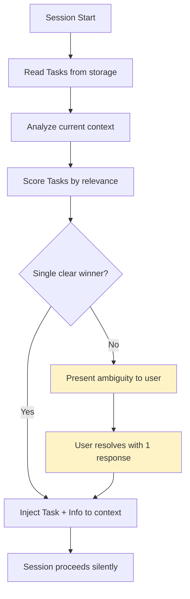
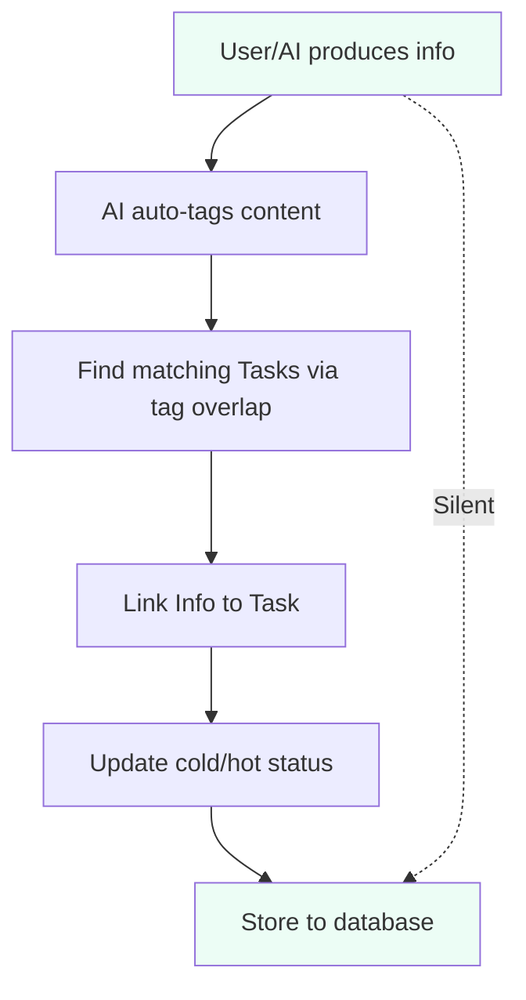
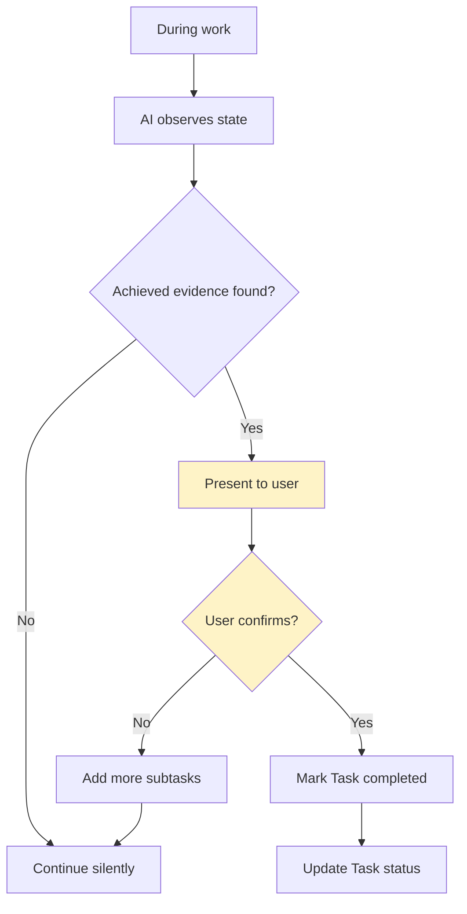

# Interaction Design Analysis: Silent Operation vs. Active Dialogue

**Date:** 2026-04-22
**Status:** For Discussion
**Purpose:** Analyze Claude-Mem's interaction model and design mem0ress interaction approach

---

## 1. The Core Tension

| Approach | Description | User Burden | Example |
|----------|-------------|-------------|---------|
| **Fully Silent** | System runs in background, no prompts | Zero | MemPalace batch mode |
| **Hook-Driven** | Automatic capture, silent unless anomaly | Minimal | Claude-Mem |
| **Dialogue-Heavy** | AI asks questions, confirms with user | High | Original mem0ress concept |

**User's insight:** "Memory系统的一个关键特征是静默运行，我的设计可能过多交互了"

**Goal:** 99% silent, 1% minimal interaction when uncertain.

---

## 2. Claude-Mem: Hook-Driven Silent Operation

### 2.1 The 6 Lifecycle Hooks

Claude-Mem uses 6 hooks that fire at specific moments:

```
┌─────────────────────────────────────────────────────────────┐
│                    Claude Code Session                        │
│                                                              │
│  SessionStart                                                │
│    └─► smart-install (dependency check)                     │
│    └─► worker-service start (background daemon)             │
│    └─► context injection (prior memories)                   │
│                                                              │
│  UserPromptSubmit                                            │
│    └─► session-init (initialize SDK agent)                 │
│                                                              │
│  PostToolUse                                                 │
│    └─► observation (capture tool usage)                     │
│                                                              │
│  Stop                                                        │
│    └─► summarize (queue summary generation)                 │
│                                                              │
│  SessionEnd                                                  │
│    └─► session-complete (cleanup)                           │
│                                                              │
└─────────────────────────────────────────────────────────────┘
```

### 2.2 What Happens Silently vs. With Interaction

| Hook | Silent/Background | Interaction | Notes |
|------|-------------------|-------------|-------|
| SessionStart | Worker daemon starts | Context injected | User sees memories but no prompt |
| UserPromptSubmit | Session initialized | None | SDK agent starts silently |
| PostToolUse | Observation queued | None | Tool usage captured automatically |
| Stop | Summary queued | None | 120s timeout for generation |
| SessionEnd | Cleanup | None | 1.5s cap, failsafe |

### 2.3 Claude-Mem Interaction Points

**The ONLY times Claude-Mem interacts visibly:**

1. **Memory appears in context** — At session start, prior memories are silently injected into context. User sees them but wasn't asked.

2. **mcp__search tool** — User/AI can search memories. This is a tool call, not a dialogue prompt.

3. **Web viewer UI (port 37777)** — User can open browser to view memory stream. Opt-in, not required.

4. **User asks about past work** — "What did we decide about X?" → AI calls search tools silently.

### 2.4 Claude-Mem's "Interaction" is Tool-Mediated

```
User asks: "Why did we choose Postgres?"
    │
    ▼
AI calls search tool (silent to user)
    │
    ▼
Tool returns relevant observations
    │
    ▼
AI presents answer

The user didn't have to:
- "Save this conversation"
- "Remember to add this to memory"
- "Confirm the tags are correct"
```

---

## 3. Contrast: Dialogue-Heavy vs. Silent

### 3.1 Original mem0ress Concept (Dialogue-Heavy)

```
Session Start
    │
    ▼
AI: "你好，我看到你说要做X项目..."
AI: "能告诉我你现在想达成什么吗？"
AI: "这个目标完成时会是什么样子？"
    │
    ▼
User: "我想做登录模块"
AI: [creates Task]
AI: "Picture是?"
User: "登录<1秒"
AI: [sets Picture]
    │
    ▼
... 10 more questions ...
```

**Problem:** Every session starts with an interrogation. User has to "maintain" the system.

### 3.2 Target: Silent + Minimal Uncertainty Triggers

```
Session Start
    │
    ▼
[Automatic]
- Read current tasks from storage
- Infer from context which task is active
- Inject relevant memories
    │
    ▼
User sees: "Working on 登录模块. Picture: 登录<1秒. Status: 60%."
(No questions asked unless uncertain)
    │
    ▼
IF AI uncertain about:
  - Which task is current?
  - Whether picture is achieved?
  - Whether context switched?
THEN:
  - Light prompt: "I think we're on X. Correct?"
  - One question, not ten.
```

---

## 4. Proposed Interaction Model for mem0ress

### 4.1 Silent Operations (Default)

```
┌─────────────────────────────────────────────────────────────┐
│                    Silent by Default                         │
│                                                              │
│  ✓ Task auto-created from context                           │
│  ✓ Picture auto-inferred from conversation                  │
│  ✓ Status auto-updated from tool usage                      │
│  ✓ Info auto-tagged from content                            │
│  ✓ Info auto-linked to Task via tags                        │
│  ✓ Plane auto-discovered at session start                   │
│  ✓ Context auto-injected at session start                  │
│                                                              │
│  User experiences: "It just knows"                          │
└─────────────────────────────────────────────────────────────┘
```

### 4.2 Uncertainty Triggers (Only Then Interact)

```
┌─────────────────────────────────────────────────────────────┐
│                 Uncertainty Triggers                         │
│                                                              │
│  TRIGGER 1: Which Task is current?                          │
│  ├─ Context suggests multiple possible tasks                │
│  └─ Light prompt: "Working on X? (Y is also active)"       │
│                                                              │
│  TRIGGER 2: Task not found, might need new                  │
│  ├─ New project mentioned, no existing Task                 │
│  └─ Light prompt: "Start new Task for X?"                    │
│                                                              │
│  TRIGGER 3: Picture might be achieved                        │
│  ├─ AI observes evidence of completion                      │
│  └─ Light prompt: "X seems done. Mark complete?"            │
│                                                              │
│  TRIGGER 4: Conflict detected                                │
│  ├─ New info contradicts existing                           │
│  └─ Light prompt: "X was decided as Y, but now..."         │
│                                                              │
└─────────────────────────────────────────────────────────────┘
```

### 4.3 Interaction Modalities

| Situation | Interaction Type | Example |
|----------|-----------------|---------|
| Uncertainty about task | Inline confirm | "On 登录模块? [Y/n]" |
| New task detected | Quick confirm | "New task: OAuth? [Y]" |
| Picture achieved | Suggestion | "登录模块 looks complete. Close it?" |
| Conflict detected | Alert | "X was Y, but Z suggests otherwise" |
| None of the above | Zero interaction | Silent operation |

---

## 5. Implementation Comparison

### 5.1 Claude-Mem: Hooks at Action Boundary

```
Claude-Mem approach:
  Hook fires at TOOL USE or SESSION END
    │
    └─► Capture what happened
    └─► Queue for processing
    └─► Return to user immediately

  Processing happens async (background)
    └─► LLM extracts observation
    └─► Store to database

  User NEVER waits for memory processing
```

### 5.2 mem0ress: Context Inference (Silent)

```
mem0ress approach:
  Session starts
    │
    └─► Read all Tasks from storage
    └─► Analyze current context
    └─► Score each Task for relevance
    └─► Pick highest-scoring Task
    └─► Inject relevant Info

  This all happens in <100ms
    │
    └─► User sees context, not prompts
```

### 5.3 The Key Difference

| Aspect | Claude-Mem | mem0ress (Silent) |
|--------|-----------|-------------------|
| **Capture trigger** | Tool use boundary | Context inference |
| **What captured** | Tool results, conversations | Task state, relevance |
| **Processing** | Async LLM extraction | Async LLM inference |
| **User wait** | Never | Never |
| **User interaction** | None (tool-mediated) | Only on uncertainty |

---

## 6. Mermaid Flow Diagrams

### 6.1 Silent Operation Flow



### 6.2 Info Capture Flow



### 6.3 Picture Achievement Detection



---

## 7. Open Question: Hybrid Hook + Inference?

Claude-Mem's hooks capture at action boundaries. mem0ress could use context inference. Perhaps the best of both:

```
┌─────────────────────────────────────────────────────────────┐
│                 Hybrid Approach                               │
│                                                              │
│  HOOKS (like Claude-Mem):                                   │
│  ├─ Tool use → extract key decisions/discoveries            │
│  ├─ Session end → update Task status implicitly             │
│  └─ File change → mark related Info as potentially hot      │
│                                                              │
│  INFERENCE (mem0ress unique):                                │
│  ├─ Session start → infer current Task                      │
│  ├─ Context shift → detect and update                       │
│  └─ Picture achievement → infer and suggest                 │
│                                                              │
│  RESULT: Hooks handle accurate capture                        │
│          Inference handles smart context injection            │
│          User rarely sees a prompt                           │
│                                                              │
└─────────────────────────────────────────────────────────────┘
```

---

## 8. Recommendations

1. **Default to silent** — If AI can infer with >80% confidence, don't ask
2. **One-question max** — When uncertain, ask ONE question, not ten
3. **Tool-mediated, not dialogue-mediated** — Memory should feel like a tool, not a conversation partner
4. **Opt-in confirmation** — User can always ask "Am I on the right task?" but system doesn't强迫
5. **Ambient awareness** — System observes silently, only speaks when concerned

---

## 9. Summary

| System | Silent? | Interaction Mode | User Burden |
|--------|---------|-----------------|-------------|
| MemPalace | Yes | Manual commands | High (active) |
| Claude-Mem | Yes | Hooks + tool calls | Zero |
| Original mem0ress | No | Dialogue | High |
| **Target mem0ress** | **Yes** | **Uncertainty triggers** | **Minimal** |

**The goal:** Memory system feels like a background service that "just knows." User interaction should be:
- Rare (< 1% of sessions)
- Light (one question)
- Optional (user can always override)
