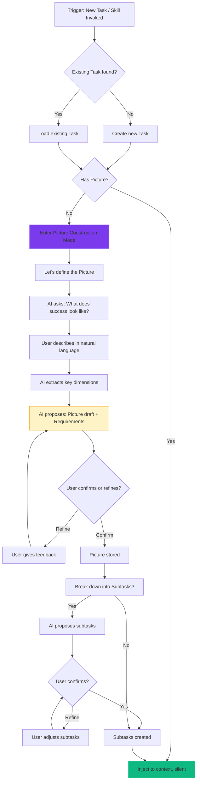
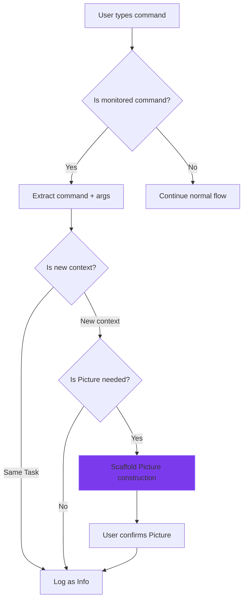

# Picture Interaction Design

**Date:** 2026-04-22
**Status:** For Discussion
**Purpose:** Deep design for Picture construction and heavy interaction flows

---

## 1. Overview: Picture as the Heaviest Interaction

Picture is the **completion standard** — if it's wrong, the entire goal-tracking system fails.

| Interaction Type | Weight | Example | Trigger |
|-----------------|--------|---------|---------|
| **Heavy** | ~10-30 min initial, ~5 min updates | Picture construction | New task, ambiguous context, skill invocation |
| **Medium** | ~1 min | Task confirmation, completion check | Uncertainty triggers |
| **Light** | <10 sec | Tag confirm, status update | Auto-inferred with high confidence |
| **Zero** | 0 | Silent capture | 99% of operations |

**Design goal for Picture:**
- First-time construction: Heavy but structured (scaffolded dialogue)
- Updates: Medium weight (incremental refinement)
- Achievement check: Medium (evidence-based suggestion)
- Event triggers: Can leverage existing skills/commands as signals

---

## 2. Picture Construction Flow

### 2.1 Trigger Conditions for Picture Construction

```
┌─────────────────────────────────────────────────────────────┐
│                 Picture Construction Triggers               │
│                                                              │
│  T1: New Task Detected                                     │
│  ├─ New project mentioned, no existing Task                  │
│  ├─ Skill/command invocation (e.g., /ce:brainstorm)        │
│  └─ Explicit user intent ("I want to...")                   │
│                                                              │
│  T2: Existing Task has no Picture                          │
│  ├─ Task created but picture is empty                       │
│  └─ First time accessing this Task                          │
│                                                              │
│  T3: Picture Obsolete                                       │
│  ├─ New context suggests current Picture is wrong            │
│  └─ User explicitly says "I meant something else"          │
│                                                              │
│  T4: Picture Achievement Stalled                           │
│  ├─ No progress for N days                                  │
│  └─ Subtasks complete but Picture not matched               │
│                                                              │
└─────────────────────────────────────────────────────────────┘
```

### 2.2 Picture Construction Dialogue Flow



### 2.3 Picture Scaffold Questions

When constructing Picture, AI uses **scaffolded questions** to extract completeness:

```
┌─────────────────────────────────────────────────────────────┐
│                 Picture Scaffold Questions                  │
│                                                              │
│  PHASE 1: Outcome (必答)                                    │
│  Q1: "What does success look like when this is done?"     │
│  Q2: "How will you know it's achieved?"                   │
│                                                              │
│  PHASE 2: Boundaries (建议)                                 │
│  Q3: "What's explicitly OUT of scope?"                    │
│  Q4: "What would make this 'overkill'?"                   │
│                                                              │
│  PHASE 3: Metrics (可选)                                    │
│  Q5: "How would you measure success?"                      │
│  Q6: "What are acceptable thresholds?"                      │
│                                                              │
│  PHASE 4: Risks (高级)                                      │
│  Q7: "What could go wrong?"                                │
│  Q8: "What would make you abandon this?"                    │
│                                                              │
└─────────────────────────────────────────────────────────────┘
```

**Note:** Phase 1 is mandatory. Phases 2-4 are progressive disclosure based on complexity.

---

## 3. Event/Skill Invocation as Triggers

### 3.1 The Pattern: Observed Commands as Signals

Many AI tools already have **skill/command invocation patterns**:

```
/ce:brainstorm     → "User wants to explore/plan"
/ce:plan           → "User wants to build something"
/code-review       → "User wants feedback on code"
/debug            → "User is solving a problem"
```

**mem0ress can observe these as Picture construction triggers:**

```mermaid
graph LR
    A[User invokes /skill] --> B[Hook intercepts command]
    B --> C[Extract skill metadata]
    C --> D{Is new Picture needed?}
    D -->|Yes| E[Enter Picture Construction]
    D -->|No| F[Link to existing Task]
    E --> G[AI: "This looks like X. Want to create a Picture?"]
    G --> H[User confirms or creates new]
```

### 3.2 Skill Metadata Extraction

```
┌─────────────────────────────────────────────────────────────┐
│                 Skill Invocation Signal                     │
│                                                              │
│  Observed: /ce:brainstorm "design memory system"          │
│                                                              │
│  Extracted:                                                 │
│  ├─ skill: brainstorm                                       │
│  ├─ intent: explore, plan                                   │
│  ├─ topic: memory system                                     │
│  └─ implied_task: memory system design                       │
│                                                              │
│  Action:                                                    │
│  ├─ Create Task: "Design memory system"                      │
│  ├─ Trigger Picture scaffold                                 │
│  └─ Link skill invocation as Info                           │
│                                                              │
└─────────────────────────────────────────────────────────────┘
```

### 3.3 Built-in Skill Signals (Reference Patterns)

| Skill Pattern | Intent | Suggested Picture Trigger |
|--------------|--------|--------------------------|
| `/ce:brainstorm` | Explore/ideate | "Understand X" type Picture |
| `/ce:plan` | Build/create | "Deliver X working" type Picture |
| `/debug` | Fix/resolve | "Fix X, Y works" type Picture |
| `/code-review` | Evaluate/feedback | Implicit, no new Picture |
| `/research` | Investigate/learn | "Understand X deeply" Picture |
| `/test` | Verify/validate | "X works as expected" Picture |

**Note:** These are signals, not templates. AI still constructs Picture through dialogue.

---

## 4. Picture Achievement Detection

### 4.1 Achievement vs. Completion

```
┌─────────────────────────────────────────────────────────────┐
│                 Achievement vs. Completion                    │
│                                                              │
│  COMPLETION: All subtasks are done                          │
│  ├─ Mechanical: every subtask.status = completed             │
│  └─ NOT sufficient: Picture might not be achieved          │
│                                                              │
│  ACHIEVEMENT: Picture criteria are met                      │
│  ├─ Evidence-based: current state matches Picture          │
│  └─ REQUIRED: for Task to be truly complete                │
│                                                              │
│  Example:                                                    │
│  ├─ All subtasks done ✓                                     │
│  ├─ Tests pass ✓                                            │
│  └─ But user still complains "it's slow"                    │
│     → Picture NOT achieved, keep Task active                │
│                                                              │
└─────────────────────────────────────────────────────────────┘
```

### 4.2 Achievement Detection Flow

```mermaid
graph TD
    A[During work] --> B[AI observes evidence]
    B --> C{Types of evidence?}

    C -->|Positive| D[Subtask completed, test passed, user said "works"]
    C -->|Negative| E[User complained, error occurred, regression]
    C -->|Neutral| F[Time passed, no progress]

    D --> G{Achievement signals > threshold?}
    E --> H{Are issues resolvable?}
    F --> I{Stalled > N days?}

    G -->|Yes| J[AI: "Picture seems achieved"]
    G -->|No| K[Continue monitoring]
    H -->|Yes| L[Add subtask to resolve]
    H -->|No| M[Flag for user]
    I -->|Yes| M
    I -->|No| K

    J --> N[Present to user: "Mark complete?"]
    N --> O{User confirms?}
    O -->|Yes| P[Task.completed = true]
    O -->|No| Q[User provides feedback]
    Q --> R[AI: "What's missing?"]
    R --> S[Add/remove subtasks]
    S --> A

    style J fill:#fef3c7,stroke:#f59e0b
    style N fill:#fef3c7,stroke:#f59e0b
    style P fill:#10b981,stroke:#34d399
```

### 4.3 Evidence Types

| Evidence Type | Weight | Source |
|--------------|--------|--------|
| User says "it works" | +3 | Natural language |
| Tests pass | +2 | CI/hook |
| Feature functional | +2 | Tool use |
| User says "perfect" | +3 | Natural language |
| User complained | -2 | Natural language |
| Error occurred | -3 | Tool use |
| No progress (7d) | -1 | Time |

---

## 5. Data Storage for Picture

### 5.1 Picture Entity

```typescript
interface Picture {
  id: UUID;

  // Core content
  statement: string;           // "X delivered, working in production"
  requirements: string[];       // Measurable criteria
  scope_exclusions: string[];   // What's explicitly NOT included

  // Evidence tracking
  achievement_evidence: Evidence[];
  achievement_score: number;     // Calculated: sum of evidence weights

  // Metadata
  created_at: timestamp;
  updated_at: timestamp;
  confirmed_at: timestamp | null;  // When user confirmed
  version: number;             // For tracking changes

  // Relationships
  task_id: UUID;             // Parent task
  created_by: 'user' | 'ai' | 'collaborative';
}

interface Evidence {
  id: UUID;
  content: string;             // "User said 'login works now'"
  type: 'user_statement' | 'tool_result' | 'test_result' | 'observation';
  weight: number;              // +3, +2, -2, -3 etc.
  source: string;             // "Session 2024-04-22"
  timestamp: timestamp;
  reviewed: boolean;           // User has seen this?
}
```

### 5.2 Picture Version History

```
┌─────────────────────────────────────────────────────────────┐
│                 Picture Version History                      │
│                                                              │
│  Task: Design memory system                                  │
│                                                              │
│  v1 (2024-04-20):                                          │
│  "Memory system works"                                      │
│  requirements: ["stores data", "retrievable"]               │
│  → Created by AI from context                               │
│                                                              │
│  v2 (2024-04-21):                                          │
│  "Memory system with Task/Info/Plane, 96.6% recall"         │
│  requirements: ["goal-anchored", "cold/hot", "silent"]    │
│  → Refined via dialogue                                     │
│                                                              │
│  v3 (2024-04-22):                                          │
│  "Agent-native memory with Picture completion standard"      │
│  requirements: ["4 uncertainty triggers", "1% interaction"]  │
│  → Confirmed by user                                        │
│                                                              │
│  Current: v3                                                │
│                                                              │
└─────────────────────────────────────────────────────────────┘
```

---

## 6. Integration with Silent Operation

### 6.1 Where Picture Fits in Silent Model

```
┌─────────────────────────────────────────────────────────────┐
│                 Interaction Spectrum                          │
│                                                              │
│  SILENT (99%)                                               │
│  ├─ Task auto-created from context                         │
│  ├─ Info auto-tagged, auto-linked                          │
│  ├─ Subtask status auto-updated                            │
│  └─ Cold/hot auto-managed                                   │
│                                                              │
│  LIGHT (trigger: uncertainty)                                │
│  ├─ "Which task?" → one-tap confirm                        │
│  └─ "Context switch?" → one-tap confirm                    │
│                                                              │
│  HEAVY (trigger: picture construction)                       │
│  ├─ New task with no Picture                               │
│  ├─ Picture obsolete                                        │
│  ├─ Picture achievement check                                │
│  └─ [Skill invocation detected]                              │
│                                                              │
│  HEAVY interactions are SCAFFOLDED, not free-form:        │
│  ├─ Structured questions (not "tell me everything")        │
│  ├─ Progressive disclosure (basic first, details later)    │
│  ├─ AI does the work (extracts, proposes, summarizes)     │
│  └─ User refines and confirms                               │
│                                                              │
└─────────────────────────────────────────────────────────────┘
```

### 6.2 Picture Construction as Scaffolded Dialogue

**Not:** "What do you want to accomplish?" (too open-ended)

**Yes:** Structured progression:

```
AI: "I see you're starting a new task. Let's define the Picture.

     First, in one sentence: what does 'done' look like?"

User: "A working login system"

AI: "Got it. Picture: 'Login system works in production.'

     To know when we're there, I need measurable criteria.
     What would you accept as 'working'?

     - [ ] Users can login with email/password
     - [ ] OAuth with Google works
     - [ ] Login takes < 1 second
     - [ ] [I'll add options based on context]

     Anything you'd add or change?"

User: "Add 'session persists across refresh'"

AI: "Done. Picture is set.

     Now: what's explicitly NOT part of this?
     Any 'this is out of scope' boundaries?"

User: "No payment integration, that's separate"

AI: "Noted. Picture locked:

     PICTURE: Login system working in production
     REQUIREMENTS:
       ✓ Users can login email/password
       ✓ OAuth with Google
       ✓ Login < 1 second
       ✓ Session persists
     OUT OF SCOPE: Payment integration

     Want me to break this into subtasks?"

[User confirms or adjusts]
```

---

## 7. Event/Skill Monitoring Implementation

### 7.1 Hook Pattern for Command Detection



### 7.2 Monitored Commands (Configurable)

```typescript
interface MonitoredCommand {
  pattern: RegExp | string;     // e.g., "/ce:*", "/debug"
  intent_extractor: (match) => Intent;
  picture_trigger: boolean;
  auto_task_create: boolean;
}

// Default patterns
const DEFAULT_MONITORS: MonitoredCommand[] = [
  {
    pattern: "/ce:brainstorm",
    intent_extractor: (m) => ({ action: "explore", topic: m.args }),
    picture_trigger: true,
    auto_task_create: true
  },
  {
    pattern: "/ce:plan",
    intent_extractor: (m) => ({ action: "build", topic: m.args }),
    picture_trigger: true,
    auto_task_create: true
  },
  {
    pattern: "/debug",
    intent_extractor: (m) => ({ action: "fix", topic: m.args }),
    picture_trigger: false,  // Debug is usually subtask
    auto_task_create: false
  }
];
```

---

## 8. Summary: Picture Interaction Design

### 8.1 Heavy Interactions

| Interaction | Weight | Trigger | Flow |
|-------------|--------|---------|------|
| **Picture Construction** | Heavy (10-30 min) | New task, skill invoke, no Picture | Scaffolded dialogue |
| **Picture Refinement** | Medium (5 min) | Obsolete, context shift | Incremental update |
| **Picture Achievement** | Medium (2-5 min) | Evidence threshold | Suggest + confirm |

### 8.2 Design Principles

1. **Scaffolded, not free-form** — Structured questions, AI does extraction
2. **Progressive disclosure** — Basic Picture first, details on demand
3. **Evidence-based achievement** — Not just subtask completion
4. **Event-driven triggers** — Skill/command invocation as signals
5. **Version history** — Picture evolves, old versions preserved
6. **User confirms, AI proposes** — AI extracts and suggests, user refines

### 8.3 Silent Operation Integration

- Heavy interactions are **scaffolded** to minimize user burden
- AI prepares drafts, user confirms/refines
- Between Picture events, system runs silently
- 99% of operations still zero-interaction

---

## 9. Open Questions

| # | Question | Options |
|---|----------|---------|
| Q1 | How to handle Picture conflict between sessions? | Keep latest / User choice / AI merge |
| Q2 | Should Picture have confidence score? | Yes / No |
| Q3 | How to handle multi-user Picture? | N/A for v1 (single agent) |
| Q4 | Min viable Picture — how minimal can it be? | Statement only / Statement + 1 requirement |
