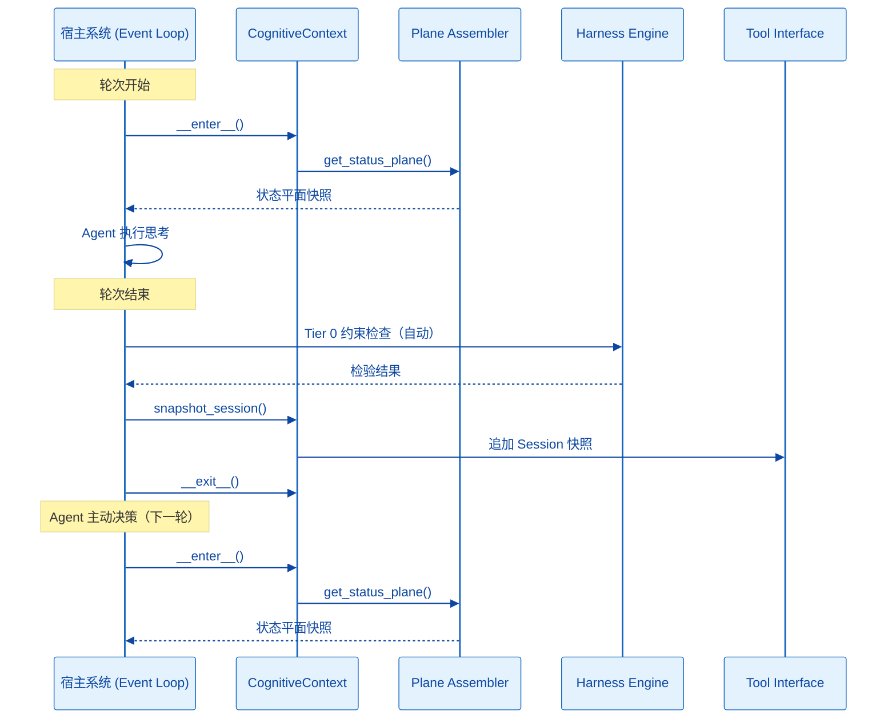

## 1. 项目目录结构 (Project Structure)

本项目采用 **"认知中间件"** 模式设计。mem0ress 不再被视为一个独立的 OS，而是一个伴生式 SDK。它不接管业务编排逻辑，也不执行工具或做决策，只专注于认知状态的构建、检验与管理。

```plaintext
mem0ress/
├── pyproject.toml         # 核心项目配置 (基于 uv)
├── .python-version        # uv 固定的 Python 版本 (3.12+)
├── README.md
├── .mem0ress/             # [认知基座 Substrate] 物理承载层
│   └── tasks/             # 分形任务树 (包含 index.md, session.md, gotchas/)
└── src/
    └── mem0ress/
        ├── __init__.py
        ├── cli.py             # [终端入口] 提供基座初始化、态势可视化 (Rich)
        ├── core/              # [核心契约]
        │   ├── __init__.py
        │   └── schema.py     # 基于 Pydantic 的强类型模型 (PRC 三要素、Task、Session)
        ├── gateway/            # [认知网关] 认知对齐平面的逻辑中枢
        │   ├── __init__.py
        │   ├── plane.py       # Plane Assembler（状态平面组装，纯展示）
        │   ├── actions.py     # Tool Interface（写入指令集：update_todo, complete_task 等）
        │   └── intercept.py   # 生命周期钩子封装（CognitiveContext 上下文管理器）
        ├── substrate/         # [认知基座操作]
        │   ├── __init__.py
        │   ├── fs.py          # Markdown ↔ Pydantic 双向解析，带 Hash 乐观锁校验
        │   └── git_ops.py     # Git 固化、Data Plane commit ID 映射管理
        └── harness/           # [检验引擎]
            ├── __init__.py
            ├── runner.py      # Tier 1/2 机械检查（Todo 完成度、Requirements 满足度）
            └── judge.py       # Tier 3 语义裁决器（调用独立 LLM 进行 Picture 对齐判断）

```

### 模块边界一览

| 模块 | 类型 | 职责 |
|------|------|------|
| Plane Assembler | 只读出口 | 实时编译当前任务的状态平面快照，纯展示不缓存 |
| Tool Interface | 写操作入口 | 认知状态写入，暴露 `create_task`、`update_todo`、`complete_task` 等工具 |
| Harness Engine | 验证出口 | Tier 0 约束越界检查，每轮次结束后由系统自动触发 |
| 任务完成度检查 | 验证组件 | Tier 1/2/3 完成度检查，Agent 按需调用 |

---

## 2. 核心配置文件 (pyproject.toml)

使用 uv 初始化，声明依赖。typer 处理命令，pydantic 处理严格的文档 Schema，pyyaml 处理 Frontmatter，litellm 处理多模型接入（仅 Harness Engine 的 Judge 语义裁决），GitPython 处理客体回溯。

```toml
[project]
name = "mem0ress"
version = "0.1.0"
description = "A Cognitive Alignment Plane (CAP) SDK with Lifecycle Hooking."
readme = "README.md"
requires-python = ">=3.12"
dependencies = [
    "typer>=0.12.3",       # 用于构建 CLI 外壳
    "pydantic>=2.7.0",     # 强类型 Schema，完美配合 ty 进行类型推断
    "pyyaml>=6.0.1",       # Markdown Frontmatter 解析
    "litellm>=1.35.0",     # 仅用于 Harness Engine 的 Judge 语义裁决
    "gitpython>=3.1.43",   # 数据平面的 commit ID 管理
    "rich>=13.7.1",        # 终端可视化的态势投影展示
]

[project.optional-dependencies]
dev = [
    "pytest>=8.0",
    "ruff>=0.9.0",
    "ty>=0.0.32",
]

[project.scripts]
mem0 = "mem0ress.cli:app"

[build-system]
requires = ["hatchling"]
build-backend = "hatchling.build"

# Astral 工具链配置 (Ruff + Ty)
[tool.ruff]
line-length = 100
target-version = "py312"

[tool.ruff.lint]
select = ["E", "F", "I", "UP"]
ignore = []

[tool.ty]
# 开启 ty 的严格类型检查模式，保证内核代码的确定性
strict = true
```

---

## 3. 核心机制设计

### 3.1 认知拦截器 (Gateway Interceptor)

`gateway/intercept.py` 提供 `CognitiveContext` 上下文管理器，作为 SDK 参与 Agent 循环的唯一入口：

**enter (Before Turn)：**
- 启动 Plane Assembler 扫描物理基座。
- 构建 Status Plane 快照，供 Agent 按需注入到上下文。

**exit (After Turn)：**
- 宿主系统自动触发 Session 快照（`snapshot_session`），追加记录至 session.md。
- 若检测到 Tier 0 约束违反，触发 Harness Engine 的约束越界检查。
- Tool Interface 的写操作（`update_todo`、`complete_task` 等）由 Agent 在轮次内主动调用，不在此处自动执行。

`CognitiveContext` 只负责生命周期钩子的编排，不做业务决策。

### 3.2 任务检验逻辑 (Harness)

Harness 的 Tier 0 和 Tier 1/2/3 职责不同，不可混淆：

**Tier 0 — Constraints 约束检查：**
每轮次结束后由系统自动触发（不等 Agent 调用）。若约束违反：
1. 尝试自动修复
2. 若无法修复，**发起让度请求并同步等待外部响应**，同时记录 Gotcha
3. **绝不执行隐式自动修复后继续**——让度是 Agent 的主动行为

**Tier 1 — Todo 完成度 + 子任务关闭检查：**
- 所有 Todo 步是否已完成
- 所有直接子任务是否已关闭（COMPLETED 或 ABANDONED）
- 任一未完成则直接阻断，不进入 Tier 2

**Tier 2 — Requirements 满足检查：**
- 验证每个 Requirement 是否达标
- 未满足则直接阻断，不进入 Tier 3

**Tier 3 — 语义对齐检查：**
- 读取任务的 Picture 与实际产出，执行语义对齐判断
- 与执行态 Agent 上下文**隔离**（带外检验），避免污染 Agent 的执行状态
- 仅在满足 spec.md 7.2 的触发条件时由 Agent 主动调用：
  - Picture 涉及主观判断或利益相关者感知
  - Constraints 与 Picture 之间存在语义歧义
  - 任务被宿主判定为高危（宿主自定义算法）
  - Agent 或利益相关者显式请求

### 3.3 乐观锁机制 (Optimistic Locking)

`substrate/fs.py` 在写入任何 `index.md` 前，必须比对内容 Hash。若基座在 Agent 思考期间被外部修改，抛出 `409 Conflict`，强制 Agent 重新投影平面后重试写入。

### 3.4 运行逻辑

mem0ress 的核心业务闭环由 Agent 的三个主动决策构成：

1. **认知构建：** Agent 调用 `get_status_plane()`，获取状态平面快照（任务树、TODO 进度、任务状态、Gotchas、Session 指针）。Picture/Requirements/Constraints 从 Manifest 按需读取，不在状态平面中展开。
2. **任务检验：** Agent 调用 `verify_task()`，驱动 Tier 1/2/3 检查。Tier 0 在每轮次结束后由系统自动触发，独立于 `verify_task()`。
3. **状态更新：** Agent 根据检验结果调用 Tool Interface 写操作（`complete_task`、`abandon_task`、`update_todo` 等）。Gotcha 作为带外偏差记录，不影响状态，不阻断执行。

**系统自动机制（不属于业务流）：**

- 每轮次结束时，宿主系统自动调用 `snapshot_session`，追加状态快照到 session.md。
- 每轮次结束后，系统自动触发 Tier 0 约束检查。

### 3.5 宿主挂载方式

mem0ress 自身没有后台守护进程，通过以下方式挂载到宿主 Event Loop：



让度的持有点：Tier 0 不可修复失败时，Agent 发起让度请求并同步等待外部响应。此处 Agent 暂停执行，直至宿主持有响应。

---

## 4. MVP 落地 Todo 清单

* [ ] Phase 1: 物理契约与类型安全 (Substrate & Ty Check)
  * [ ] 配置 uv, ruff, ty 环境。
  * [ ] 实现 `core/schema.py`：定义 PRC 三要素与分形 Task 模型（Pydantic）。
  * [ ] 实现 `substrate/fs.py`：Markdown Frontmatter ↔ Pydantic 双向转换，含 Hash 乐观锁。
* [ ] Phase 2: 拦截器与态势投影 (Interception & Projection)
  * [ ] 实现 `gateway/plane.py`：递归目录树生成带层级缩进的 Status Plane 文本（纯展示，不缓存）。
  * [ ] 实现 `gateway/intercept.py`：编写 `CognitiveContext` 上下文管理器，封装 Before Turn / After Turn 钩子。
* [ ] Phase 3: 动作网关与版本锚定 (Tools & GitOps)
  * [ ] 实现 `gateway/actions.py`：暴露 `create_task`、`update_todo`、`complete_task`、`abandon_task` 等工具。
  * [ ] 实现 `substrate/git_ops.py`：Data Plane 的 commit ID 自动管理与关联。
* [ ] Phase 4: 属性对齐验证 (Verification Engine)
  * [ ] 实现 `harness/runner.py`：Tier 1（Todo + 子任务关闭检查）与 Tier 2（Requirements 满足检查）。
  * [ ] 实现 `harness/judge.py`：调用裁判模型进行 Tier 3 语义对齐，带外执行隔离。
* [ ] Phase 5: CLI 可观测性 (CLI Observability)
  * [ ] 在 `cli.py` 中利用 Rich 实现 `mem0 status`：在终端展示高亮、分形的认知地图。
