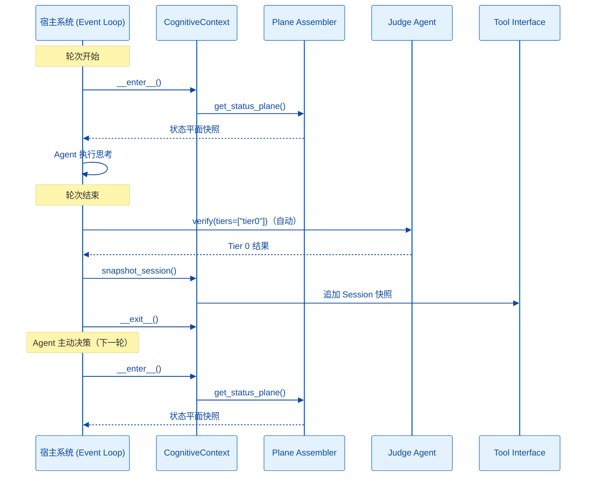

## 1. 项目目录结构 (Project Structure)

本项目采用 **"认知中间件"** 模式设计。mem0ress 不再被视为一个独立的 OS，而是一个伴生式 SDK。它不接管业务编排逻辑，也不执行工具或做决策，只专注于认知状态的构建、检验与管理。

每个 Task 伴生一个 Judge Agent，负责执行 Tier 0/1/2/3 检验，与 Task 生命周期同步。

```plaintext
mem0ress/
├── pyproject.toml         # 核心项目配置 (基于 uv)
├── .python-version        # uv 固定的 Python 版本 (3.12+)
├── README.md
├── .mem0ress/             # [认知基座 Substrate] 物理承载层
│   └── tasks/
│       └── {task_id}/
│           ├── index.md            # Task Manifest（Picture/Requirements/Constraints/Todo）
│           ├── session.md          # 轮次快照序列
│           ├── data-plane/        # Data Plane 引用（仓库 → commit ID）
│           ├── gotchas/           # 偏差记录
│           └── {task_id}-judge.md # Judge Agent Manifest（平铺）
└── src/
    └── mem0ress/
        ├── __init__.py
        ├── cli.py             # [终端入口] mem0 status 态势可视化 (Rich)
        ├── core/              # [核心契约]
        │   ├── __init__.py
        │   └── schema.py     # 基于 Pydantic 的强类型模型 (PRC 三要素、Task、Judge Agent)
        ├── gateway/            # [认知网关] 认知对齐平面的逻辑中枢
        │   ├── __init__.py
        │   ├── plane.py       # Plane Assembler（状态平面组装）
        │   ├── actions.py     # Tool Interface（create_task, complete_task, abandon_task 等）
        │   └── intercept.py   # CognitiveContext 上下文管理器（Before Turn / After Turn 钩子）
        ├── substrate/         # [认知基座操作]
        │   ├── __init__.py
        │   ├── fs.py          # Markdown ↔ Pydantic，带 SHA-256 乐观锁
        │   └── git_ops.py     # Data Plane commit ID 管理（待实现）
        └── harness/           # [检验引擎] Judge Agent
            ├── __init__.py    # Tier 1/2 机械检查，Tier 3 语义对齐上下文准备
            └── judge.py       # Tier 3 语义对齐判断上下文准备（由 Agent 执行）

```

### 模块边界一览

| 模块 | 类型 | 职责 |
|------|------|------|
| Plane Assembler | 只读出口 | 实时编译当前任务的状态平面快照，只读不缓存 |
| Tool Interface | 写操作入口 | 认知状态写入，暴露 `create_task`、`update_todo`、`complete_task` 等工具 |
| Judge Agent | 验证执行器 | 执行 Tier 0/1/2/3 检验，返回 verdict + tier_results |

三者共同构成认知网关，无跨越自身职责范围的操作。

---

## 2. 核心配置文件 (pyproject.toml)

使用 uv 管理依赖，pydantic 处理严格的文档 Schema，pyyaml 处理 Frontmatter，typer 构建 CLI 外壳，rich 实现终端可视化。**不依赖任何外部 LLM 或向量库。**

```toml
[project]
name = "mem0ress"
version = "0.1.0"
description = "A Cognitive Alignment Plane (CAP) SDK with Lifecycle Hooking."
readme = "README.md"
requires-python = ">=3.12"
dependencies = [
    "typer>=0.12.0",    # CLI 外壳
    "pydantic>=2.10.0", # 强类型 Schema
    "pyyaml>=6.0.0",    # Markdown Frontmatter 解析
    "rich>=13.7.1",     # 终端态势投影
]

[project.optional-dependencies]
dev = [
    "pytest>=8.0.0",
    "ruff>=0.8.0",
]

[project.scripts]
mem0 = "mem0ress.cli:app"

[build-system]
requires = ["hatchling"]
build-backend = "hatchling.build"

[tool.ruff]
line-length = 100
target-version = "py312"

[tool.ruff.lint]
select = ["E", "F", "I", "UP"]
ignore = []

[tool.pytest.ini_options]
testpaths = ["tests"]
pythonpath = ["src"]
```

---

## 3. 核心机制设计

### 3.1 Judge Agent 生命周期

每个 Task 伴生一个 Judge Agent（`{task_id}-judge.md`），其生命周期与 Task 同步：

**状态机：** `created → ready → verifying → ready → ... → destroyed`

| 状态 | 含义 |
|------|------|
| `created` | 刚创建，三要素未加载 |
| `ready` | 三要素已加载，等待检验调用 |
| `verifying` | 执行检验中 |
| `destroyed` | Task 结束，Judge Agent 销毁 |

**初始化流程：**
```
Task 创建 → spawn Judge Agent (id: {task_id}-judge)
         → 加载 Picture/Requirements/Constraints
         → 建立 Todo → Requirements 映射
         → status: ready
```

**文件存储：** Judge Agent Manifest 平铺在 Task 目录下，不创建独立子目录。验证历史追加到 Manifest 的 `verification_history` 字段。

### 3.2 认知拦截器 (Gateway Interceptor)

`gateway/intercept.py` 提供 `CognitiveContext` 上下文管理器，作为 SDK 参与 Agent 循环的唯一入口：

**enter (Before Turn)：**
- 启动 Plane Assembler 扫描物理基座。
- 构建 Status Plane 快照，供 Agent 按需注入到上下文。

**exit (After Turn)：**
- 宿主系统自动触发 Session 快照（`snapshot_session`），追加记录至 session.md。
- 若检测到 Tier 0 约束违反，触发 Judge Agent 的约束越界检查，结果返回给主 Agent，由主 Agent 决定是否修复及如何修复。
- Tool Interface 的写操作（`update_todo`、`complete_task` 等）由 Agent 在轮次内主动调用，不在此处自动执行。

`CognitiveContext` 只负责生命周期钩子的编排，不做业务决策。

### 3.3 任务检验逻辑 (Judge Agent)

Judge Agent 执行 Tier 0/1/2/3 检验，生成一次性报告写入 `report.md`。

**各层触发时机：**

- **Tier 0：** 每轮次结束后由系统自动触发。只读 Constraints 和当前代码状态，检测违反事实并写入报告。
- **Tier 1：** 由主 Agent 按需调用。检查所有 Todo 步是否已完成、所有直接子任务是否已关闭。
- **Tier 2：** 由主 Agent 按需调用。验证每个 Requirement 是否达标。
- **Tier 3：** 由主 Agent 按需触发（Picture 涉及主观判断 / 宿主判定高危 / Agent 显式请求）。Judge Agent 准备判断所需信息，实际判断由主 Agent 执行。

**报告生成规则：**
- 检验结束时一次性生成，写入 `report.md`
- 每轮覆写，不追加
- 主 Agent 通过 hook 返回值感知报告已生成，唤醒时读取

**Judge Agent 交互接口：**

| 接口 | 说明 |
|------|------|
| `verify()` | 执行 Tier 0 → 1 → 2 → 3 完整链路检验，写入 `report.md` |
| 返回 | 通过 hook 返回值通知主 Agent，主 Agent 唤醒时读取 `report.md` |

**Judge Agent 与主 Agent 的交互原则：**
- Judge Agent 读取 Task 文件系统，不读取主 Agent 的执行上下文（带外）
- 检验结果写入 `report.md`，不直接返回给主 Agent

### 3.4 乐观锁机制 (Optimistic Locking)

`substrate/fs.py` 在写入任何 `index.md` 前，必须比对内容 SHA-256 Hash。若基座在 Agent 思考期间被外部修改，抛出 `409 Conflict`，强制 Agent 重新投影平面后重试写入。

### 3.5 运行逻辑

mem0ress 的核心业务闭环由 Agent 的三个主动决策构成：

1. **认知构建：** Agent 调用 `get_status_plane()`，获取状态平面快照（任务树、TODO 进度、任务状态、Gotchas、Session 指针）。Picture/Requirements/Constraints 从 Manifest 按需读取，不在状态平面中展开。
2. **任务检验：** Agent 调用 `verify()`，驱动 Judge Agent 执行 Tier 0~3 检验。Tier 0 在每轮次结束后由系统自动触发。
3. **状态更新：** Agent 根据检验结果调用 Tool Interface 写操作（`complete_task`、`abandon_task`、`update_todo` 等）。Gotcha 作为带外偏差记录，不影响状态，不阻断执行。

**系统自动机制（不属于业务流）：**

- 每轮次结束时，宿主系统自动调用 `snapshot_session`，追加状态快照到 session.md。
- 每轮次结束后，系统自动触发 Tier 0 约束检查。

### 3.6 宿主挂载方式

mem0ress 自身没有后台守护进程，通过以下方式挂载到宿主 Event Loop：



让度的持有点：Tier 0 检测到约束违反且主 Agent 无法自行修复时，Agent 发起让度请求并同步等待外部响应。此处 Agent 暂停执行，直至宿主持有响应。

---

## 4. MVP 落地 Todo 清单

* [x] Phase 1: 物理契约与类型安全 (Substrate & Ty Check)
  * [x] 实现 `core/schema.py`：定义 PRC 三要素与分形 Task 模型（Pydantic）。
  * [x] 实现 `substrate/fs.py`：Markdown Frontmatter ↔ Pydantic 双向转换，含 Hash 乐观锁。
* [x] Phase 2: 拦截器与态势投影 (Interception & Projection)
  * [x] 实现 `gateway/plane.py`：递归目录树生成带层级缩进的 Status Plane 文本（纯展示，不缓存）。
  * [x] 实现 `gateway/intercept.py`：`CognitiveContext` 上下文管理器，封装 Before Turn / After Turn 钩子。
* [x] Phase 3: 动作网关与版本锚定 (Tools & GitOps)
  * [x] 实现 `gateway/actions.py`：`create_task`、`update_todo`、`complete_task`、`abandon_task` 等工具。
  * [ ] 实现 `substrate/git_ops.py`：Data Plane 的 commit ID 自动管理与关联。
* [x] Phase 4: 属性对齐验证 (Verification Engine)
  * [x] 实现 `harness/__init__.py`：Tier 1（Todo + 子任务关闭检查）与 Tier 2（Requirements 满足检查）。
  * [x] 实现 `harness/judge.py`：Tier 3 语义对齐判断上下文准备（由 Agent 执行）。
* [x] Phase 5: CLI 可观测性 (CLI Observability)
  * [x] 实现 `cli.py`：利用 Rich 实现 `mem0 status`，在终端展示高亮、分形的认知地图。
