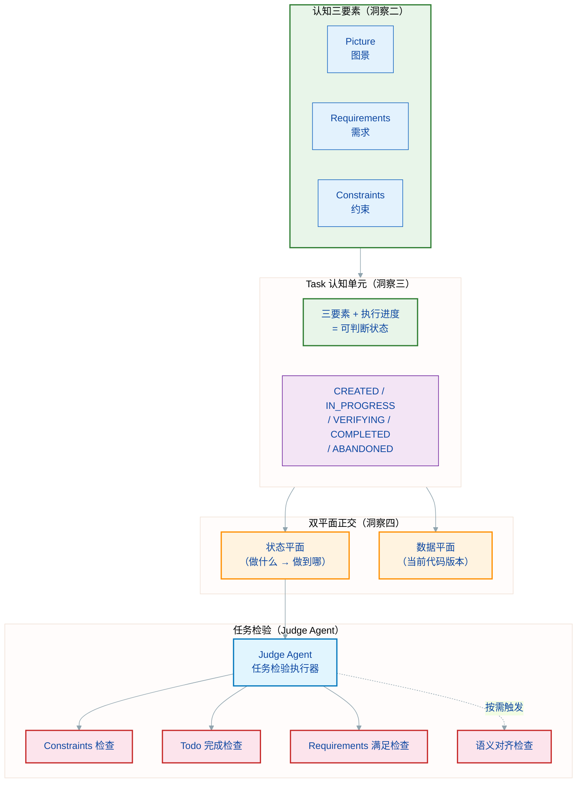
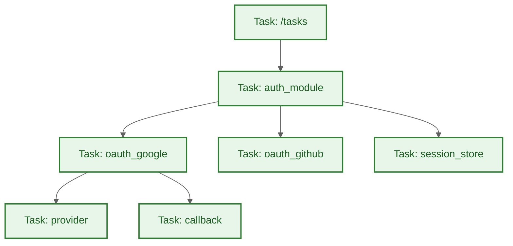
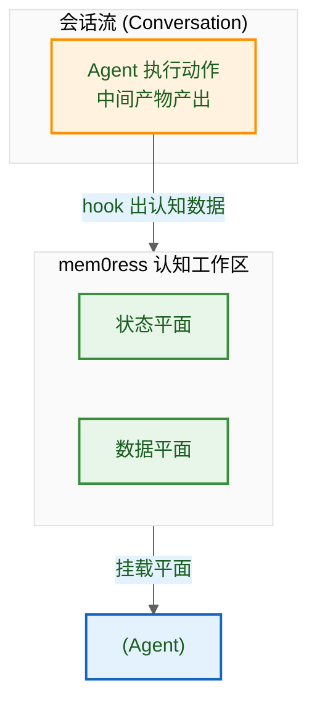
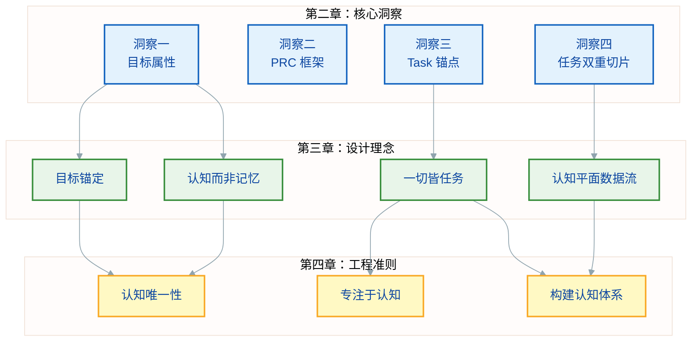
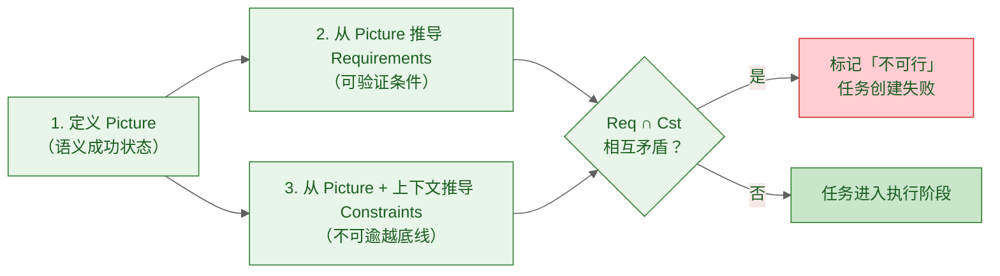
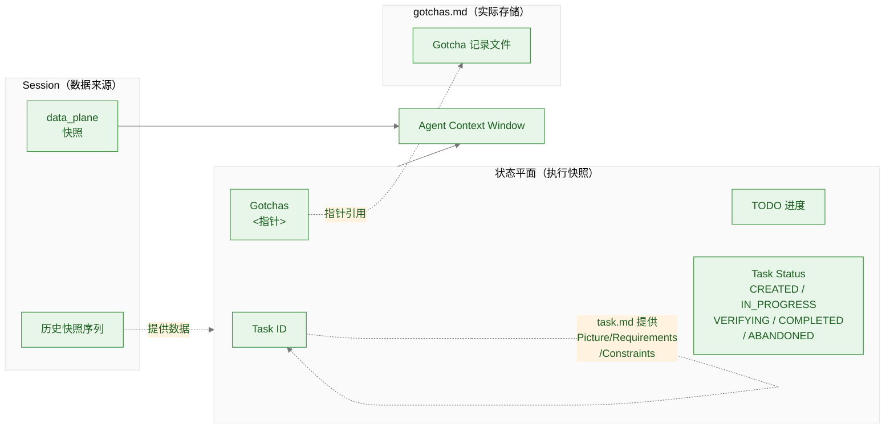
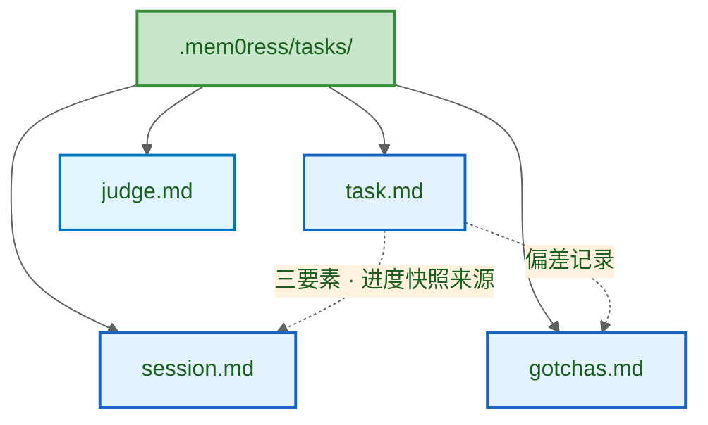
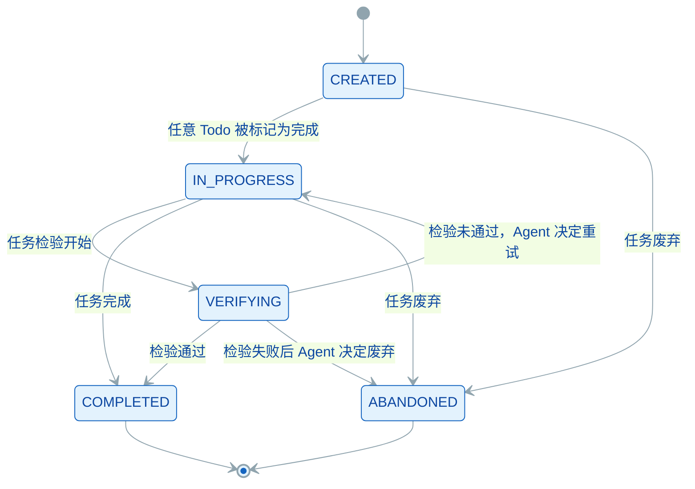

# mem0ress: 认知对齐平面(Cognitive Alignment Plane)架构规约


## 1. 综述 (Overview)

### 1.1 背景

"记忆"这个词暗示了一种向后看、被动式的存储行为。但在真正执行复杂任务时，我们需要的不是"翻找档案"，而是"向前的目标感"和"当下的全局掌控力"。

当前 AI Agent 在"长文本上下文"和"精确检索"之间不断徘徊，催生了三个结构性问题：

* **数据汤困境：** 传统记忆将历史对话、代码片段、废弃架构融合成一锅没有边界的"数据汤"，导致上下文污染和不可逆的熵增。
* **意图迷失：** 数据库本身没有意图。通过追溯历史来拼凑当下，永远无法匹配"向前看"的目标牵引。
* **大模型之上的大模型：** 许多 memory 系统徒增算力消耗，试图用 LLM 总结 LLM 来缓解交互局限，但从未触及"自主管理状态"这一核心问题。

讨论记忆时，我们真正关心的不是过去每一秒的原始画面，而是现在和未来：我们现在在做什么，已经完成了什么，还需要做什么，是否满足需求，是否符合约束，是否达成目标。

我们需要的不是记忆，而是**认知（Cognition）**。

### 1.2 系统定位

**目标用户：** AI/Agent 框架开发者。mem0ress 为开发者提供任务状态管理和目标态势感知能力，而非直接面向终端用户。

mem0ress 是一个**认知对齐平面 (Cognitive Alignment Plane)**。它不是传统意义上的"记忆检索数据库"，也不以二进制或向量方式存储，而是一个基于纯文本的、通过利用已有信息来有效构建目标相关视图、并持续检验执行偏差的逻辑框架。

核心功能是：在任务执行过程中，为 AI Agent 提供清晰的图景与执行约束，确保 Agent 的动作始终与既定需求对齐，防止其在长路径任务中偏离目标。

mem0ress 不试图重现所有记忆，而是让 AI 始终能够保持明确的认知：我是谁、我在做什么、我的目标是什么、我还有什么要做。当前的 AI 已经足够智能，不需要从会话中一遍又一遍检索相似信息，但它往往在多轮会话之后对自己的目标认知产生了偏差。

### 1.3 核心解法概览

mem0ress 将所有认知单元统一为同构的任务节点（Task），每个任务由三个要素定义：Picture（图景）、Requirements（需求）和 Constraints（约束）。三者共同构成判断未来动作是否偏离的绝对标准。在此基础上，系统通过**状态平面**和**数据平面**两个时间切片，以极低的 Token 成本为 Agent 提供实时态势感知。

这一核心解法的认知科学基础和完整推导见第二章。



## 2. 核心洞察

mem0ress 的设计基于四个核心洞察。四个洞察之间存在一条推导链——前一个洞察是后一个洞察的前提。

### 2.1 记忆的目标属性

**洞察一：记忆以目标为锚，而非以时间为锚。**

人类记忆不是被动记录仪。同一段经历，在不同目标下被提取的内容截然不同——不是因为记忆被篡改了，而是因为提取的线索（目标）不同。这说明记忆的组织方式天然以目标为锚，而非以时间为锚。

认知心理学中，目标导向记忆（Goal-Directed Memory）的研究表明：记忆的编码和检索都依赖于目标线索。相同材料在不同目标下激活完全不同的记忆网络。这直接否定了"被动存储所有对话历史"的做法——存储本身并不产生有用的认知，目标的锚定才能。

这一洞察是整个 mem0ress 设计决策的起点：它否定了"存储优先"的记忆架构，转向"目标锚定的认知架构"。

### 2.2 完成标准的结构

**洞察二：目标若无结构化的完成标准，执行结果无法被验证。**

仅有方向性的目标描述（如"实现用户登录功能"）无法指导执行或判断完成。执行者面临三个无法回避的问题：什么样的状态算成功？需要满足哪些可验证的条件？什么是绝对不可逾越的边界？

传统软件工程的回答是"测试用例通过即完成"。但测试用例通过只验证了预设假设，无法回答"利益相关者真正想要的问题是否被解决了"。需求文档定义的是实现路径，不是目标本身——两者之间的缺口在 AI Agent 场景下变得更加尖锐，因为 AI 能够理解语义而不依赖完整枚举的检验条件。

这意味着需要一种机制来锚定"真正的成功状态"，而不是"符合测试用例"。完成标准必须有结构，能让执行者和判断者独立地做出相同的判断。

### 2.3 认知单元的形态

**洞察三：认知信息需要以任务为单位组织，而非以知识点或原始对话为单位。**

事件记忆（Episodic Memory）比语义记忆更牢固、更易提取。"上周的架构评审会议"比"分布式系统一致性原理"更容易被准确回忆，原因在于事件天然封装了目标、行动、结果和上下文——这些维度共同提供了记忆的边界和检索线索。

孤立的知识点或对话片段没有这种结构。它们既没有目标锚点，也没有可判断的边界，无法成为可靠的认知单元。

这推导出一个结论：认知系统应以任务（Task）为唯一单元。每个任务封装目标、可验证条件、不可逾越边界和执行进度——四者的组合使得任务在任意时刻都有一个可判断的状态。

同构性是关键的设计选择。如果认知单元种类繁多（里程碑、史诗、故事点、子任务），系统需要为每种类型设计不同的处理逻辑，认知负载倍增。统一的任务模型在任何粒度下都适用，系统复杂性维持在常数级别。

### 2.4 认知的呈现方式

**洞察四：认知需要两个相互独立的切面——一个回答"做到了什么"，另一个回答"推进到哪里"。**

对任意认知单元，系统需要同时掌握两个不同维度的事实：

"做到了什么"是数据层面的——当前操作的是哪个版本的代码，文档处于什么状态。"推进到哪里"是执行层面的——任务进展到哪了，完成度如何，是否偏离目标。

两个问题在认知性质上完全不同。如果混合在一起回答，认知负载翻倍。更重要的是，Agent 需要能够独立判断"我现在应该关注数据版本还是执行进度"——这要求两个问题必须分开处理，不能搅在一个答案里。

分开之后，当问题出现时，Agent 能直接定位是哪个维度出了问题，而不是面对一锅混淆的状态。

这条推导链决定了整篇规范的叙事结构——理解它，就能理解 mem0ress 为什么是这样设计而不是那样。

---

---

## 3. 设计理念

mem0ress 源于对当前 AI Agent 发展路径的底层反思。拒绝将 RAG（检索增强生成）等同于 AI 的大脑，摒弃传统的"被动记忆检索"理念。mem0ress 的架构设计并非为了优化数据的存储与查询，而是为了给自主 Agent 构建一个具备前瞻性（Forward-looking）的心智模型。

系统的运转建立在以下四大核心理念之上：

### 3.1 目标锚定：目的论认知

**源自洞察一（2.1）：上下文是被发现的，而非被维持的。**

在传统基于向量的记忆设计中，信息是游离的，系统通过算力去大海捞针。但在 mem0ress 中，认知遵循严格的"目的论（Teleology）"。任何被引入平面的信息必须有明确的目的。系统不存储无关的零散数据，仅记录与任务目标直接相关的认知增量。失去目标指向的信息被视为噪音，不予投影到当前平面。

### 3.2 认知而非记忆：记录"状态突变"

**源自洞察一（2.1）：记忆的目标属性决定了认知应以任务为中心，只记录与目标相关的状态变化。**

人类的大脑之所以高效，是因为它懂得遗忘过程，只铭记结果。系统不记录 Agent 执行过程中的所有流水账，仅记录导致目标推进或路径修正的**状态变更**。通过记录状态变更而非过程录像，有效控制上下文规模。

### 3.3 同构的认知单元：一切皆任务

**源自洞察三（2.3）：任务是将模糊意图转化为可判断状态的认知锚点。同构单元确保任意粒度下解析逻辑一致。**

任务（Task）是唯一的认知单元。mem0ress 不区分"任务"、"子任务"、"里程碑"、"史诗"或其他类型——所有认知单元都是 Task，结构完全一致。一个任务就是一个 Task，一个子任务也是一个 Task，父任务也是一个 Task。同构意味着没有例外，没有特殊节点，没有需要特殊处理的边界情况。

这种同构性是设计选择，不是实现妥协。正是因为所有节点同类，认知网关只需要一套解析逻辑——不需要判断这是什么类型的节点，不需要选择哪种处理策略，不需要维护异构的类型系统。

分形树状结构是这个同构性带来的自然结果：父节点是 Task，子节点也是 Task，递归下去每一层都是 Task。"树"不是设计的核心，只是同构单元物理化后的呈现形式——目录深度表达依赖，`ls` 就能看到边界，不需要额外的状态聚合。



### 3.4 认知平面的数据流架构

**源自洞察四（2.4）：状态平面与数据平面正交互斥，避免状态与数据之间的维度捆绑——即每次获取状态时被迫同时加载数据版本，或混合后 Agent 无法独立判断当前该关注哪个维度。**

mem0ress 的认知数据来自会话本身，而非外部知识库。系统从会话流中 **hook** 出构建认知所需的信息，这是与外部数据完全独立的并行过程——外部知识（向量数据库、API 文档、全网搜索）属于 Agent 的背景知识，mem0ress 不感知、不管理，也不依赖它们。

**认知数据的来源与流向：**

会话流承载了 Agent 的所有执行动作与中间产物。mem0ress 在会话中 hook 出与任务目标相关的数据，将其组织为两个时间切片：

* **状态平面：** 从会话中提取任务执行状态（Todo 进度、代码产出、文档进度、组件状态），聚合成某一时刻的执行快照。Agent 唤醒时强制挂载（因为它回答的是"我在哪"）。
* **数据平面：** 从会话中提取相关数据的 commit ID 快照，记录代码和文档在某一时刻的版本。Agent 需要操作具体数据时才按需挂载。

两个平面都来源于会话，按需挂载。Agent 获取平面后，在其**认知工作区**中完成目标推理与决策。

三个核心动作与 Task 生命周期绑定：轮次结束后依次执行**认知构建**（生成当前状态快照）、**任务检验**（判断是否满足 Picture）和**状态更新**（将检验结果反映到 Task 状态）。这三个动作的顺序是固定的——认知构建先于任务检验，任务检验先于状态更新。

> **注：** 状态平面和数据平面都是时间切片，不是组件。图中的状态平面 / 数据平面指的是"某一时刻的快照"，而非独立的进程或服务。认知工作区是 Agent 的内部工作空间，两者是一体的。



以上四大理念，共同构成了 mem0ress 的设计哲学。以下工程准则，是将上述理念落实为具体约束的实践规范——违反这些准则，即等同于违反第二章（核心洞察）的设计初衷。

这里有一个根本的区分：mem0ress 不是回答问题的引擎，而是呈现状态的窗口。传统 memory 系统像问答机器人：你问一个点，它试图给一个更精确的答案。mem0ress 不一样——它不是问答，是构建。任何时刻，只要你需要，它把当前认知的所有要素完整铺开：任务树在哪、做到哪了、约束有没有被触碰、目标偏了没有。没有哪个要素比其他要素更重要，也没有"相关性排序"决定谁被展示谁被丢弃。

这不是精确性的问题，是存在形态的问题。检索式系统的局限不在于它找不到答案，而在于它只能回答被问到的问题——没有被问到的问题，答案再精确也是空白。认知体系则始终是完整的，即使 Agent 还没有意识到某个偏差的存在，偏差也已经在那里了，只是还没被注意到。

向量数据库 + 检索给出的是答案的碎片。mem0ress 给出的是认知的快照——某一时刻、完整的、不挑选的。Agent 从快照里自己判断该关注什么，而不是等着系统告诉它答案。



## 4. 工程准则

### 4.1 认知唯一性

认知是唯一的。对于一个任务，没有两份认知同时存在的状态。我们不讨论认知的新旧与变更，只是维护一份认知。

### 4.2 专注于认知

mem0ress 只管一件事：认知的生命周期管理，也就是任务的创建、检验与认知态势的构建。大模型沙箱隔离、并发控制这些，都交给宿主操作系统。

### 4.3 构建认知体系

mem0ress 不是回答问题的引擎，而是呈现状态的窗口。它在任何时刻都完整构建当前认知的所有要素——任务树在哪、做到哪了、约束有没有被触碰、目标偏了没有。不做相关性排序，不挑选，不截断。

## 5. 概念

### 5.1 认知三要素：定义与使用指南

第二章讲过理论，这节说怎么填。

Picture、Requirements、Constraints 怎么定义、谁定义、什么时候定义，下面一一说清楚。

| 要素 | 主要定义者 | 参与者 |
|------|-----------|--------|
| Picture | 利益相关者（用户、业务负责人） | Agent 辅助提炼 |
| Requirements | Agent（基于 Picture 推导） | 利益相关者确认 |
| Constraints | Agent + 领域知识 | 利益相关者确认 |

**什么时候定义：**

先定 Picture。Picture 是利益的语义锚——说不清楚"做成什么样"，后面都没法推。三者都定完之后，检查 Requirements 和 Constraints 有没有矛盾，有的话直接标记"不可行"，别等到执行阶段才发现。



Picture 写得好不好，就看能不能向利益相关者描述一个他们能想象的状态。如果写的是实现路径（"用 OAuth 2.0 实现登录"）而不是成功状态（"用户不用输入密码就能登录"），说明没写到位。

Requirements 能不能自动检验？每个 Requirement 都得有明确的通过/失败标准。"界面美观大方"这种依赖主观判断的，不是有效的 Requirements。

Constraints 能不能被阻断？违反的时候系统能不能检测到并拦住？"代码要有良好可读性"这种系统感知不到的，不适合作为 Constraints，应该放到 Requirements 里。

Picture / Requirements / Constraints 存在 task.md 里，不在别处重复记录。状态平面只展示摘要，不展开全文。

### 5.2 状态平面与数据平面

mem0ress 的认知系统由两个核心平面构成，它们都是**时间切片**（某一时刻的快照），不是组件。

**状态平面 (Status Plane)：** 任务相关的所有执行状态的聚合快照。状态平面是运行时快照，在 Agent 需要了解当前认知态势时（认知构建阶段）由认知数据模型按需组装，并在 Agent 唤醒时自动挂载到上下文。组装来源包括 task.md（任务定义）、Session（历史切片）、Data Plane（版本指针）、Gotchas（偏差记录）。spec 定义组装的时机和职责边界，arch 定义具体的组装机制。

状态平面包括：
- 任务树结构（父子关系）
- 每个任务的 todo 完成度（如 "2/3 Todos 完成"）
- 任务状态（CREATED / IN_PROGRESS / COMPLETED / ABANDONED）
- 偏差记录（Gotchas，指针）
- Session 最近变化指针（指向 Session 中最近的状态快照位置，供 Agent 按需追溯）

Agent 唤醒时强制挂载，只输出当前状态，不做偏差判断。

**数据平面 (Data Plane)：** 各仓库当前 commit ID 快照，记录在 Session 每轮快照的 `data_plane` 字段中。顺着状态平面的指针按需展开，不默认加载。

**Session 作为数据来源：** Session 是每个 Task 的私有历史，记录每个轮次的状态快照。版本快照模型，只追加不覆盖。它是状态平面内容的数据来源之一，但不等于平面本身——平面是某一时刻的聚合快照，Session 是快照的时间序列。

Session 记录执行进度（代码写到哪、文档完成多少、TODO 状态）和 `data_plane` 快照（各仓库当前 commit ID）。data_plane 不单独文件记录，Session 每轮快照中的 `data_plane` 字段即为版本快照，供回溯使用。



## 6. 文档数据模型

### 6.1 设计思想

mem0ress 采用**纯文本持久化 + 运行时组装**的数据模型，参考了 OpenClaw 的 context engine 设计思路：OpenClaw 明确指出"文件是 memory 的唯一真相来源，模型只记忆写入磁盘的内容"，mem0ress 将这一原则延伸至任务认知领域。

认知数据（Picture/Requirements/Constraints/Todo/状态/Gotchas）以 Markdown 文件形式存储在文件系统，运行时由 Plane Assembler 按需组装为状态平面，而非在内存中维护可变状态。选择目录加文档方式的原因有以下三点。

**消除隐藏状态。** 所有认知数据都可被 Agent 直接读取和修改，不存在内存中的影子状态，外部工具（git、grep、编辑器）可直接操作，审计无盲区。

**时间切片而非可变状态。** Session 的每次轮次快照是追加的，Data Plane 的版本引用是不可变的，Gotchas 是带时间戳的增量记录，状态变化通过追加而非覆写实现，不存在"数据汤"问题。

**与 Agent 工具生态无缝衔接。** Agent 的文件工具天然支持文本操作，无需额外的 SDK 或数据库驱动，跨 Agent 共享只需共享文件路径。

这一设计的局限在于：不支持需要事务语义的多步原子操作，所有一致性保证依赖调用方遵守组装协议。

### 6.2 组成与目录结构

mem0ress 的文档数据模型由四个核心文档组成，各自承担不同的认知职责，协作构成完整的任务认知体系。系统使用文件树表达认知的从属关系与上下文边界。

| 文档 | 定位 | 何时写入 |
|------|------|----------|
| task.md | 任务声明，Picture/Requirements/Constraints 的唯一真相来源 | 任务创建时写入，运行时以它为准 |
| Session（`session.md`） | 轮次历史，按时间追加，不改变 task.md；含 data_plane 快照 | 每轮次结束后追加 |
| Gotchas（`gotchas.md`） | 偏差记录，带外追加，不阻塞主流程 | 偏差确认后追加 |
| judge.md | Judge Agent task 文件，与 Task 生命周期同步；不属于 Task 的三个物理子节点 | 任务创建时生成，检验后更新 |

四个文档的关系：task.md 是锚，三要素从它读取；Session 提供进度数据和 data_plane 快照，支撑认知构建；Gotchas 记录偏离，供后续复盘追溯；judge.md 承载任务检验逻辑，与 Task 生命周期同步。



```plaintext
.mem0ress/tasks/
└── {task_id}/
    ├── task.md       # 任务声明（Picture/Requirements/Constraints/Todo）
    ├── session.md    # 轮次快照序列（含 data_plane 快照）
    ├── gotchas.md    # 偏差记录（追加式）
    └── judge.md      # Judge Agent task 文件（平铺）
```

具体各文档的内容格式和字段说明见附录 B 模板参考。

## 7. 逻辑与流程设计 (Logic & Workflow Design)

Task 的执行循环围绕三个核心动作展开：认知构建、任务检验和状态更新。这三个动作在每个轮次结束后依次执行，构成完整的感知-判断-更新闭环。

### 7.1 任务创建

任务创建是确立认知边界的起点。Agent 在创建任务或子任务时，首要目标不是写代码，而是明确定义任务的 Picture、Requirements 和 Constraints。三要素的定义应从 Picture 开始——先定义 Picture 作为目标锚，再从中推导出 Requirements 和 Constraints。冲突检测在三者全部定义后进行——若 Requirements 与 Constraints 相互矛盾，系统立即标记任务为"不可行"，而非等到执行阶段才发现。

Todo 步进拆解：在锚定三要素后，Agent 将任务拆解为具体的机械步（Todo）。这些 Todo 构成了后续检验进度的基准线。

### 7.2 认知构建

认知构建是轮次结束后生成状态平面快照的动作。它在任何节点（刚启动时、执行中、或检验失败后）都需要执行，为 Agent 提供当前任务的可判断状态。

状态平面是认知构建的产出物，具有以下特性：只输出当前状态，不做偏差判断；实时扫描，每次调用直接读文件系统，不缓存；全面覆盖，显示所有任务，不隐藏任何节点；非侵入，只读不写，不改变任何状态。

状态平面的显示内容包括：任务树结构（父子关系）；每个任务的 todo 完成度（如 "2/3 Todos 完成"）；任务状态（CREATED / IN_PROGRESS / COMPLETED / ABANDONED）；偏差记录（Gotchas）指针；Session 最近变化指针（指向 Session 中最近的状态快照位置，供 Agent 按需追溯）。Picture/Requirements/Constraints 从 task.md 获取，不显示在状态平面中。

Session 快照是认知构建的数据来源。每个轮次的状态快照记录 code_progress、docs_progress、todos 和 status。Session 采用版本快照模型，只追加不覆盖。

### 7.3 任务检验

任务检验在认知构建之后执行，负责判断当前状态是否满足 Picture。检验在轮次结束后自动触发，是只读操作，不执行写操作。

**四层关卡（Tiers）：**

任务检验按顺序执行以下四层关卡。其中 Tier 0/1/2 为客观检验条件，由 Judge Agent 自动执行并判断是否通过，无需主 Agent 主观决策；Tier 3 为语义对齐关卡，由 Agent 根据任务属性决定是否启用。

* **Tier 0: Constraints 约束检查。** 检查 Constraints 是否被违反，若有违反报告违反事实，由主 Agent 决定是否修复及如何修复。
* **Tier 1: Todo 完成检查。** 检查所有 Todo 步是否已完成、所有直接子任务是否已关闭。子任务处于 COMPLETED 或 ABANDONED 状态即为已关闭；处于 CREATED 或 IN_PROGRESS 状态则视为未完成。
* **Tier 2: Requirements 满足检查。** 验证每个 Requirement 是否达标。
* **Tier 3: 语义对齐检查。** 读取 Picture 与实际产出，执行语义对齐判断。Tier 3 需要 Agent 主动判断本次检验是否需要语义对齐，以下情况适用：Picture 涉及主观判断或利益相关者感知时；Constraints 与 Picture 之间存在语义歧义时；任务被宿主系统判定为高危时；Agent 或利益相关者显式请求时。

例如：一个 Picture 是"用户无需输入密码即可登录"的 OAuth 任务，Tier 1 检查了所有 Todo 是否完成，Tier 2 验证了"支持 Google OAuth"和"支持 GitHub OAuth"这两个 Requirements 都满足，但 Tier 3 额外检查了"实际登录流程中用户确实没有被要求输入密码"——这个检查无法通过代码结构验证，必须看实际行为，属于语义对齐。

**决策执行规则：**

检验完成后结果写入 `judge.md`，由主 Agent 从 `judge.md` 读取并决策下一步。任务完成后是否标记完成，由 Agent 自主决定。ABANDONED 由 Agent 主动标记，与检验结果无关。

检验通过 → Agent 可标记任务完成；检验未通过 → Agent 决定下一步（修正、重试或废弃）。

### 7.4 状态更新

状态更新将检验结果反映到 Task 状态，并处理决策执行。

**状态机：**

Task 生命周期包含五种状态：

- **CREATED**：三要素已定义，所有 Todo 均未开始
- **IN_PROGRESS**：至少有一个 Todo 已完成，执行中
- **VERIFYING**：任务检验进行中，瞬态，不能持续
- **COMPLETED**：目标达成，认知生命周期结束
- **ABANDONED**：目标放弃，记录 Gotcha 经验

状态转换规则：CREATED → IN_PROGRESS（任意 Todo 被标记为完成）；CREATED → ABANDONED（任务废弃）；IN_PROGRESS → VERIFYING（任务检验开始）；VERIFYING → IN_PROGRESS（检验未通过，Agent 决定重试）；VERIFYING → COMPLETED（检验通过）；VERIFYING → ABANDONED（检验失败后 Agent 决定废弃）；IN_PROGRESS → COMPLETED（任务完成）；IN_PROGRESS → ABANDONED（任务废弃）。



**决策执行：**

检验完成后 Agent 自主决策下一步。

## 附录 A: 状态与节点

#### 状态表 (State Table)

| State | 说明 |
|-------|------|
| `CREATED` | 任务已创建，三要素已定义，所有 Todo 均未开始 |
| `IN_PROGRESS` | 任务进行中，至少有一个 Todo 已完成 |
| `VERIFYING` | 任务检验进行中，瞬态，检验完成必须离开此状态 |
| `COMPLETED` | 目标达成，认知生命周期结束 |
| `ABANDONED` | 目标放弃，记录 Gotcha 经验 |

#### 节点表 (Node Table)

| Node | 说明 |
|------|------|
| `Turn N` | 轮次节点（1.1, 1.2, 2.1...）。每轮次记录状态快照（code_progress/docs_progress/todos/status），由系统在轮次结束时自动追加。不含 Picture/Requirements/Constraints（从 task.md 获取） |
| `Task` | 认知单元，包含 task.md、session.md、gotchas.md 三个物理子节点；judge.md 与 Task 并列平铺，不属于 Task 的子节点 |
| `Subtask` | 子任务节点，嵌套于父任务目录下。通过目录深度表达依赖关系，父任务完成以所有子任务完成为前提 |
| `Judge Agent` | 伴生组件，执行任务检验；Judge Agent 节点与 Task 节点并列平铺于同一任务目录下，judge.md 是其物理文件 |

---

## 8. FAQ

### Q: 为什么我们需要的是"认知"而不是"记忆"？
A: 记忆是向后看（Retrospective）、被动式的存储行为。mem0ress 不是检索过去对话的存储系统，而是**前向的认知系统**，维持 AI 对当前目标、进度和认知缺口的 awareness。核心区分：传统记忆问"我们之前讨论了什么"，认知框架问"我要达成什么目标？我离目标还有多远？我还需要做什么？"

### Q: 为什么采用任务模型，以及一切皆任务？
A: 任务模型（Task Model）是认知对齐平面的基本单元。将一切视为任务带来以下优势：
- **同构性**：所有认知单元（Task）拥有相同结构，降低解析复杂度
- **可分解性**：复杂目标拆解为子任务，物理上通过目录深度表达依赖关系
- **可验证性**：每个 Task 都有明确的完成标准（Picture），便于检验
- **无冲突设计**：父任务完成以其所有子任务完成为绝对前提，避免并发冲突

### Q: 为什么任务没有冲突协调机制？
A: mem0ress 的设计遵循**冲突只能避免，无法解决**的哲学原则（来自 MetaDev 规范的哲学四）。协调机制是试图在冲突发生后解决它，但更好的做法是通过设计使冲突根本不发生。

mem0ress 通过以下设计消除冲突：
- **物理隔离**：不同任务处于不同目录，父任务目录下嵌套子任务目录，通过目录深度表达依赖关系
- **顺序保障**：父任务必须等待所有子任务完成后才能完成
- **继续拆分原则**：当两个任务出现冲突时，正确的处理方式是继续拆分任务直到冲突消除，而非引入协调机制

冲突出现时，不是记录下来等待解决，而是追溯到任务定义层面，重新划分边界直到冲突消除。如果确实无法继续拆分，则让度给人确认。

### Q: 为什么使用状态平面与数据平面？
A: 双平面设计实现认知与数据的分离：
- **状态平面：** 任务执行状态的聚合快照（Todo 进度、代码产出、文档进度、组件状态等）
- **数据平面：** 所有相关数据的 commit ID 快照

两者都是时间切片，而非组件。这种分离让 Agent 始终以极低 Token 成本了解"现在在哪"和"离目标还有多远"。

### Q: 为什么状态平面没有回溯？
A: 状态平面是任一时刻的执行快照，不是历史记录。这是设计上的刻意选择：
- **认知效率：** Agent 每次获取的是当前真相，而非沉积的变更历史
- **绝对可观测性：** 基于纯文本和目录树，Agent 可直接读取，无需版本遍历

若需历史演进，Session 提供版本快照模型用于追踪。

### Q: 为什么 Picture（图景）是完成标准，而不是 Requirements、Constraints 或者子任务清单？
A: Picture 是语义层面的成功状态，Requirements 是可验证的指标，Constraints 是不可逾越的底线，子任务清单是执行路径：
- **Picture vs Requirements**：即使所有 Requirements 满足，Picture 可能未达成（如"用户说还是慢"）
- **Picture vs 子任务**：子任务是路径而非目的地，完成所有子任务不等于达成目标
- **Picture vs Constraints**：Constraints 是底线，Picture 是目标，两者维度不同

Picture 作为完成标准防止"勾选心态"——Agent 不会在完成所有条目后仍然错失实际需求。

### Q: 什么是"数据汤"困境，mem0ress 如何避免？
A: 数据汤（Data Soup）发生在记忆系统将所有信息存入无结构的池子时：信息失去边界、新旧混杂、无法区分当前与过时，导致上下文污染和熵增。

mem0ress 通过以下机制避免：
- **目标锚定**：信息仅在与活跃 Task 关联时才有意义，失去目标指向的信息视为噪音，不予投影到当前平面
- **认知来源隔离**：mem0ress 的认知数据来源于会话 hook，不管理也不依赖外部知识（向量数据库/API 文档/全网搜索）——外部知识属于 Agent 的背景知识，Agent 按需检索后体现在会话中，mem0ress 只从会话流提取切片
- **生命周期一致**：认知与任务关联，任务完成则认知生命周期结束
