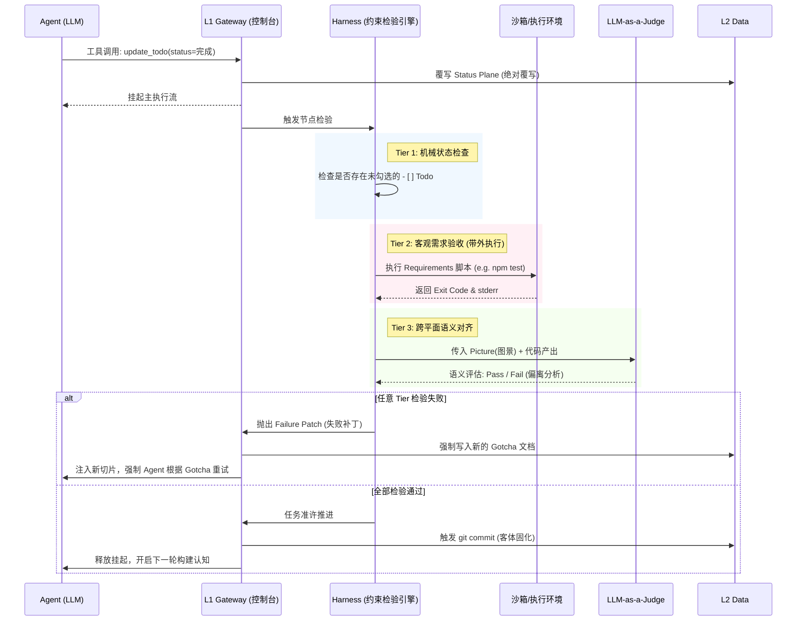

# mem0ress: 认知对齐平面(Cognitive Alignment Plane)架构规约

**版本:** v3.0 (Master Blueprint)
**定位:** 辅助 AI Agent 构建目标态势并校准执行偏差的轻量级工具框架


## 1. 综述 (Overview)

### 1.2 背景

“记忆”这个词带有极强的误导性，它暗示了一种向后看（Retrospective）、被动式（Passive）的存储行为——就像一个积满灰尘的档案柜。但我们在真正执行复杂任务时，需要的根本不是“翻找档案”，而是“向前的目标感（Forward-looking）”和“当下的全局掌控力（Situational Awareness）”。 

实际上我们都被“Memory（记忆）”这个词局限住了, 在不断地在卷“长文本上下文”和“精确检索”的时候，我们在大数据量和清晰认知之间不断徘徊，导致了系统级的结构性困境。

* 数据汤困境（The Data Soup Dilemma）： 传统记忆将所有历史对话、代码片段、废弃架构融合成一锅没有边界的“数据汤”。系统试图依赖向量相似度算法来打捞信息，这不仅导致了严重的上下文污染（Context Collapse），也让记忆库随着时间推移陷入不可逆的熵增。
* 意图迷失（The Intent Fallacy）：数据库本身没有意图。通过追溯历史来拼凑当下，永远无法匹配复杂任务中“向前看（Forward-looking）”的图景牵引。大模型极易陷入“为了写代码而写代码”的局部最优解。 
* 以毒攻毒的架构补丁： 许多memory系统本质上只是在“大模型之上再套一层大模型”，试图通过让 LLM 不断总结、反思和微调来缓解交互局限，但这从未触及“自主管理状态”这一架构核心，徒增算力消耗与幻觉风险。

当我们在讨论记忆的时候，我们实际上并不是关心过去每一秒的原始画面，我们实际上关心的是当前和未来。即我们现在在做什么（Task），我们已经完成了什么(Plane)，我们还需要做什么(Todo)，我们的目标是什么（Picture）, 我们当前与目标是否存在偏差(Constraint)。

我们真正需要的，不是记忆，而是认知（Cognition）。

#### 1.2 系统定位

在这个视角下，在AI应用中，记忆的本质不再是用来“回想”的，而是用来“维持 AI 代理在极度复杂的数字环境中的神智清醒（Sanity）”的。

mem0ress 是一个认知对齐平面 (Cognitive Alignment Plane)。它不是传统意义上的“记忆检索数据库(RAG Database)”，也不以二进制或向量方式存储，而是一个基于文本的，通过利用已有信息来构建目标相关视图，并持续检验执行偏差的逻辑框架。

其核心功能是：在任务执行过程中，为 AI Agent 提供清晰的意图边界（Picture）与执行约束（Constraints），确保 Agent 的动作始终与既定需求对齐，防止其在长路径任务中偏离目标。

mem0ress并不试图去重现所有记忆，而是使AI始终能够保持明确地认知，即，我是什么，我在做什么，我的目标是什么，我还有什么要做。传统的记忆中，我拥有什么信息，被从这里抛开。

我们认为，当前的AI已经足够智能，它不需要从会话中一遍又一遍地检索和过滤相似的信息, 但它往往在多轮会话之后，对自己的目标认知产生了偏差。

#### 1.3 核心解法：动态平面和数据基座

针对上述痛点，mem0ress 提出了彻底的范式转移：停止构建庞大的记忆库，将目标放在构建动态的认知系统。mem0ress 将信息流拆分为两个维度：

* 认知对齐平面 (Cognitive Alignment Plane - 状态)： 代表当前的动态态势。它是前向的、不断更新的，负责告诉 Agent“现在在哪”以及“离目标还有多远”。
* 认知基座(Cognitive Substrate - 数据)： 代表物理存储的静态数据。包含代码、文档和历史记录。它是每一时刻状态的客观物理承载。

通过这种分离，系统能够以极低的 Token 成本，让 Agent 始终保持对目标的关注，并能通过“约束检验”快速发现并修正偏差。

## 2. 设计理念

mem0ress 的诞生，源于对当前 AI Agent 发展路径的底层反思。我们拒绝将 RAG（检索增强生成）等同于 AI 的大脑，摒弃传统的“被动记忆检索”理念。mem0ress 的架构设计并非为了优化数据的存储与查询，而是为了给自主 Agent 构建一个具备前瞻性（Forward-looking）的心智模型（Mental Model）。

系统的运转建立在以下四大核心理念之上：

### 2.1 目标锚定 (Goal-Anchored)：目的论认知

没有悬空的数据孤岛，信息必须为意图服务。

在传统基于向量的记忆设计中，信息是游离的，系统通过算力去大海捞针。但在 mem0ress 中，认知遵循严格的“目的论（Teleology）”。所有的信息、经验和上下文，都绝不允许成为悬空的数据孤岛。
任何被激活的认知片段，都必须严格服务于当前活跃的任务（Task），并指向该任务最终的目标图景（Picture）。系统不问“我们昨天聊了什么”，只问“为了达成这个 Picture，我们现在需要知道什么”。失去目标锚定的信息在系统中视同噪音，将被底层的注意力机制无情剥离。

任何被引入平面的信息必须有明确的目的。系统不存储无关的零散数据，仅记录与任务目标直接相关的认知增量。失去目标指向的信息被视为噪音，不予投影到当前平面。

### 2.2 认知而非记忆：记录“状态突变” (Cognitive Delta)

放弃记录流水账，对抗上下文熵增。

人类的大脑之所以高效，是因为它懂得遗忘过程，只铭记结果。传统记忆系统试图完整保留 AI 与环境交互的每一句对话流水账，这必然导致上下文坍塌与信息熵增。

mem0ress 确立了“认知高于记忆”的原则。系统只记录推进目标的“状态突变（Cognitive Delta）”。大模型在执行过程中尝试了五种错误的 API 调用方法，这些过程数据不会被保存；系统只会将最终的成功路径或得出的架构约束，提炼为一份高信噪比的经验沉淀（Gotcha）进行覆写。我们用认知状态的“切片”，取代了时间流的“录像”。

系统不记录 Agent 执行过程中的所有流水账，仅记录导致目标推进或路径修正的“状态突变（Delta）”。通过记录认知切片而非过程录像，有效控制上下文规模。

### 2.3 同构的认知单元：分形树状结构 (Isomorphic Task Unit)

用最极简的实体，构建无限复杂的意图宇宙。

在 mem0ress 中，认知的基本物理单元和逻辑单元是且仅是 Task。每一个 Task 之下可以包含多个 Subtask，但从系统哲学的角度来看，Task 与 Subtask 是完全同构的（Isomorphic）。

这意味着它们在本质上共享同一套 DNA：一个当前的 Subtask，如果其复杂度膨胀，它可以随时被视作一个独立的 Task，拥有自己的 Picture、Requirements 和 Constraints。这种同构性赋予了系统“分形（Fractal）”的特征——无论向下拆解多少个层级，大模型面对的认知结构始终如一。这极大降低了系统 认知网关的解析复杂度，使得 Agent 能够以同一种心智模式应对从“修复一个按钮”到“重构整个微服务”的所有跨度。

任务被拆解为同构的单元（Task）。每个子任务都拥有独立的清单文件（Manifest），物理上通过目录深度表达依赖关系。父任务的完成必须以所有子任务的对齐为前提。

### 2.4 三层物理隔离 (The CPU-RAM-Disk Model)

捍卫工作记忆的纯洁性，拒绝客观数据的直接污染。传统 RAG 最大的架构灾难，在于将外部检索到的海量客观事实，不加咀嚼地直接塞入大模型的上下文中，导致 AI 产生严重的幻觉和指令遗忘。mem0ress 坚决捍卫认知边界，在逻辑与物理上实施了极其严格的三层隔离：

* CPU（处理枢纽）： AI Agent，负责理解、推理、决策与执行。
* RAM（工作内存）： mem0ress 本体，维持高频、强状态的态势感知（Plane）与私有经验。
* Disk（客观硬盘）： 外部的向量数据库、API 官方文档、全网知识。它是无状态、无偏见的。

系统定下铁律：硬盘数据绝不直接污染内存。外部庞大的知识库必须、且只能经由 Agent 的主动检索，在隔离的沙盒中被 Agent 阅读、理解之后，提取出真正服务于当前目标的几行结论（知识蒸馏），最后才能内化并写入 mem0ress (RAM) 中。知识的搬运工必须是具备思考能力的 CPU。

```mermaid
%% label：三层物理隔离
graph TD
    subgraph 外部世界 (Disk / 硬盘)
        direction TB
        VectorDB[(外部向量数据库)]
        API[API 官方文档]
        Web[全网搜索源]
    end

    subgraph 系统边界 (mem0ress / RAM)
        direction TB
        StatusPlane[Status Plane <br> 状态平面 / 当前任务态势]
        DataPlane[Data Plane <br> 数据平面 / 客体与代码]
    end

    subgraph 处理核心 (CPU)
        LLM((大语言模型 <br> Agent))
    end

    %% 数据流向控制
    VectorDB -. "绝对禁止物理直连污染" .-> StatusPlane
    
    %% 正确的知识蒸馏流向
    VectorDB & API & Web -- "1. 检索与阅读" --> LLM
    LLM -- "2. 蒸馏内化 (提取经验)" --> DataPlane
    DataPlane -- "3. 挂载" --> StatusPlane
    StatusPlane <== "4. 高频工作记忆交互" ==> LLM

    classDef core fill:#e1f5fe,stroke:#01579b,stroke-width:2px;
    classDef ram fill:#e8f5e9,stroke:#2e7d32,stroke-width:2px;
    classDef disk fill:#fafafa,stroke:#9e9e9e,stroke-width:1px,stroke-dasharray: 5 5;
    class LLM core;
    class StatusPlane,DataPlane ram;
    class VectorDB,API,Web disk; 
```

## 3. 工程准则

为了让上述高维哲学在工程中落地而不发生形变，mem0ress 在系统设计上坚守以下三大工程准则：

### 3.1 单一事实来源与绝对覆写 (SSOT & Absolute Overwrite)

拒绝模糊的认知合并，保持世界观的清晰度。

在传统系统中，Agent 往往被要求对多个冲突的历史记忆进行“合并（Merge）”，这极易引发幻觉和逻辑精神分裂。

mem0ress 坚持认知的“单一事实来源（Single Source of Truth）”。新认知产生时，直接对旧认知进行绝对覆写（Overwrite）。为了防止误操作，系统在覆写前提供严格的冲突检查（Conflict Check）机制。面对冲突，由 Agent 根据当前态势做出决断，而非交由底层算法隐式合并，从而确保认知的确定性。

### 3.2 系统级卸责 (System-Level Offloading)

极致的边界感：让系统归系统，让认知归认知。

mem0ress 只专注一件事：认知的生命周期管理， 即认知的构建、记录和检验。

它绝不越俎代庖去处理宿主环境的底层复杂性。例如：大模型执行验证脚本时的沙箱安全性隔离（Sandbox Security）、在读取文件时的并发控制（Concurrency Locking），均通过系统级卸责交由操作系统或容器环境解决。通过将这些非业务复杂度卸载给系统环境，mem0ress 保持了核心逻辑的极度轻量与纯粹。


### 3.3 反黑盒与绝对可观测性 (Anti-Blackbox & Absolute Observability)

物理隔离向量库，用人类可读的文件树重塑记忆介质。

系统的态势感知和经验库，完全建立在人类与 AI 皆可无障碍阅读的“目录树 + 纯文本（Markdown/YAML）”之上。没有任何黑盒数据库的封装。这赋予了系统无与伦比的可观测性（Observability）。即使剥离 AI，开发者依然可以通过任意编辑器打开目录树，精准复盘 Agent 的全部心智演进过程与当前卡点。


## 4. 概念：认知与态势感知 (Cognitive Concepts)

在 mem0ress 中，我们不再使用“记忆”、“对话记录”等传统词汇。系统的运行本质，是围绕目标不断进行态势感知（Situational Awareness）与认知纠偏。

为了消除大模型在执行长周期任务时的上下文发散，系统在逻辑层面上定义了以下三大核心概念簇：

### 4.1 认知三要素 (The Cognitive Triad)

认知三要素是系统对“目标”的最高级抽象，它们构成了 Agent 执行任务的绝对牵引力。

  * 图景 (Picture)： 任务的“北极星”。它用清晰的自然语义描述了任务完成后的终极成功状态（例如：“用户能够顺畅地使用邮箱和 Google OAuth 登录，UI 无卡顿”）。它是大模型在最后关头进行语义评估的唯一标准。
  * 需求 (Requirements)： 抵达图景的量化阶梯。它是客观的、刚性的、可被程序验证的硬性指标（例如：测试覆盖率 > 80%，响应延迟 < 200ms）。
  * 约束 (Constraints)： 认知的护栏。它定义了执行任务时“绝对不可逾越的底线”（例如：禁止引入重量级第三方框架、必须兼容旧版 API）。约束用于强制收敛大模型发散性的代码生成思维。

### 4.2 动态位面分离 (Dynamic Plane Separation)

在运行时（Session）期间，Agent 脑海中的“工作记忆”不再是一整块臃肿的文本，而是借鉴了 SDN（软件定义网络）的思想，拆分为两个正交的平面：

* 状态平面 (Status Plane)： 系统的“控制塔”。它极其轻量，包含了当前激活的 Task 进度（Todo）、核心指针（Reference）以及最高优先级的预警。Agent 每次苏醒，状态平面会全量强制挂载到 LLM 的上下文中。 它是维持 Agent 全局感知能力的核心。
* 数据平面 (Data Plane)： 系统的“有效载荷（Payload）”。它包含长篇的 PRD 需求文档、庞大的错误日志或外部 API 规约。数据平面不默认加载，而是当 Agent 在状态平面中发现信息不足时，顺着“指针（Reference）”按需路由挂载。这彻底解决了长上下文导致的注意力衰减（Context Collapse）。

```mermaid
%% label：动态位面分离
graph LR
    subgraph Agent Context Window (当前工作记忆)
        direction LR
        
        subgraph Status Plane (状态平面 - 全量强制挂载)
            Manifest[Task Manifest <br> 当前意图与 Todo]
            Picture[Picture 图景概要]
            Ref1(ref: prd_v2.md)
            Ref2(ref: gotchas/cors.md)
        end
        
        subgraph Data Plane (数据平面 - 按需水化挂载)
            PRD[详细长篇 PRD 文档]
            Code[源码文件 (AST/Git)]
            Gotcha[历史错误日志与决策]
        end
        
        %% 引用路由关系
        Ref1 == "主动调用水化工具" ==> PRD
        Ref2 == "主动调用水化工具" ==> Gotcha
        Manifest -. "控制 / 改变" .-> Code
    end

    classDef status fill:#fff3e0,stroke:#e65100,stroke-width:2px;
    classDef data fill:#ede7f6,stroke:#4527a0,stroke-width:2px;
    class Status Plane,Manifest,Picture,Ref1,Ref2 status;
    class Data Plane,PRD,Code,Gotcha data;
```

### 4.3 行动与反思 (Action & Metacognition)

认知的生长源于行动与现实的碰撞。

* Todo (机械步)： 拆解后的具体执行动作。它不是独立的文件，而是从属于意图锚点的状态标识。
* Gotcha (认知增量)： 代理在执行 Todo 过程中“踩过的坑”或做出的“架构决策”。它是系统单向生长的经验沉淀，用于覆写旧的错误认知。
* Harness (约束检验台)： 独立于执行 Agent 的“质检逻辑”。它负责在关键节点唤醒，顺着数据平面读取 Requirements 和 Picture，对当前产出进行无情的抽打和验收。


## 5. 物理文档模型 (Document Model)

概念在逻辑上是解耦的，但在物理落地时必须遵循“高内聚、低耦合”的原则。为了防止“上下文碎片化”，mem0ress 坚决弃用 session.md、todo.md 等碎块化文件。
系统的物理世界被极简的“声明式清单（Manifest）”与“目录拓扑”所定义。

### 5.1 目录即认知地图 (Directory Topology)

我们彻底抛弃基于`Tag`的平面过滤网，转而使用文件树来表达认知的从属关系与上下文边界。

```plaintext
.mem0ress/
├── inbox.md                 # 游离想法的单文件缓冲池
└── tasks/
    └── auth_module/         # 任务级上下文边界
        ├── index.md         # The Manifest (包含图景、需求与 Todo)
        └── gotchas/         # 该任务独享的认知增量收纳盒
            ├── cors_preflight_issue.md
            └── jwt_over_redis.md
```

> 注：如果某子任务演化得过于复杂，可通过创建同级目录如 auth_middleware/ 进行升格，维持单任务的认知纯粹性。

### 5.2 声明式清单与 Reference (引用) 机制

`index.md`扮演了 Kubernetes 中 Manifest（清单）或 C 语言中 Header（头文件）的角色。

为了保持 Status Plane（状态平面） 的极度轻量，index.md 引入了 Reference (ref:) 机制。对于短文本，允许直接内联（Inline）；对于长文本（如复杂的测试规约或长篇需求），仅保存指向外部文档或 Gotcha 的指针。

这种“内联与引用并存”的策略，确保了大模型在更新 Todo 时，绝不会因为需要阅读上千字的需求文档而产生修改幻觉。

```mermaid
%% label：声明式清单与 Reference (引用) 机制
classDiagram
    class `task_auth_module/index.md (Manifest)` {
        <<Status Plane Anchor>>
        +String picture (ref或内联)
        +List requirements (可执行校验脚本)
        +List constraints (护栏与底线)
        +List gotcha_refs (历史踩坑指针)
        +List todos (- [x] 进度标记)
    }

    class `gotchas/jwt_decision.md` {
        <<Data Plane Payload>>
        +Date timestamp
        +String 报错分析与架构决议
    }

    class `docs/auth_vision.md` {
        <<Data Plane Payload>>
        +String 完整的交互UI与逻辑长篇描述
    }

    `task_auth_module/index.md (Manifest)` --> `docs/auth_vision.md` : 路由 (ref: 图景)
    `task_auth_module/index.md (Manifest)` --> `gotchas/jwt_decision.md` : 路由 (ref: 经验)

    note for `task_auth_module/index.md (Manifest)` "这是Agent每次苏醒\n必读的极简清单"
```

### 5.3 Schema 物理契约

所有的`.md`文件必须遵守严格的`YAML Frontmatter`定义。

清单文档 (`tasks/.../index.md`) Schema:

````markdown
---
id: task_auth_module
type: manifest
status: in-progress

# 认知三要素 (通过 Reference 路由至数据平面)
cognitive_triad:
  picture: "ref:docs/vision/auth_picture.md"    # 引用外部图景
  requirements:
    - "响应延迟 < 200ms"                         # 内联短指标
    - "ref:tests/auth_reqs.md#tier1"            # 引用长指标
  constraints:
    - "禁止引入 Redux 等重量级状态管理库"

# 已内化的经验指针
gotcha_refs:
  - "ref:gotchas/jwt_over_redis.md"
---

# 执行步伐 (Todos)
- [x] 开发基础登录 API
- [ ] 集成 Google OAuth
````


## 6. 逻辑与流程设计 (Logic & Workflow Design)
本章详细定义 mem0ress 系统的核心运转时序。在 mem0ress 中，构建认知、记录认知与检验认知的本质，就是动态组装、突变和校验系统位面（Plane）的过程。

系统在运行时严格划分为两个正交的平面：状态平面（Status Plane）与数据平面（Data Plane）。Agent 的一切心智流转，均在这两个平面的交织中进行。

### 6.1 构建认知 (Build Cognition: 投影位面)
构建认知，即是 Agent 醒来时或在执行中，在脑海中投影出当前的态势感知。系统将物理层的数据按需转化为 Agent 上下文中的两个平面。

#### 6.1.1 投影状态平面：回答“做到哪了” (Where are we?)
状态平面是时间的当下切片，它代表着系统此刻的绝对意志与注意力焦点。

组装逻辑： 认知网关通过扫描目录树下的 index.md 及其他相关联的 manifest 文件构建。它提取当前所有的意图锚点、Todo 进度以及最高优先级的预警信息。


时间单向性： 状态平面不可回退。它不追求历史版本的同步，只追求并行或串行的当下执行态。一旦状态改变，这就是一个全新的状态切片，不存在“回到某个状态”的协调机制。Agent 只能不断向前推进认知。

#### 6.1.2 挂载数据平面：回答“存在什么” (What exists?)
数据平面是物理客体与经验知识的承载体。它不会在启动时全量加载，而是当 Agent 在状态平面中发现需要落地细节时，按需路由挂载。

组装逻辑： 数据平面由 Git 底层 与 语义层（Semantic Layer） 共同构成。

  * Git 层： 负责管理文件的版本历史、分支结构和物理存储。
  * 语义层： 在纯文本文件之上建立视图，包括代码的 AST 结构、模块依赖关系、接口契约（Interface Contracts）以及详细的需求文档或 Gotcha 经验。

空间可溯性： 与状态平面相反，数据平面是可以回溯（Revert）的。当客观产出发生灾难性错误时，Agent 可以调用底层 Git 能力，将数据平面回滚到特定的历史状态。

### 6.2 记录认知 (Record Cognition: 状态突变与客体固化)

当 Agent 执行动作后，系统的记录行为严格区分对待两个平面，坚持单一事实来源（SSOT）。

#### 6.2.1 状态平面的无情覆写 (Status Mutation)

Agent 修改了 index.md 中的 - [x] 状态，或调整了当前的认知焦点。

由于状态平面代表“当下”，这种记录是绝对覆写（Overwrite）的。没有合并，没有撤销。Agent 的认知必须像推土机一样向前，直接覆盖旧的进度认知。

#### 6.2.2 数据平面的版本固化 (Data Persistence)

Agent 编写了新的代码文件，或提炼了一份新的 Gotcha 架构决策文档。

这些物理变更被写入数据平面的文件系统中，并通过 Git 提交（Commit）形成版本节点。这为将来可能的“客观错误回滚”提供了安全锚点，同时更新了语义层中的接口契约。

### 6.3 检验认知 (Verify Cognition: 属性驱动的对齐验证)

检验的本质不是简单的流程检查，而是利用任务属性（Task Attributes）作为绝对规约，去验证状态平面与数据平面是否满足预期要求。

1. 检验的依据： 存储在 index.md（Manifest）中的认知三要素（图景、需求、约束）以及 Todo 列表状态。

2. 检验的对象：

  * 状态平面验证： 验证 Agent 的当前认知状态（做到哪了、重心在哪）是否与 Todo 实际勾选状态逻辑自洽。
  * 数据平面验证： 验证数据平面中的物理产出（代码、文档）是否满足需求（Requirements）、不违背约束（Constraints）并趋近图景（Picture）。

3. 对齐判定： 只有当状态平面与数据平面同时满足任务属性的要求时，认知才算闭环。



#### 6.3.1 触发与短路验证 (Trigger & Evaluation)

当状态平面中的 index.md 发生todo变更，触发 Harness 进程：

* Tier 1: 机械状态检查 (Status Plane Check)： 解析 index.md, 扫描状态平面中的 Todo 列表。若存在未勾选的 - [ ]，直接阻断，要求Agent继续执行。
* Tier 2: 客观规律验收 (Data Plane Check)： 运行Requirements对应的验证脚本。在数据平面（代码与环境）中执行测试，校验语义层的接口契约是否被打破。若测试报错，阻断执行。
* Tier 3: 跨平面语义对齐 (Cross-Plane Alignment)： 调用高阶 LLM，提取状态平面中的 Picture（图景），对比数据平面中的最终产出（代码逻辑/日志/运行结果）, 评估两者是否在自然语义上真正对齐。

## 6.3.2 失败反哺 (Failure Feedback)

若检验失败，Harness 决不尝试回退状态平面，而是推动认知继续向前：

Harness 在数据平面中生成一份新的 Gotcha（错误日志与偏差分析）。

将该 Gotcha 作为高优先级的“失败补丁”，强制拉入 Agent 下一秒生成的新状态平面中。

Agent 带着包含教训的全新状态切片，决定是修复代码（修改数据平面），还是放弃当前路径（如 git revert 恢复数据平面），进而开启新一轮的“构建认知”。


## 7. 技术方案 (Technical Implementation)

系统采用“核外操作系统（Exokernel-like）”架构，认知网关作为连接 LLM (大脑) 与 认知基座的中枢总线。

### 7.1 系统架构设计 (System Architecture)

系统在物理实现上采用一种极轻量的“核外操作系统（Exokernel-like）”架构，认知网关作为连接大语言模型（LLM）与 认知基座的中枢总线。

* LLM Interface (大脑接口):

  负责对接外部的大型语言模型。它不保留任何状态，纯粹作为推理计算引擎（Compute Unit）。

* L1 Cognitive Gateway (认知网关):

  系统的核心控制台。它承担类似于操作系统的内存管理器与文件描述符的角色。包含三个核心子模块：

  * Plane Assembler (平面组装器): 负责扫描任务文档，解析 Manifest 与 Reference 指针，在发送给 LLM 之前动态编译出 Status Plane 和 Data Plane 的上下文。
  * Tool Execution Engine (工具执行引擎): 提供标准化的协议接口（如类似 Model Context Protocol 的规范），将系统能力封装为具象化的 Tool Calls（工具调用）供 LLM 触发。
  * Harness Engine (检验引擎): 独立于主流程之外的约束裁决器。 

* L2 Cognitive Substrate(认知基座):

  由操作系统的原生 File System（文件系统）与 Git 版本控制系统共同构成，提供静态的 Markdown/YAML 存储与历史版本固化能力。

### 7.2 核心机制设计 (Core Mechanisms)

为确保认知模型在工程落地时不发生形变，系统在 L1 网关层内置了以下三大关键机制：

#### 7.2.1 引用水化机制 (Reference Hydration Mechanism)

为了实现 Status Plane 的极度轻量与 Data Plane 的按需加载，系统引入了“水化”机制。

  * 机制描述： 当 Plane Assembler 解析 index.md 时，遇到形如 ref:docs/prd.md 的指针，绝不默认加载全文。Status Plane 中仅保留该指针的路径描述。
  * 按需路由： 只有当 LLM 在推理中明确决定需要获取更多细节，并主动调用 resolve_reference(ref_path) 工具时，引擎才会从文件系统中抓取目标内容，将其“水化”并追加挂载到当前的 Data Plane 中。

#### 7.2.2 乐观锁冲突感知机制 (Optimistic Locking & Conflict Awareness)

为了捍卫“绝对覆写”的确定性，防止因外部修改或环境异步导致的数据损坏。

  * 机制描述： 在执行写操作前，放弃复杂的悲观锁阻塞，采用乐观锁机制。认知网关为每一个读取的文件生成一个状态哈希（或利用最后修改时间戳 mtime）。
  * 拦截与警告： 当 LLM 发出 write_document() 指令时，引擎比对当前哈希。若哈希不一致，说明物理客体已被修改，引擎直接抛出 409 Conflict 阻断写入，并将物理层最新的状态摘要返回给 LLM，强制其更新 Status Plane 后重新决策。
  
  执行写操作时，引擎比对目标文件的状态哈希（或 mtime）。若检测到外部修改导致的哈希不一致，引擎抛出 409 Conflict 阻断写入，返回最新客体状态摘要，强制 LLM 更新状态平面后重新决断，捍卫“绝对覆写”的确定性。

#### 7.2.3 原生 Git 数据回溯机制 (Git-Native Revert Mechanism)

数据平面的物理客体不可避免地会出现试错偏差（如写出了灾难性的 Bug）。

  * 机制描述： 引擎将 Git 能力深度封装为大模型的标准技能（Skills）。每次任务节点的推进或重要 Gotcha 的生成，都会在后台触发自动的 git commit，形成物理快照。
  * 执行回退： 若 Harness 检验失败且 LLM 判断当前代码结构已陷入死胡同，LLM 可直接调用 git_revert(commit_hash) 工具。此时，数据平面恢复纯净，但 Status Plane（时间当下的状态切片）记录了“执行了一次 Revert 并放弃该方案”的动作，继续单向向前演进。

#### 7.2.4 带外约束检验机制 (Out-of-Band Constraint Verification) 

  Harness 引擎不再仅仅是一个拦截器，它是一个“三元验证器”：
  
  * 输入流： 任务属性 (index.md) + 当前状态平面 (Status Plane) + 当前数据平面 (Data Plane)。
  * 验证逻辑：
    
    * Status vs. Task： 扫描 Todo 状态，若状态平面宣称完成但 Todo 存在空项，触发中断。
    * Data vs. Requirements： 运行 validator 脚本，在隔离沙箱中验证物理产出。
    * Data vs. Picture/Constraints： 调用独立 LLM 作为裁判，审查数据平面是否违背约束或偏离图景。
  
### 7.3 技术流程：事件驱动的控制循环 (Event-Driven Control Loop)

整个 mem0ress 的运行本质上是一个高频运转的事件循环（Event Loop），严格遵循以下流程：

  1. Context Assembly (平面投影): 循环开启。L1 控制台抓取最新的 index.md，构建轻量级的 Status Plane；根据上一轮的动作，决定是否挂载特定的 Data Plane，最终拼接为统一的 System Prompt 喂给 LLM。
  2. Reason & Action (推理决策): LLM 进行推理。如果需要更多信息，它发出读取指令（水化指针）；如果得出结论，它发出写入指令（覆写状态或客体）。
  3. Gateway Validation (网关校验): L1 拦截 LLM 的 Action。进行乐观锁冲突检测和路径权限验证，验证通过后执行物理读写操作。
  4. Harness Verification (约束检验): 若 Action 涉及改变任务的 [- ] 状态，主循环挂起。Harness 进程接管，基于外部脚本与语义层执行三级短路验证。
  5. State Mutation (状态突变): 无论验证通过还是产生 Failure Patch，任务文档均完成更新。这标志着旧的平面已失效，系统返回步骤 1，基于新的客观现实投射出全新的时间切片。
  
  ```mermaid
  %% label：事件驱动控制循环 (Event-Driven Control Loop)
  graph TD
      subgraph L1 Cognitive Gateway (认知网关)
          direction TB
          Assembler[Plane Assembler <br> 平面组装器]
          Engine[Tool Execution Engine <br> 工具执行与乐观锁]
          Harness[Harness Engine <br> 带外约束检验]
      end
  
      subgraph LLM Interface (大脑)
          Agent((推理与决策))
      end
  
      subgraph L2 Cognitive Substrate(认知基座)
          FS[(原生文件系统 <br> Markdown/YAML)]
          Git[(Git 版本控制 <br> 数据客体固化)]
      end
  
      %% 循环事件流
      FS --> |"1. Context Assembly (扫描大纲与Manifest)"| Assembler
      Assembler --> |"2. 投影 Status Plane + 水化 Data Plane"| Agent
      Agent --> |"3. Action (工具调用: 覆写/水化/回滚)"| Engine
      Engine --> |"乐观锁验证"| FS
      Engine --> |"触发固化"| Git
      Engine -.-> |"4. 节点变更触发"| Harness
      Harness -.-> |"带外抽打"| FS
      Harness ==> |"5. 态势突变 (成功/生成补丁)"| Assembler
  
      classDef gateway fill:#fff8e1,stroke:#fbc02d,stroke-width:2px;
      classDef llm fill:#e3f2fd,stroke:#1565c0,stroke-width:2px;
      classDef storage fill:#eceff1,stroke:#546e7a,stroke-width:2px;
      
      class Assembler,Engine,Harness gateway;
      class Agent llm;
      class FS,Git storage;
```
