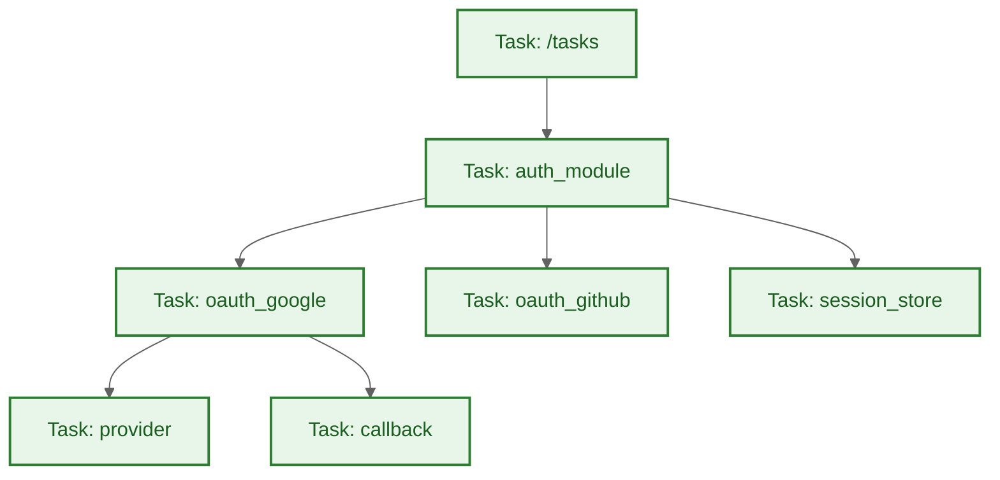
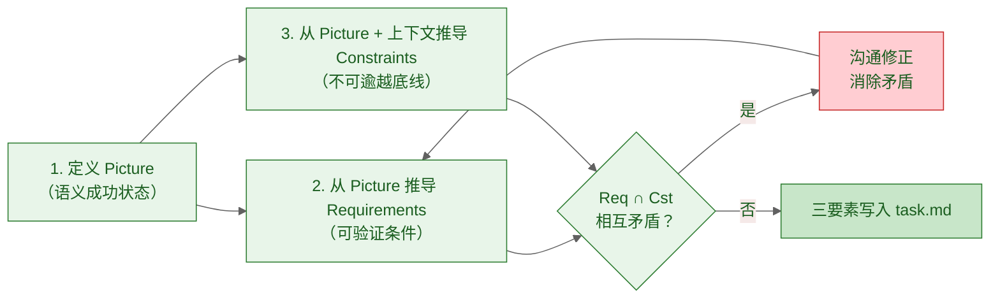
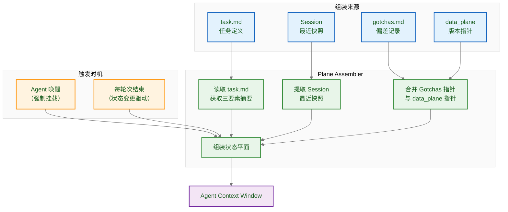
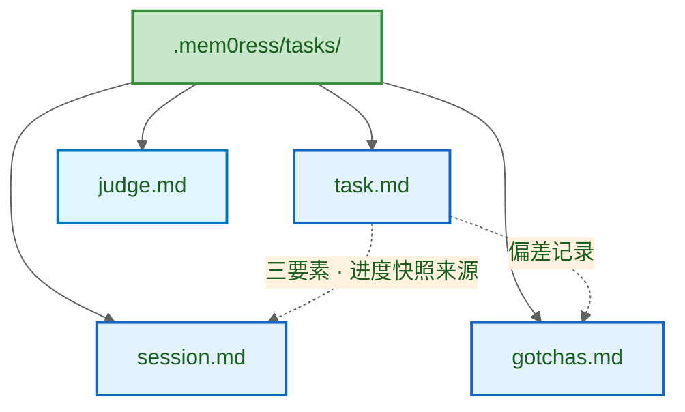
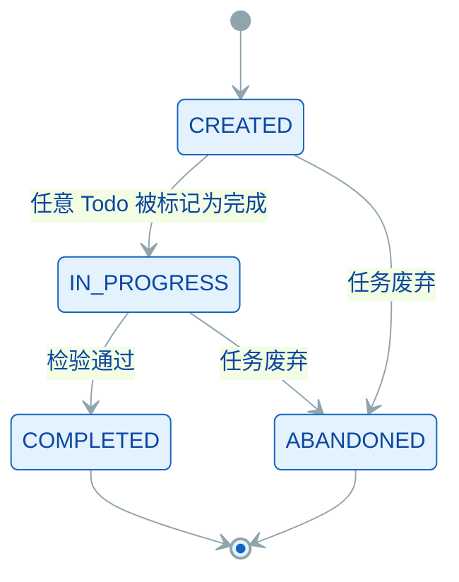

# mem0ress: 认知对齐平面(Cognitive Alignment Plane)架构规约


## 1. 综述 (Overview)

### 1.1 背景

"记忆"这个词暗示了一种向后看、被动式的存储行为。但在真正执行复杂任务时，我们需要的不是"翻找档案"，而是"向前的目标感"和"当下的全局掌控力"。

当前 AI Agent 在"长文本上下文"和"精确检索"之间不断徘徊，催生了三个结构性问题：

* **数据汤困境：** 传统记忆将历史对话、代码片段、废弃架构融合成一锅没有边界的"数据汤"，导致上下文污染和不可逆的熵增。
* **意图迷失：** 数据库本身没有意图。通过追溯历史来拼凑当下，永远无法匹配"向前看"的目标牵引。
* **大模型之上的大模型：** 许多 memory 系统徒增算力消耗，试图用 LLM 总结 LLM 来缓解交互局限，但从未触及"自主管理状态"这一核心问题。

讨论记忆时，我们真正关心的不是过去每一秒的原始画面，而是现在和未来：我们现在在做什么，已经完成了什么，还需要做什么，是否满足需求，是否符合约束，是否达成目标。

我们需要的不是记忆，而是**认知（Cognition）**。

### 1.2 系统定位

**目标用户：** AI/Agent 框架开发者。mem0ress 为开发者提供任务状态管理和目标态势感知能力，而非直接面向终端用户。

mem0ress 是一个**认知对齐平面 (Cognitive Alignment Plane)**。它不是传统意义上的"记忆检索数据库"，也不以二进制或向量方式存储，而是一个基于纯文本的、通过利用已有信息来有效构建目标相关视图、并持续检验执行偏差的逻辑框架。

核心功能是：在任务执行过程中，为 AI Agent 提供清晰的图景与执行约束，确保 Agent 的动作始终与既定需求对齐，防止其在长路径任务中偏离目标。

mem0ress 不试图重现所有记忆，而是让 AI 始终能够保持明确的认知：我是谁、我在做什么、我的目标是什么、我还有什么要做。当前的 AI 已经足够智能，不需要从会话中一遍又一遍检索相似信息，但它往往在多轮会话之后对自己的目标认知产生了偏差。

### 1.3 核心解法概览

mem0ress 将所有认知单元统一为同构的任务节点（Task），每个任务由三个要素定义：Picture（图景）、Requirements（需求）和 Constraints（约束）。三者共同构成判断未来动作是否偏离的绝对标准。在此基础上，系统通过**状态平面**和**数据平面**两个时间切片，以极低的 Token 成本为 Agent 提供实时态势感知。

这一核心解法的认知科学基础和完整推导见第二章。


## 2. 核心洞察

mem0ress 的设计基于三个核心洞察。三个洞察之间存在一条推导链——前一个洞察是后一个洞察的前提。

### 2.1 记忆以目标为锚

**洞察一：记忆以目标为锚，而非以时间为锚。**

人类记忆不是被动记录仪。同一段经历，在不同目标下被提取的内容截然不同——不是因为记忆被篡改了，而是因为提取的线索（目标）不同。这说明记忆的组织方式天然以目标为锚，而非以时间为锚。

认知心理学中，目标导向记忆（Goal-Directed Memory）的研究表明：记忆的编码和检索都依赖于目标线索。相同材料在不同目标下激活完全不同的记忆网络。这直接否定了"被动存储所有对话历史"的做法——存储本身并不产生有用的认知，目标的锚定才能。

这一洞察是整个 mem0ress 设计决策的起点：它否定了"存储优先"的记忆架构，转向"目标锚定的认知架构"。

### 2.2 任务以完成标准为边界

**洞察二：目标若无结构化的完成标准，执行结果无法被验证。**

仅有方向性的目标描述（如"实现用户登录功能"）无法指导执行或判断完成。执行者面临三个无法回避的问题：什么样的状态算成功？需要满足哪些可验证的条件？什么是绝对不可逾越的边界？

传统软件工程的回答是"测试用例通过即完成"。但测试用例通过只验证了预设假设，无法回答"利益相关者真正想要的问题是否被解决了"。需求文档定义的是实现路径，不是目标本身——两者之间的缺口在 AI Agent 场景下变得更加尖锐，因为 AI 能够理解语义而不依赖完整枚举的检验条件。

这意味着需要一种机制来锚定"真正的成功状态"，而不是"符合测试用例"。完成标准必须有结构，能让执行者和判断者独立地做出相同的判断。

更进一步，完成标准的结构必须与任务绑定才能生效——孤立的条件列表没有锚点，无法在执行过程中被追溯、被判断、被验证。

### 2.3 任务需要的是认知，而非记忆

**洞察三：任务真正需要的不是记忆，而是认知。**

当前 AI Agent 的记忆系统在两个极端之间徘徊：要么是无限膨胀的对话历史（上下文污染），要么是精确但孤立的向量检索（只能回答被问到的问题）。两者都在试图回答"我之前见过什么"，却回避了一个更根本的问题——任务执行过程中，Agent 最需要的是对当前目标、进度和偏差的清晰感知。这种感知无法通过积累更多历史数据来获得，因为数据再多也无法替代判断力。

这意味着对 Agent 而言，真正稀缺的不是更多信息，而是**一种能让自己随时判断"我在哪、目标偏没偏、还差什么"的能力**。记忆系统存储的是过去，认知系统回答的是当下。一个始终知道"我现在在做什么任务、目标是什么、已完成哪些步骤"的 Agent，对任务的掌控力远强于一个存储了十年对话的 Agent——不是因为它记得更多，而是它能判断更多。

这条推导链决定了整篇规范的叙事结构——理解它，就能理解 mem0ress 为什么是这样设计而不是那样。

---

## 3 设计决策


### 3.1 选择任务作为认知单元

洞察一否定了以时间为锚的记忆架构，洞察三指明了任务需要认知而非存储。这两者共同推导出一个结论：认知系统应以任务（Task）为唯一单元。事件记忆（Episodic Memory）比语义记忆更牢固、更易提取，原因在于事件天然封装了目标、行动、结果和上下文——这些维度共同提供了认知的边界和检索线索。孤立的知识点或对话片段没有这种结构，它们既没有目标锚点，也没有可判断的边界，无法成为可靠的认知单元。

每个任务封装目标、可验证条件、不可逾越边界和执行进度——四者的组合使得任务在任意时刻都有一个可判断的状态。同构性是关键的设计选择：如果认知单元种类繁多（里程碑、史诗、故事点、子任务），系统需要为每种类型设计不同的处理逻辑，认知负载倍增。统一的任务模型在任何粒度下都适用，系统复杂性维持在常数级别。

以目录树表达任务层级。父任务目录下嵌套子任务目录，目录深度即依赖关系——`ls` 就能看到边界，不需要额外的状态聚合。

所有认知单元同类同构：父任务是 Task，子任务也是 Task，递归下去每一层都是 Task。没有里程碑、没有史诗、没有故事点，只有 Task。同构性使认知网关只需要一套解析逻辑。认知唯一：对于一个任务，没有两份认知同时存在的状态，不讨论新旧与变更，只维护一份认知。



### 3.2 选择PRC作为任务检验要素

任务检验需要结构化的要素。三个要素既在创建时锚定完成标准，也在检验时提供判断依据——让执行者和判断者独立地做出相同的判断。因此为每个任务定义三个要素：Picture（语义成功状态）、Requirements（可验证条件）、Constraints（不可逾越底线）。

定义顺序：先定 Picture，再从 Picture 推导出 Requirements 和 Constraints。三者都定义完之后检查有没有矛盾——若存在矛盾，在多轮沟通中引导协作者修正，直到矛盾消除，三要素写入 task.md。

### 3.3 选择双重平面来呈现认知

任务需要同时掌握两个不同维度的事实：做到了什么（数据层面）和推进到哪里（执行层面）。两个问题认知性质不同，必须分开处理。详见 §4.2。

三个核心动作按固定顺序执行：认知构建 → 任务检验 → 状态更新。认知构建先于任务检验，任务检验先于状态更新。

### 3.4 选择状态变更驱动认知构建

每轮次结束时，Agent 感知本轮任务内容的状态变更，并基于此更新对任务的认知。系统检测本轮中发生的任务相关变化——Todo 完成状态变化、Constraints 违反记录、Requirements 满足情况、任务状态转移、子任务关闭、新偏差追加——并将这些变化写入 Session 快照。Plane Assembler 从 Session 中提取最新快照，组装为状态平面挂载到 Agent 上下文，使 Agent 在下一轮开始时立即掌握当前任务态势。

认知构建以轮次为周期，感知→构建→挂载构成完整闭环。只记录导致目标推进或路径修正的状态变更，不记录过程录像。

**纯文本持久化的设计理由：** 见 §4.4 文档数据模型。

mem0ress 只管一件事：认知的生命周期管理，也就是任务的创建、检验与认知态势的构建。大模型沙箱隔离、并发控制这些，都交给宿主操作系统。

mem0ress 不是回答问题的引擎，而是呈现状态的窗口。它在任何时刻都完整构建当前认知的所有要素——任务树在哪、做到哪了、约束有没有被触碰、目标偏了没有。不做相关性排序，不挑选，不截断。

---

## 4. 概念与设计

mem0ress 的概念体系围绕任务展开。本章描述任务的核心概念、两种平面的构成、生命周期以及数据模型。

### 4.1 PRC——任务三要素

每个任务由三个要素定义：Picture、Requirements、Constraints。三者共同构成判断执行是否偏离的绝对标准。

**Picture（图景）**是语义层面的成功状态。利益相关者能想象的目标，而不是实现路径。比如"用户不用输入密码就能登录"是 Picture，"用 OAuth 2.0 实现登录"是实现路径，不是 Picture。Picture 写得再好，如果利益相关者无法想象它描述的状态，就失去了锚定作用。

**Requirements（需求）**是可验证的通过/失败条件。Agent 依据 Picture 推导，利益相关者确认。每个 Requirement 都必须有明确的验收标准——"界面美观大方"这种依赖主观判断的不是有效的 Requirements。

**Constraints（约束）**是绝对不可逾越的底线。Agent 联合领域知识推导，利益相关者确认。违反时系统必须能检测到并拦住——如果系统感知不到，就不适合作为 Constraints，应该放到 Requirements 里。

三要素的定义角色如下：

| 要素 | 主要定义者 | 参与者 |
|------|-----------|--------|
| Picture | 利益相关者（用户、业务负责人） | Agent 辅助提炼 |
| Requirements | Agent（基于 Picture 推导） | 利益相关者确认 |
| Constraints | Agent + 领域知识 | 利益相关者确认 |

定义顺序固定：先定 Picture，再推导 Requirements 和 Constraints。三者都定义完之后检查有没有矛盾——若存在矛盾，在多轮沟通中引导协作者修正，直到矛盾消除，三要素写入 task.md。



Picture / Requirements / Constraints 存在于 task.md 里，不在别处重复记录。状态平面只展示摘要，不展开全文。

### 4.2 双重平面

任务需要同时掌握两个不同维度的事实，认知性质不同，必须分开处理。

| | 状态平面（Status Plane） | 数据平面（Data Plane） |
|---|---|---|
| 回答 | "我在哪、做到哪了、目标偏了没有" | "当前操作的是哪个版本的代码" |
| 挂载时机 | Agent 唤醒时强制挂载 | 按需展开，不默认加载 |
| 内容 | 任务树结构、Todo 完成度、任务状态、Gotchas 指针、Session 最近变化指针 | 各仓库当前 commit ID（格式 `{repo_name}: "{commit_id}"`） |
| 组装来源 | task.md、Session 历史切片、Data Plane 版本指针、Gotchas | Session 每轮快照的 `data_plane` 字段 |

**Plane Assembler 的触发与组装机制：** Plane Assembler 在两个时机执行组装——一是 Agent 唤醒时（强制挂载状态平面到上下文），二是每轮次结束时（检测本轮状态变更，将变化写入 Session 快照）。组装过程为：读取 task.md 获取任务定义和 Picture/Requirements/Constraints 摘要 → 提取 Session 中最近的状态快照 → 合并 Gotchas 指针和 data_plane 版本指针 → 组装为状态平面挂载到 Agent 上下文。只输出当前状态，不做偏差判断。

Picture / Requirements / Constraints 存在于 task.md 里，状态平面不显示 PRC 三要素全文，只展示摘要。

两个平面都来源于会话本身——从会话流中 hook 出认知数据，与外部知识（向量数据库、API 文档、全网搜索）完全独立。外部知识属于 Agent 的背景知识，按需检索后体现在会话中，mem0ress 只从会话流提取切片。

Session 是每个 Task 的私有历史，记录每个轮次的状态快照。版本快照模型，只追加不覆盖。它是状态平面内容的数据来源之一，但不等于平面本身——平面是某一时刻的聚合快照，Session 是快照的时间序列。



```mermaid
%% label：状态平面与数据平面的构成
%%{ init: { 'theme': 'base', 'themeVariables': { 'primaryColor': '#e8f5e9', 'primaryTextColor': '#1b5e20', 'primaryBorderColor': '#388e3c', 'lineColor': '#757575', 'secondaryColor': '#fff3e0', 'tertiaryColor': '#fafafa' } } }%%
graph LR
    subgraph SP_Group["状态平面（执行快照）"]
        TID["Task ID"]
        TODO["TODO 进度"]
        STS["Task Status\nCREATED / IN_PROGRESS\nVERIFYING / COMPLETED\n/ ABANDONED"]
        GTA["Gotchas<br/><指针>"]
    end

    subgraph SESSION_Group["Session（数据来源）"]
        HIST["历史快照序列"]
        DPFLD["data_plane\n快照"]
    end

    SP_Group --> AC["Agent Context Window"]
    DPFLD --> AC
    HIST -.->|提供数据| SP_Group
    TID -.->|task.md 提供<br>Picture/Requirements<br>/Constraints| TID
    GTA -.->|指针引用| GREC

    subgraph GOTCHA_Group["gotchas.md（实际存储）"]
        GREC["Gotcha 记录文件"]
    end

### 4.3 任务生命周期

任务从创建到结束经历五种状态：CREATED（三要素已定义，所有 Todo 未开始）、IN_PROGRESS（至少有一个 Todo 已完成）、VERIFYING（任务检验进行中，瞬态）、COMPLETED（目标达成）、ABANDONED（目标放弃）。

状态转换规则：CREATED → IN_PROGRESS（任意 Todo 被标记为完成）；CREATED → ABANDONED（任务废弃）；IN_PROGRESS → COMPLETED（检验通过）；IN_PROGRESS → ABANDONED（任务废弃）。

```mermaid
%% label：Task 生命周期状态机
%%{ init: { 'theme': 'base', 'themeVariables': { 'primaryColor': '#e3f2fd', 'primaryTextColor': '#0d47a1', 'primaryBorderColor': '#1565c0', 'lineColor': '#90a4ae' } } }%%
stateDiagram-v2
    [*] --> CREATED
    CREATED --> IN_PROGRESS : 任意 Todo 被标记为完成
    CREATED --> ABANDONED : 任务废弃
    IN_PROGRESS --> COMPLETED : 检验通过
    IN_PROGRESS --> ABANDONED : 任务废弃
    COMPLETED --> [*]
    ABANDONED --> [*]
```

> **注：** VERIFYING 是瞬态，存在于检验执行期间，检验完成后立即转换到 COMPLETED 或 ABANDONED，不作为独立稳定状态存在于图中。

**任务检验**在认知构建之后执行，判断当前状态是否满足 Picture。检验按四层关卡执行：

* **Tier 0: Constraints 检查。** 检查 Constraints 是否被违反，若有违反报告违反事实，由主 Agent 决定是否修复及如何修复。
* **Tier 1: Todo 完成检查。** 检查所有 Todo 步是否已完成、所有直接子任务是否已关闭。子任务处于 COMPLETED 或 ABANDONED 状态即为已关闭。
* **Tier 2: Requirements 满足检查。** 验证每个 Requirement 是否达标。
* **Tier 3: Picture 语义对齐检查。** 读取 Picture 与实际产出，执行语义对齐判断。Tier 3 由 Agent 主动判断是否需要启用，适用于：Picture 涉及主观判断或利益相关者感知时、Constraints 与 Picture 之间存在语义歧义时。

检验完成后 Agent 自主决策下一步。检验通过 → Agent 可标记任务完成；检验未通过 → Agent 决定下一步（修正、重试或废弃）。

### 4.4 文档数据模型

mem0ress 采用纯文本持久化 + 运行时组装的数据模型。认知数据以 Markdown 文件形式存储在文件系统，运行时由 Plane Assembler 按需组装为状态平面。

**四个核心文档**：

* **task.md**：任务声明，Picture/Requirements/Constraints 的唯一真源。任务创建时写入，运行时以它为准。
* **session.md**：轮次快照序列，含 data_plane 快照。每轮次结束后按时间追加，不改变 task.md。
* **gotchas.md**：偏差记录，带外追加，不阻塞主流程。偏差确认后追加。
* **judge.md**：Judge Agent 任务文件，与 Task 生命周期同步。judge.md 与 Task 节点并列平铺于同一任务目录下，不属于 Task 的物理子节点——它属于 Judge Agent 的物理文件，与 Task 同级并行。任务创建时生成，检验后更新。

task.md 是锚，三要素从它读取；Session 提供进度数据和 data_plane 快照，支撑认知构建；Gotchas 记录偏离，供后续复盘追溯；judge.md 承载任务检验逻辑，与 Task 生命周期同步。

纯文本持久化有三个原因：消除隐藏状态（所有数据可直接读取和修改，外部工具 git、grep、编辑器可直接操作）、时间切片而非可变状态（快照追加，不存在数据汤问题）、与 Agent 工具生态无缝衔接（文件工具天然支持，无需额外 SDK）。


Task、Session、Gotchas、Judge 文件的模板见`docs/templates`。

```plaintext
.mem0ress/tasks/
└── {task_id}/
    ├── task.md       # 任务声明（Picture/Requirements/Constraints/Todo）
    ├── session.md    # 轮次快照序列（含 data_plane 快照）
    ├── gotchas.md    # 偏差记录（追加式）
    └── judge.md      # Judge Agent task 文件
```

这一设计的局限：不支持需要事务语义的多步原子操作，所有一致性保证依赖调用方遵守组装协议。

---

## 5. 逻辑与流程设计 

Task 的执行循环围绕三个核心动作展开：认知构建、任务检验和状态更新。这三个动作在每个轮次结束后依次执行，构成完整的感知-判断-更新闭环。

### 5.1 任务创建

任务创建是确立认知边界的起点。Agent 在创建任务或子任务时，首要目标不是写代码，而是明确定义任务的 Picture、Requirements 和 Constraints。三要素的定义应从 Picture 开始——先定义 Picture 作为目标锚，再从中推导出 Requirements 和 Constraints。冲突检测在三者全部定义后进行——若 Requirements 与 Constraints 相互矛盾，在多轮沟通中引导协作者修正，直到矛盾消除，三要素写入 task.md。

Todo 步进拆解：在锚定三要素后，Agent 将任务拆解为具体的机械步（Todo）。这些 Todo 构成了后续检验进度的基准线。

### 5.2 认知构建

认知构建是轮次结束后生成状态平面快照的动作。它在任何节点（刚启动时、执行中、或检验失败后）都需要执行，为 Agent 提供当前任务的可判断状态。

状态平面是认知构建的产出物，具有以下特性：只输出当前状态，不做偏差判断；实时扫描，每次调用直接读文件系统，不缓存；全面覆盖，显示所有任务，不隐藏任何节点；非侵入，只读不写，不改变任何状态。

状态平面的显示内容包括：任务树结构（父子关系）；每个任务的 todo 完成度（如 "2/3 Todos 完成"）；任务状态（CREATED / IN_PROGRESS / COMPLETED / ABANDONED）；偏差记录（Gotchas）指针；Session 最近变化指针（指向 Session 中最近的状态快照位置，供 Agent 按需追溯）。Picture/Requirements/Constraints 从 task.md 获取，不显示在状态平面中。

Session 快照是认知构建的数据来源。每个轮次的状态快照记录 code_progress、docs_progress、todos 和 status。Session 采用版本快照模型，只追加不覆盖。

### 5.3 任务检验

任务检验在认知构建之后执行，负责判断当前状态是否满足 Picture。检验在轮次结束后自动触发，是只读操作，不执行写操作。

**四层关卡（Tiers）：**

任务检验按顺序执行以下四层关卡。其中 Tier 0/1/2 为客观检验条件，由 Judge Agent 自动执行并判断是否通过，无需主 Agent 主观决策；Tier 3 为语义对齐关卡，由 Agent 根据任务属性决定是否启用。

* **Tier 0: Constraints 约束检查。** 检查 Constraints 是否被违反，若有违反报告违反事实，由主 Agent 决定是否修复及如何修复。
* **Tier 1: Todo 完成检查。** 检查所有 Todo 步是否已完成、所有直接子任务是否已关闭。子任务处于 COMPLETED 或 ABANDONED 状态即为已关闭；处于 CREATED 或 IN_PROGRESS 状态则视为未完成。
* **Tier 2: Requirements 满足检查。** 验证每个 Requirement 是否达标。
* **Tier 3: 语义对齐检查。** 读取 Picture 与实际产出，执行语义对齐判断。Tier 3 需要 Agent 主动判断本次检验是否需要语义对齐，以下情况适用：Picture 涉及主观判断或利益相关者感知时；Constraints 与 Picture 之间存在语义歧义时；Agent 或利益相关者显式请求时。

例如：一个 Picture 是"用户无需输入密码即可登录"的 OAuth 任务，Tier 1 检查了所有 Todo 是否完成，Tier 2 验证了"支持 Google OAuth"和"支持 GitHub OAuth"这两个 Requirements 都满足，但 Tier 3 额外检查了"实际登录流程中用户确实没有被要求输入密码"——这个检查无法通过代码结构验证，必须看实际行为，属于语义对齐。

**决策执行规则：**

检验完成后结果写入 `judge.md`，由主 Agent 从 `judge.md` 读取并决策下一步。任务完成后是否标记完成，由 Agent 自主决定。ABANDONED 由 Agent 主动标记，与检验结果无关。

检验通过 → Agent 可标记任务完成；检验未通过 → Agent 决定下一步（修正、重试或废弃）。

### 5.4 状态更新

状态更新将检验结果反映到 Task 状态，并处理决策执行。

**状态机：**

Task 生命周期包含五种状态：

- **CREATED**：三要素已定义，所有 Todo 均未开始
- **IN_PROGRESS**：至少有一个 Todo 已完成，执行中
- **VERIFYING**：任务检验进行中，瞬态，不能持续
- **COMPLETED**：目标达成，认知生命周期结束
- **ABANDONED**：目标放弃，记录 Gotcha 经验

状态转换规则：CREATED → IN_PROGRESS（任意 Todo 被标记为完成）；CREATED → ABANDONED（任务废弃）；IN_PROGRESS → COMPLETED（检验通过）；IN_PROGRESS → ABANDONED（任务废弃）。



> **注：** VERIFYING 是瞬态，存在于检验执行期间，检验完成后立即转换到 COMPLETED 或 ABANDONED，不作为独立稳定状态存在于图中。

**决策执行：**

检验完成后 Agent 自主决策下一步。


---

## 6. FAQ

### Q: 为什么我们需要的是"认知"而不是"记忆"？
A: 记忆是向后看（Retrospective）、被动式的存储行为。mem0ress 不是检索过去对话的存储系统，而是**前向的认知系统**，维持 AI 对当前目标、进度和认知缺口的 awareness。核心区分：传统记忆问"我们之前讨论了什么"，认知框架问"我要达成什么目标？我离目标还有多远？我还需要做什么？"

### Q: 为什么采用任务模型，以及一切皆任务？
A: 任务模型（Task Model）是认知对齐平面的基本单元。将一切视为任务带来以下优势：
- **同构性**：所有认知单元（Task）拥有相同结构，降低解析复杂度
- **可分解性**：复杂目标拆解为子任务，物理上通过目录深度表达依赖关系
- **可验证性**：每个 Task 都有明确的完成标准（Picture），便于检验
- **无冲突设计**：父任务完成以其所有子任务完成为绝对前提，避免并发冲突

### Q: 为什么任务没有冲突协调机制？
A: mem0ress 的设计遵循**冲突只能避免，无法解决**的哲学原则（来自 MetaDev 规范的哲学四）。协调机制是试图在冲突发生后解决它，但更好的做法是通过设计使冲突根本不发生。

mem0ress 通过以下设计消除冲突：
- **物理隔离**：不同任务处于不同目录，父任务目录下嵌套子任务目录，通过目录深度表达依赖关系
- **顺序保障**：父任务必须等待所有子任务完成后才能完成
- **继续拆分原则**：当两个任务出现冲突时，正确的处理方式是继续拆分任务直到冲突消除，而非引入协调机制

冲突出现时，不是记录下来等待解决，而是追溯到任务定义层面，重新划分边界直到冲突消除。如果确实无法继续拆分，则让度给人确认。

### Q: 为什么使用状态平面与数据平面？
A: 双平面设计实现认知与数据的分离：
- **状态平面：** 任务执行状态的聚合快照（Todo 进度、代码产出、文档进度、组件状态等）
- **数据平面：** 所有相关数据的 commit ID 快照

两者都是时间切片，而非组件。这种分离让 Agent 始终以极低 Token 成本了解"现在在哪"和"离目标还有多远"。

### Q: 为什么状态平面没有回溯？
A: 状态平面是任一时刻的执行快照，不是历史记录。这是设计上的刻意选择：
- **认知效率：** Agent 每次获取的是当前真相，而非沉积的变更历史
- **绝对可观测性：** 基于纯文本和目录树，Agent 可直接读取，无需版本遍历

若需历史演进，Session 提供版本快照模型用于追踪。

### Q: 为什么 Picture（图景）是完成标准，而不是 Requirements、Constraints 或者子任务清单？
A: Picture 是语义层面的成功状态，Requirements 是可验证的指标，Constraints 是不可逾越的底线，子任务清单是执行路径：
- **Picture vs Requirements**：即使所有 Requirements 满足，Picture 可能未达成（如"用户说还是慢"）
- **Picture vs 子任务**：子任务是路径而非目的地，完成所有子任务不等于达成目标
- **Picture vs Constraints**：Constraints 是底线，Picture 是目标，两者维度不同

Picture 作为完成标准防止"勾选心态"——Agent 不会在完成所有条目后仍然错失实际需求。

### Q: 什么是"数据汤"困境，mem0ress 如何避免？
A: 数据汤（Data Soup）发生在记忆系统将所有信息存入无结构的池子时：信息失去边界、新旧混杂、无法区分当前与过时，导致上下文污染和熵增。

mem0ress 通过以下机制避免：
- **目标锚定**：信息仅在与活跃 Task 关联时才有意义，失去目标指向的信息视为噪音，不予投影到当前平面
- **认知来源隔离**：mem0ress 的认知数据来源于会话 hook，不管理也不依赖外部知识（向量数据库/API 文档/全网搜索）——外部知识属于 Agent 的背景知识，Agent 按需检索后体现在会话中，mem0ress 只从会话流提取切片
- **生命周期一致**：认知与任务关联，任务完成则认知生命周期结束

---

## 附录 A: 状态与节点

#### 状态表 (State Table)

| State | 说明 |
|-------|------|
| `CREATED` | 任务已创建，三要素已定义，所有 Todo 均未开始 |
| `IN_PROGRESS` | 任务进行中，至少有一个 Todo 已完成 |
| `VERIFYING` | 任务检验进行中，瞬态，检验完成必须离开此状态 |
| `COMPLETED` | 目标达成，认知生命周期结束 |
| `ABANDONED` | 目标放弃，记录 Gotcha 经验 |

#### 节点表 (Node Table)

| Node | 说明 |
|------|------|
| `Turn N` | 轮次节点（1.1, 1.2, 2.1...）。每轮次记录状态快照（code_progress/docs_progress/todos/status），由系统在轮次结束时自动追加。不含 Picture/Requirements/Constraints（从 task.md 获取） |
| `Task` | 认知单元，包含 task.md、session.md、gotchas.md 三个物理子节点；judge.md 与 Task 并列平铺，不属于 Task 的子节点 |
| `Subtask` | 子任务节点，嵌套于父任务目录下。通过目录深度表达依赖关系，父任务完成以所有子任务完成为前提 |
| `Judge Agent` | 伴生组件，执行任务检验；Judge Agent 节点与 Task 节点并列平铺于同一任务目录下，judge.md 是其物理文件 |
