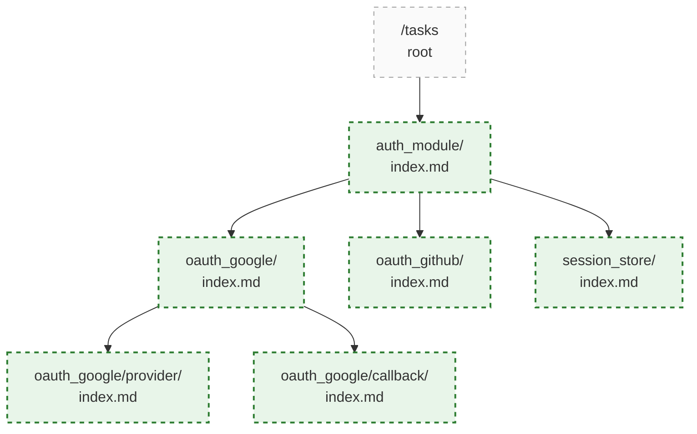
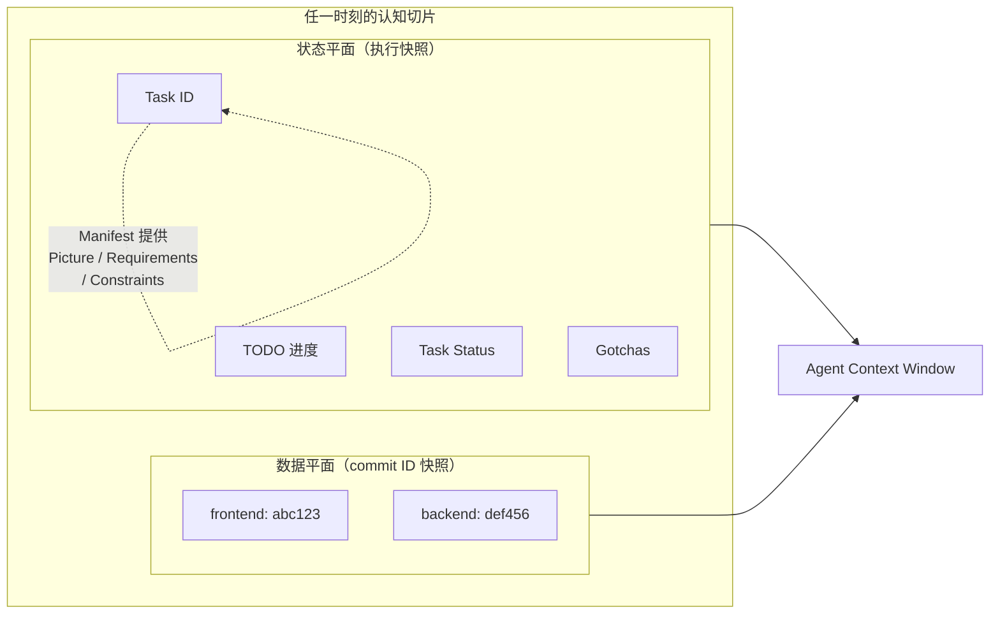
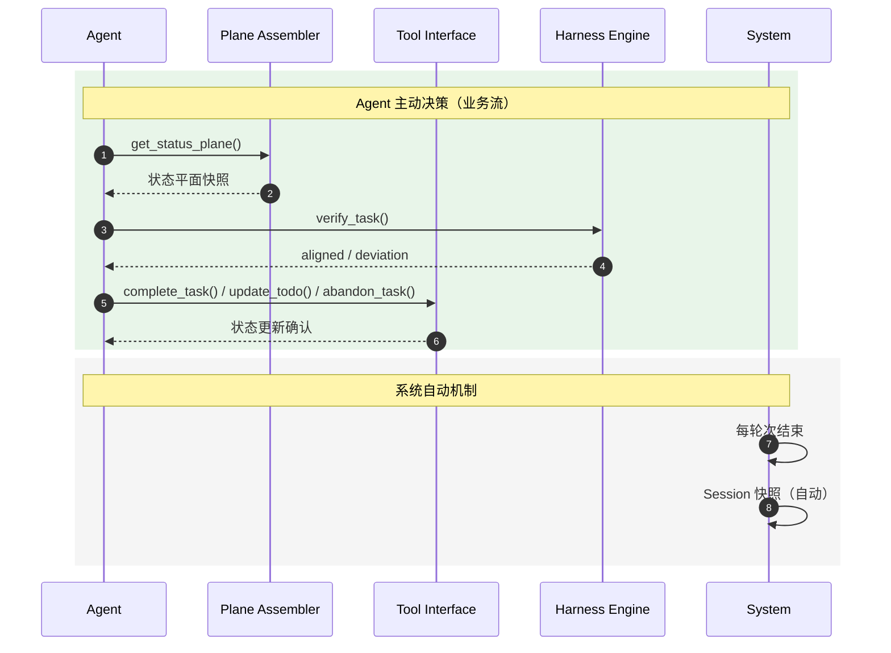

# mem0ress: 认知对齐平面(Cognitive Alignment Plane)架构规约

**版本:** v3.5 (Master Blueprint)
**定位:** 辅助 AI Agent 构建目标态势并校准执行偏差的轻量级工具框架

## 1. 综述 (Overview)

### 1.1 背景

"记忆"暗示了一种向后看（Retrospective）、被动式的存储行为。在真正执行复杂任务时，我们需要的不是"翻找档案"，而是"向前的目标感"和"当下的全局掌控力"。

当前 AI Agent 在"长文本上下文"和"精确检索"之间不断徘徊，催生了三个结构性问题：

* **数据汤困境：** 传统记忆将历史对话、代码片段、废弃架构融合成一锅没有边界的"数据汤"，导致上下文污染（Context Collapse）和不可逆的熵增。
* **意图迷失：** 数据库本身没有意图。通过追溯历史来拼凑当下，永远无法匹配"向前看"的目标牵引。
* **大模型之上的大模型：** 许多 memory 系统徒增算力消耗，试图通过 LLM 总结 LLM 来缓解交互局限，但从未触及"自主管理状态"这一架构核心。

当我们讨论记忆时，真正关心的不是过去每一秒的原始画面，而是当前和未来：我们现在在做什么（Task），已经完成了什么（状态平面），还需要做什么（Todo），目标是什么（Picture），当前是否偏离了目标（Constraints）。

我们需要的不是记忆，而是**认知（Cognition）**。

### 1.2 系统定位

**目标用户：** AI/Agent 框架开发者。mem0ress 为开发者提供任务状态管理和目标态势感知能力，而非直接面向终端用户。

mem0ress 是一个**认知对齐平面 (Cognitive Alignment Plane)**。它不是传统意义上的"记忆检索数据库"，也不以二进制或向量方式存储，而是一个基于纯文本的、通过利用已有信息来有效构建目标相关视图、并持续检验执行偏差的逻辑框架。

其核心功能是：在任务执行过程中，为 AI Agent 提供清晰的意图边界（Picture）与执行约束（Constraints），确保 Agent 的动作始终与既定需求对齐，防止其在长路径任务中偏离目标。

mem0ress 不试图重现所有记忆，而是使 AI 始终能够保持明确的认知：我是谁、我在做什么、我的目标是什么、我还有什么要做。当前的 AI 已经足够智能，不需要从会话中一遍又一遍检索相似信息，但它往往在多轮会话之后对自己的目标认知产生了偏差。

### 1.3 核心解法：认知切片分离

mem0ress 将信息流拆分为两个时间切片：

* **状态平面 (Status Plane)：** 任一时刻，任务相关的所有执行状态（Todo 进度、代码产出、文档进度、组件状态等）的聚合快照。它是前向的、不断更新的，负责告诉 Agent"现在在哪"以及"离目标还有多远"。
* **数据平面 (Data Plane)：** 任一时刻，所有相关数据的 commit ID 快照。它是每一时刻状态的客观物理承载，顺着状态平面的指针按需路由挂载。

两者都不是组件，而是时间切片。状态平面定义"此刻任务走到了哪"，数据平面定义"此刻相关数据是什么版本"。

通过这种分离，系统能够以极低的 Token 成本，让 Agent 始终保持对目标的关注，并能在**任务创建、任务检验与认知构建**的严密心智循环中，快速发现并修正偏差。

## 2. 设计理念

mem0ress 的诞生，源于对当前 AI Agent 发展路径的底层反思。我们拒绝将 RAG（检索增强生成）等同于 AI 的大脑，摒弃传统的“被动记忆检索”理念。mem0ress 的架构设计并非为了优化数据的存储与查询，而是为了给自主 Agent 构建一个具备前瞻性（Forward-looking）的心智模型（Mental Model）。

系统的运转建立在以下四大核心理念之上：

### 2.1 目标锚定 (Goal-Anchored)：目的论认知

**没有悬空的数据孤岛，信息必须为意图服务。**

在传统基于向量的记忆设计中，信息是游离的，系统通过算力去大海捞针。但在 mem0ress 中，认知遵循严格的“目的论（Teleology）”。任何被引入平面的信息必须有明确的目的。系统不存储无关的零散数据，仅记录与任务目标直接相关的认知增量。失去目标指向的信息被视为噪音，不予投影到当前平面。

### 2.2 认知而非记忆：记录“状态突变” (Cognitive Delta)

**放弃记录流水账，对抗上下文熵增。**

人类的大脑之所以高效，是因为它懂得遗忘过程，只铭记结果。系统不记录 Agent 执行过程中的所有流水账，仅记录导致目标推进或路径修正的“状态突变（Delta）”。通过记录认知切片而非过程录像，有效控制上下文规模。

### 2.3 同构的认知单元：分形树状结构 (Isomorphic Task Unit)

**用最极简的实体，构建无限复杂的意图宇宙。**

任务被拆解为同构的单元（Task）。每个子任务都拥有独立的清单文件（Manifest），物理上通过目录深度表达依赖关系。父任务的完成必须以所有子任务的对齐为前提。

这种同构设计解决了复杂意图管理中的三个核心问题：

**解析一致性：** 认知网关只需处理一种类型的节点（Task）。无论任务是"实现登录模块"还是"修复安全漏洞"，系统使用完全相同的解析逻辑。这比异构结构（不同节点类型需要不同处理逻辑）大大降低了复杂度。

**分形扩展：** 分形意味着自相似——树的每一层节点拥有与顶层相同的结构，只是粒度不同。"用户认证"任务的 Manifest 与"实现 OAuth 提供商"子任务的 Manifest 结构完全一致。这使得任务分解不需要额外的结构设计工作，分解过程本身是机械的。

**依赖表达的物理化：** 父任务目录下嵌套子任务目录，通过目录深度而非数据库外键表达依赖关系。这使得依赖的可见性不需要查询——`ls` 即是最直接的展示。"父任务是否完成"等价于"子任务目录是否全部关闭"，无需额外的状态聚合查询。



### 2.4 三层物理隔离 (The CPU-RAM-Disk Model)

**三层物理隔离**是对 L1/L2/L3 的功能分类描述，不是另一套独立的分层体系：

* **CPU = LLM (Agent)：** 处理枢纽，负责理解、推理、决策与执行。
* **RAM = L1 + L2 (mem0ress)：** 工作内存，维持高频、强状态的认知切片（状态平面 + 数据平面）。
* **Disk = L3 (外部知识库)：** 无状态的客观数据，外部向量数据库、API 文档、全网知识。

外部数据绝不直接流入工作内存。Agent 必须先检索、理解，再蒸馏内化为服务于目标的经验，才能写入 RAM。

> **注：** 状态平面和数据平面都是时间切片，不是组件。图中的 Status Plane / Data Plane 指的是"某一时刻的切片内容"，而非独立的进程或服务。

```mermaid
%% label：三层物理隔离（L1/L2/L3 的功能映射）
graph TD
    subgraph L3 ["L3 / Disk (外部知识库)"]
        direction TB
        VectorDB[(向量数据库)]
        API[API 文档]
        Web[全网搜索]
    end

    subgraph L1 ["L1 / CPU (Agent 处理枢纽)"]
        LLM((LLM))
    end

    subgraph L2 ["L2 / RAM (mem0ress 本体)"]
        direction TB
        StatusSlice["状态平面<br>(任务执行快照)"]
        DataSlice["数据平面<br>(commit ID 快照)"]
    end

    L3 -- "检索与阅读" --> LLM
    LLM -- "蒸馏内化" --> L2
    L2 -- "挂载切片" --> L1
    L1 <==> "高频交互" --> LLM

    classDef l1 fill:#e1f5fe,stroke:#01579b,stroke-width:2px;
    classDef l2 fill:#e8f5e9,stroke:#2e7d32,stroke-width:2px;
    classDef l3 fill:#fafafa,stroke:#9e9e9e,stroke-width:1px,stroke-dasharray:5 5;
    class LLM l1;
    class StatusSlice,DataSlice l2;
    class VectorDB,API,Web l3;
```

以上四大理念，共同构成了 mem0ress 的设计哲学。以下工程准则，是将上述理念落实为具体约束的实践规范——违反这些准则，即等同于违反第二章的设计初衷。

## 3. 工程准则

### 3.1 单一事实来源与绝对覆写 (SSOT & Absolute Overwrite)

拒绝模糊的认知合并。新认知产生时，直接对旧认知进行绝对覆写（Overwrite）。系统在覆写前提供严格的冲突检查机制，确保认知的确定性。

### 3.2 系统级卸责 (System-Level Offloading)

mem0ress 只专注一件事：认知的生命周期管理，即任务的创建、检验与认知态势的构建。大模型沙箱隔离、并发控制等底层复杂性，均交由宿主操作系统解决。

### 3.3 反黑盒与绝对可观测性 (Anti-Blackbox & Absolute Observability)

可观测性（Observability）不仅仅是"能看到日志"，而是"从输出推断内部状态"的能力。传统记忆系统是黑盒：Agent 无法直接知道系统内部的认知状态，只能通过 API 返回的结果猜测——而这些结果往往已经过蒸馏和裁剪，失去了原始上下文。

mem0ress 的解法是**零中介**：系统完全建立在"目录树 + 纯文本（Markdown/YAML）"之上，没有任何私有格式或隐藏状态。

这带来三个具体优势：

- **直接读取，无损透明：** Agent 可以直接 `cat` 任意清单文件，看到的与系统存储的完全一致。没有任何 API 层对内容做截断或改写。
- **版本控制，原生可审计：** 所有认知产物（Manifest、Session、Gotchas）均在 Git 版本控制之下，任何变更均可追溯到具体的人和轮次。
- **结构即语义，工具无绑定：** 目录深度表达依赖关系，文件名承载类型语义。Agent 不需要特殊工具就能理解和导航整个认知空间。

这与传统的"向量数据库 + 检索"模式形成鲜明对比：后者将原始信息编码为高维向量，检索时再解码——这个过程本身就是信息损失。而 mem0ress 的文本永远保持人类可读和机器可解析的双重 fidelity。

## 4. 概念：认知与态势感知 (Cognitive Concepts)
### 4.1 认知三要素 (The Cognitive Triad)

认知三要素是 mem0ress 的语义核心。任何任务若缺失其一，都无法构成完整的判断标准——系统将无法回答"成功是什么"、"如何验证"、"什么不可为"这三个根本问题。

**图景 (Picture)：任务完成后的终极成功状态。**

Picture 是语义层面的定性描述，回答"做成什么样"。它不是功能清单，不是实现路径，而是利益相关者（用户、业务负责人、评审者）眼中那个可感知的成功画面。Example：一个 OAuth 模块的 Picture 可能是"用户可以以其公司邮箱登录系统，且管理员可在后台查看所有登录记录"。即使所有代码写完、测试全绿，只要利益相关者感知到"还是不能登录"或"记录查不到"，Picture 即未达成。

**需求 (Requirements)：抵达图景的可验证硬性指标。**

Requirements 是 Picture 的客观可达条件，回答"怎么证明成功了"。每一个 Requirement 都必须可独立验证（有明确的通过/失败判定）。Example：继续上面的 OAuth 模块——"支持 Google Workspace SSO"、"登录失败错误提示不超过 3 秒"、"后台登录日志保留 90 天"这些都是可自动化检验的指标。Requirements 与 Picture 的关系是：Requirements 是 Picture 的必要条件，达成 Picture 必须首先满足所有 Requirements。

**约束 (Constraints)：执行任务时绝对不可逾越的底线。**

Constraints 定义的是红线，回答"什么绝对不能做"。与 Requirements（推动进度向前）不同，Constraints 的作用是"刹车"——一旦违反，系统必须阻断。Example："不许存储明文密码"、"Access Token 有效期不得超过 1 小时"、"用户数据不得跨区域同步"。Constraints 与 Requirements 可能冲突（例如"需支持离线使用"与"数据不得离开设备"），冲突在任务构建阶段即被发现并标记，而非等到执行阶段才暴露。

**三者的动态关系：**

三要素在任务生命周期中承担不同角色。构建任务时，**先定义 Requirements，再定义 Constraints**——因为 Constraints 是冲突检测的锚点，若 Requirements 与 Constraints 相互矛盾，任务在创建时即被标记为不可行。Picture 位于最高层，指导 Requirements 的制定，而 Requirements 反过来校验 Picture 的可达性。整个过程中，三者互相约束，任何一方的变化都可能影响其他两者。

### 4.2 认知切片 (Cognitive Slices)

mem0ress 在任一时刻都持有两个时间切片：

**状态平面 (Status Plane)：** 任务相关的所有执行状态的聚合快照。包括：
- 任务树结构（父子关系）
- 每个任务的 todo 完成度（如 "2/3 Todos 完成"）
- 任务状态（CREATED / IN_PROGRESS / COMPLETED / ABANDONED）
- 偏差记录（Gotchas）
- Session 最近变化摘要

Agent 唤醒时强制挂载，**纯展示，不做诊断**。

**数据平面 (Data Plane)：** 所有相关数据的 commit ID 快照。包括：
- 各仓库当前 commit ID 映射
- 长篇文档（PRD、设计稿等）的版本指针

顺着状态平面的指针**按需水化挂载**，不默认加载。

**Session：** 每个 Task 的私有历史，记录每个轮次的状态快照。版本快照模型，只追加不覆盖。Session 记录执行进度（代码写到哪、文档完成多少、TODO 状态），不记录 Picture/Requirements/Constraints（这些从 TaskManifest 获取）。



## 5. 物理文档模型 (Document Model)
系统使用文件树表达认知的从属关系与上下文边界。

```plaintext
.mem0ress/
└── tasks/
    └── auth_module/
        ├── index.md         # The Manifest (包含图景、需求与 Todo)
        ├── session.md       # 每个轮次的状态快照（Session 历史）
        ├── data-plane/      # Data Plane 引用（仓库 → commit ID 映射）
        └── gotchas/         # 该任务独享的认知增量与偏差修正记录
```

`index.md`扮演了声明式清单（Manifest）。Session 记录每个轮次的执行进度，Picture/Requirements/Constraints 从 Manifest 获取，不重复记录。

**Data Plane 关联表：**

Data Plane 通过仓库名 → commit ID 的映射来记录代码状态：

```markdown
data_plane:
  frontend-repo: abc123
  backend-repo: def456
  docs-repo: ghi789
```

每个 Turn 的 Session 快照中包含当时的 data_plane 状态，用于追踪多仓库开发环境。

### 5.1 Task 模板

**index.md 模板：**

```markdown
---
id: {task_id}
type: task
status: created
cognitive_triad:
  picture: {描述任务完成后的终极成功状态}
  requirements: []
  constraints: []
data_plane: {}
gotcha_refs: []
todos:
  - [ ] {第一步}
---
# {task_id}

## Picture
{picture}

## Requirements
- ...

## Constraints
- ...

## Todos
- [ ] ...
```

> **模板参考：** Session 模板、Gotcha 模板、Data Plane 模板见附录 B。
```

## 6. 逻辑与流程设计 (Logic & Workflow Design)
在 mem0ress 中，整个系统的运转不再是机械的文件读写，而是围绕任务目标的动态生命周期：任务创建、任务检验、认知构建。这是一个不断前向对齐的闭环。

### 6.1 任务创建 (Task Creation: 确立意图锚点)
任务的创建是确立认知边界的起点。系统通过声明式的方式，逐步逼近任务的核心。

逐步完善三要素： Agent 在创建任务或子任务时，首要目标不是写代码，而是明确定义任务的 Picture（图景）、Requirements（需求）和 Constraints（约束）。这三个属性确立了判断未来动作是否偏离的绝对标准。

Todo 步进拆解： 在锚定三要素后，Agent 将任务拆解为具体的机械步（Todo）。这些 Todo 构成了后续检验进度的基准线。

### 6.2 任务检验 (Task Verification: 属性驱动的对齐)
按照三步法，基于任务属性（Task Attributes），验证一个任务是否完成、是否偏离目标。

* Tier 1: 机械状态检查 (Status Check)： 检查底层依赖。若宣称任务完成，但存在未勾选的 Todo 或子任务未闭环，直接阻断。
* Tier 2: 客观规律验收 (Requirements Check)： 在沙箱中执行 Requirements 对应的脚本或测试。校验接口与物理产出是否达标。
* Tier 3: 跨平面语义对齐 (Cross-Plane Alignment)： 核心纠偏机制。当 Tier 3 触发时，独立 Judge Agent 读取被检验任务的 manifest、picture、constraints 和 data plane 产出，执行语义对齐判断，结果写入被检验任务的 gotcha_refs。

**决策执行规则：**

检验结果（aligned / deviation）由 Agent 接收。任务完成后是否调用 `complete_task()`，由 Agent 基于危险性判断自主决定，或按权限设定让度给人。ABANDONED 由 Agent 主动触发，与检验结果无关。

**任务状态与检验的关系：**
- Tier 1/2/3 全部通过 → 检验通过，任务状态保持不变，Agent 自行决定是否调用 `complete_task()`
- 检验未通过 → 偏差记录写入 gotcha_refs，Agent 决定下一步（修正、重试或标记 ABANDONED）
- `complete_task()` 的调用权属于决策权，可由 AI Agent 自主行使，或按权限分级让度给人

### 6.3 认知构建 (Cognition Building)

这是贯穿生命周期始终的核心动作。在任何节点（刚启动时、执行中、或检验失败后），系统都需要为 Agent 构建当前任务的认知切片。

**状态切片（状态平面）：**

* 纯展示，无诊断：只呈现当前状态，不做偏差判断
* 实时扫描：每次调用直接读文件系统，不缓存
* 全面覆盖：显示所有任务，不隐藏任何节点
* 非侵入：只读不写，不修改任何状态

**状态切片显示内容：**
- 任务树结构（父子关系）
- 每个任务的 todo 完成度（如 "2/3 Todos 完成"）
- 任务状态（CREATED / IN_PROGRESS / COMPLETED / ABANDONED）
- 偏差记录（Gotchas）
- Session 最近变化摘要

**Session 记录内容：**
- 每个轮次的状态快照（code_progress, docs_progress, todos, status）
- 变化动作记录
- 用于理解演进，暂不主动访问

**Session 触发规则：**
每交互轮次结束时，系统自动触发 Session 快照，自动填写时间戳和当前状态。Agent 无需显式调用 `snapshot_session()`。

**Picture / Requirements / Constraints 从 TaskManifest 获取，不显示在状态切片中。**

## 7. 技术方案 (Technical Implementation)

mem0ress 是认知对齐平面（而不是 Agent 框架）。它专注于认知状态管理，不执行工具或做决策。

### 7.1 系统架构设计 (System Architecture)

mem0ress 是认知对齐平面（而不是 Agent 框架）。它专注于认知状态管理，不执行工具或做决策。其内部划分为三个职责分明的模块：

**Plane Assembler（平面组装器）：认知构建的执行单元。**

职责是**实时编译**当前任务的认知切片（状态平面）。每次 Agent 调用 `get_status_plane()` 时，Plane Assembler 直接扫描文件系统，聚合所有 Task 节点的 Manifest 和 Session，写入状态平面输出。设计上它是纯展示层——不缓存、不诊断、不决策，只做文件系统扫描和文本聚合。

**Tool Interface（工具接口）：认知操作的有限工具集。**

mem0ress 暴露给 Agent 的不是一套通用编程接口，而是一组有限的任务操作工具（`create_task`、`update_todo`、`complete_task` 等）。这与"执行引擎"的本质区别在于：Tool Interface **只管理认知状态的写入**，不执行任何业务逻辑。Agent 需要自己理解任务语义，Tool Interface 只确保操作符合规范（例如检查状态转换是否合法）。

**操作前校验：**
- 乐观锁比对（文件哈希）：执行写操作时比对文件快照哈希。若遭外部修改，抛出 ConflictError，强制 Agent 重新进行认知构建后再决策。
- 状态转换合法性：校验状态转换是否符合状态机规则（如 IN_PROGRESS → CREATED 非法）。

**Harness Engine（检验引擎）：任务检验逻辑的承载。**

当 Agent 调用 `verify_task()` 时，Harness Engine 驱动三层验证流程：
- **Tier 1/2：** 系统自动检查（机械状态 + 客观规律验收），由 Harness 内置逻辑完成。
- **Tier 3：** 语义对齐，在独立沙箱中 spawn Judge Task 执行。

Harness Engine 本身**不是自主进程**——它没有主动触发能力，只能响应 Agent 的 `verify_task()` 调用。它是检验逻辑的**承载层**，而非检验决策者。

**三个模块的边界：** Plane Assembler 是只读的，Tool Interface 是写的入口，Harness Engine 是验证出口。三者共同构成认知网关，无跨越自身职责范围的操作。

```mermaid
%% label：三模块边界
graph LR
    Agent["Agent Context"]

    PA["Plane Assembler<br>只读出口"]
    HE["Harness Engine<br>验证出口"]
    TI["Tool Interface<br>写操作入口"]

    Agent <--> PA
    Agent <--> HE
    PA --> TI
    HE --> TI
    PA -.-> HE: 验证触发
```

### 7.2 核心机制设计

  * 引用水化机制 (Hydration): 解析清单时，ref: 指针不默认加载。LLM 需主动调用工具将其“水化”并挂载到 Data Plane 中。
  * 乐观锁冲突感知 (Optimistic Locking): 执行写操作时比对文件哈希。若遭外部修改，抛出 409 Conflict，强制 LLM 重新进行认知构建后决断。
  * 原生 Git 数据回溯 (Git-Native Revert): 检验失败且路径报废时，LLM 调用工具回退数据平面，同时在状态平面生成 Gotcha 记录偏差经验，保持时间向前。
  * 带外约束检验 (Out-of-Band Verification): Tier 3 的语义对齐在独立沙箱中执行，通过 Judge Task 调用 LLM-as-a-Judge，杜绝与执行态 Agent 发生上下文污染。

### 7.3 技术流程：Agent 驱动的业务闭环

mem0ress 的核心业务流由 Agent 的三个主动决策构成：

  1. 认知构建: Agent 调用 `get_status_plane()`，了解当前状态（任务树、TODO 进度、Session 摘要）
  2. 任务检验: Agent 调用 `verify_task()`，驱动 Harness 三层验证（机械状态 → 客观规律 → 语义对齐）
  3. 状态更新: Agent 根据检验结果决策后续行动——更新 Todo、调用 `complete_task()`、标记 ABANDONED、或继续执行。状态更新通过 Tool Interface 执行写操作，支持 `update_todo`、`complete_task`、`abandon_task` 等。Gotcha 作为带外偏差记录，不影响状态，不阻断执行。

**系统自动机制（不属于业务流）：**

每轮次结束时，系统自动触发 Session 快照，记录本轮状态变化，供后续追溯使用。



### 6.4 决策执行：Agent 是所有决策的起点与终点

mem0ress 中，人和 Agent 不存在分工——本质上都以 Agent 形态存在。决策权统一归属 Agent，Agent 按权限设定和危险性判断，自主行使或主动让度给人。

**Agent 负责的决策：**
- 任务创建时三要素的定义与完善
- 是否触发 Tier 1/2/3 检验
- 检验通过后是否调用 `complete_task()`
- 是否标记任务为 ABANDONED
- 下一步行动（修正、重试、或推进其他任务）

**决策让度的触发条件：**

Agent 按危险性阈值和权限设定，判断是否需要让人介入。危险性的判断维度包括：

| 维度 | 低危 | 高危 |
|------|------|------|
| **影响范围** | 单任务内部 | 跨任务/跨模块 |
| **可逆性** | 可随时回退 | 不可逆或代价高昂 |
| **外部依赖** | 无外部依赖 | 依赖外部服务/人员 |
| **决策后果** | 局部优化 | 全局目标偏离 |

**让度的形式：**

Agent 通过 spawn 人机协作任务实现让度——在任务 TODO 中标记"待人确认"，人在确认后 Agent 继续执行。让度是 Agent 的主动行为，不是系统强制中断。

### 6.5 权限与让度配置

通过权限分级控制让度边界。典型配置：

| 权限等级 | 适用场景 | 可自主决策 | 需让度给人 |
|----------|----------|------------|------------|
| **L4 完全自主** | 探索性任务 | 全部 | 无 |
| **L3 检验后自主** | 一般开发任务 | Tier 1/2/3 通过后自主完成标记 | `complete_task` |
| **L2 高危审批** | 生产环境变更 | `add_todo`、`update_todo` | `complete_task`、`abandon_task` |
| **L1 完全让度** | 高风险操作 | 无 | 所有状态变更 |

权限等级在任务创建时由 Agent 判定，或由人工在任务 Manifest 中预设。

## 附录 A: 动作、状态与节点表

#### 动作表 (Action Table)

| Action | 类型 | 说明 |
|--------|------|------|
| `create_task` | 任务节点 | 创建新任务 |
| `get_task` | 任务节点 | 读取任务详情 |
| `update_task` | 任务节点 | 更新任务属性 |
| `complete_task` | 任务节点 | 标记任务完成 |
| `abandon_task` | 任务节点 | 标记任务废弃 |
| `add_todo` | 执行步骤 | 添加步骤 |
| `update_todo` | 执行步骤 | 更新步骤状态 |
| `remove_todo` | 执行步骤 | 删除步骤 |
| `add_gotcha` | 偏差记录 | 记录偏差 |
| `snapshot_session` | 轮次 | （系统自动触发，每轮次结束时记录，无需 Agent 调用） |
| `get_status_plane` | 轮次 | 获取状态平面 |
| `get_session` | 轮次 | 获取会话历史 |
| `verify_task` | 验证 | 触发 Harness 三层验证 |
| `link_data_plane` | 数据平面 | 关联仓库 commit ID |

#### 状态表 (State Table)

| State | 说明 |
|-------|------|
| `CREATED` | 任务已创建 |
| `IN_PROGRESS` | 任务进行中 |
| `COMPLETED` | 任务完成 |
| `ABANDONED` | 任务废弃 |

#### 节点表 (Node Table)

| Node | 说明 |
|------|------|
| `Turn N` | 轮次节点（1.1, 1.2, 2.1...），记录每个轮次的状态快照 |
| `Task` | 任务节点，代表一个独立的认知单元 |
| `Subtask` | 子任务节点，嵌套于父任务目录下 |

#### 轮次与动作对应关系

```
Turn N 的典型流程：

1. 开始轮次
   └── get_status_plane() → 了解当前状态

2. 执行动作（可能多个）
   ├── create_task(...)     # 新任务
   ├── update_todo(...)     # 推进步骤
   ├── add_gotcha(...)      # 记录偏差
   └── verify_task(...)     # 验证

3. 结束轮次
   └── （系统自动）Session 快照 → 无需 Agent 调用
```

## 附录 B: 模板参考

### B.1 Session 模板 (session.md)

```markdown
# Session: {task_id}

## Turn 1.1
date: YYYY-MM-DD
code_progress: "..."
data_plane: {}
todos: [{text:"...", done:false}]
status: CREATED

## Turn 1.2
date: YYYY-MM-DD
code_progress: "..."
data_plane:
  frontend-repo: abc123
  backend-repo: def456
todos: [{text:"...", done:true}, ...]
status: IN_PROGRESS
```

每个 Turn 的 Session 快照中包含当时的数据平面快照（commit ID 映射），用于追踪多仓库开发环境的状态演进。

**触发规则：** 每交互轮次结束时，系统自动触发 Session 快照，自动填写时间戳和当前状态。Agent 无需显式调用 `snapshot_session()`。

### B.2 Gotcha 模板 (gotchas/{timestamp}.md)

Gotcha 是带外偏差记录，记录检验中发现的偏离与经验，不参与主流程，不影响任务状态，不阻断 Agent 继续执行。

```markdown
# Gotcha: {task_id}

## 偏离描述
{具体偏离了什么（Picture / Requirements / Constraints）}

## 原因分析
{为什么偏离}

## 经验总结
{下次如何避免}

## 关联检验
- 任务: {task_id}
- 时间: {timestamp}
- 检验 Tier: {Tier 1/2/3}
```

### B.3 Data Plane 模板 (data-plane/refs.md)

```markdown
# Data Plane: {task_id}

## Repositories

| Repository | Commit ID | Description |
|------------|-----------|-------------|
| frontend-repo | abc123 | 登录页面实现 |
| backend-repo | def456 | Auth API 完成 |

## 最新引用

- frontend-repo: abc123
- backend-repo: def456
```

## 8. FAQ

### Q: 为什么我们需要的是"认知"而不是"记忆"？
A: 记忆是向后看（Retrospective）、被动式的存储行为。mem0ress 不是检索过去对话的存储系统，而是**前向的认知系统**，维持 AI 对当前目标、进度和认知缺口的 awareness。核心区分：传统记忆问"我们之前讨论了什么"，认知框架问"我要达成什么目标？我离目标还有多远？我还需要做什么？"

### Q: 为什么采用任务模型，以及一切皆任务？
A: 任务模型（Task Model）是认知对齐平面的基本单元。将一切视为任务带来以下优势：
- **同构性**：所有认知单元（Task）拥有相同结构，降低解析复杂度
- **可分解性**：复杂目标拆解为子任务，物理上通过目录深度表达依赖关系
- **可验证性**：每个 Task 都有明确的完成标准（Picture），便于检验
- **无冲突设计**：父任务完成以其所有子任务完成为绝对前提，避免并发冲突

### Q: 为什么任务没有冲突协调机制？
A: mem0ress 采用任务分形树状结构，父任务的完成以所有子任务完成为前提。这一设计使得冲突协调变得不必要：
- **物理隔离**：不同任务处于不同目录，父任务目录下嵌套子任务目录，通过目录深度表达依赖关系
- **顺序保障**：父任务必须等待所有子任务完成后才能完成
- **系统级卸责**：冲突解决交由宿主环境处理，mem0ress 专注认知状态管理

### Q: 为什么使用状态平面与数据平面？
A: 双切片设计实现认知与数据的分离：
- **状态平面：** 任务执行状态的聚合快照（Todo 进度、代码产出、文档进度、组件状态等）
- **数据平面：** 所有相关数据的 commit ID 快照

两者都是时间切片，而非组件。这种分离让 Agent 始终以极低 Token 成本了解"现在在哪"和"离目标还有多远"。

### Q: 为什么状态平面没有回溯？
A: 状态平面是任一时刻的执行快照，不是历史记录。这是设计上的刻意选择：
- **认知效率：** Agent 每次获取的是当前真相，而非沉积的变更历史
- **绝对可观测性：** 基于纯文本和目录树，Agent 可直接读取，无需版本遍历

若需历史演进，Session 提供版本快照模型用于追踪。

### Q: 为什么 Picture（图景）是完成标准，而不是 Requirements、Constraints 或者子任务清单？
A: Picture 是语义层面的成功状态，Requirements 是可验证的指标，Constraints 是不可逾越的底线，子任务清单是执行路径：
- **Picture vs Requirements**：即使所有 Requirements 满足，Picture 可能未达成（如"用户说还是慢"）
- **Picture vs 子任务**：子任务是路径而非目的地，完成所有子任务不等于达成目标
- **Picture vs Constraints**：Constraints 是底线，Picture 是目标，两者维度不同

Picture 作为完成标准防止"勾选心态"——Agent 不会在完成所有条目后仍然错失实际需求。

### Q: 什么是"数据汤"困境，mem0ress 如何避免？
A: 数据汤（Data Soup）发生在记忆系统将所有信息存入无结构的池子时：信息失去边界、新旧混杂、无法区分当前与过时，导致上下文污染（Context Collapse）和熵增。

mem0ress 通过以下机制避免：
- **目标锚定**：信息仅在与活跃 Task 关联时才有意义，失去目标指向的信息视为噪音，不予投影到当前平面
- **知识隔离**：外部知识（KB）绝不直接流入内存，必须经 Agent 蒸馏后才能写入
- **生命周期一致**：认知与任务关联，任务完成则认知生命周期结束
