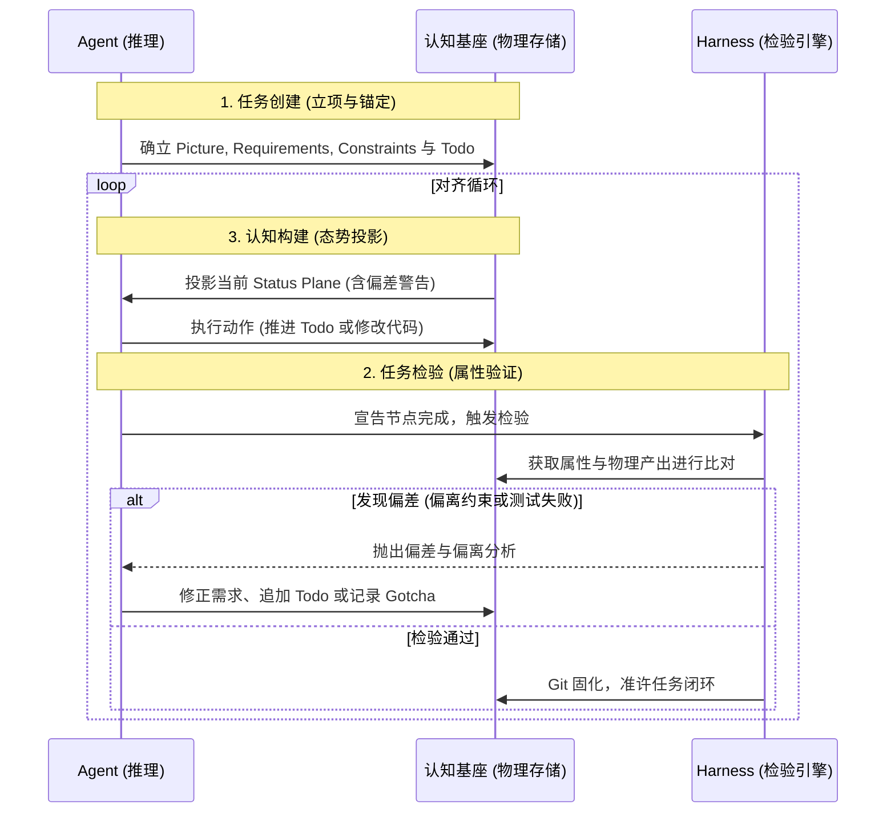

# mem0ress: 认知对齐平面(Cognitive Alignment Plane)架构规约

**版本:** v3.5 (Master Blueprint)
**定位:** 辅助 AI Agent 构建目标态势并校准执行偏差的轻量级工具框架

## 1. 综述 (Overview)

### 1.1 背景

“记忆”这个词带有极强的误导性，它暗示了一种向后看（Retrospective）、被动式（Passive）的存储行为——就像一个积满灰尘的档案柜。但我们在真正执行复杂任务时，需要的根本不是“翻找档案”，而是“向前的目标感（Forward-looking）”和“当下的全局掌控力（Situational Awareness）”。 

实际上我们都被“Memory（记忆）”这个词局限住了, 在不断地在卷“长文本上下文”和“精确检索”的时候，我们在大数据量和清晰认知之间不断徘徊，导致了系统级的结构性困境：

* **数据汤困境（The Data Soup Dilemma）：** 传统记忆将所有历史对话、代码片段、废弃架构融合成一锅没有边界的“数据汤”。系统试图依赖向量相似度算法来打捞信息，这不仅导致了严重的上下文污染（Context Collapse），也让记忆库随着时间推移陷入不可逆的熵增。
* **意图迷失（The Intent Fallacy）：** 数据库本身没有意图。通过追溯历史来拼凑当下，永远无法匹配复杂任务中“向前看（Forward-looking）”的图景牵引。大模型极易陷入“为了写代码而写代码”的局部最优解。 
* **以毒攻毒的架构补丁：** 许多 memory 系统本质上只是在“大模型之上再套一层大模型”，试图通过让 LLM 不断总结、反思和微调来缓解交互局限，但这从未触及“自主管理状态”这一架构核心，徒增算力消耗与幻觉风险。

当我们在讨论记忆的时候，我们实际上并不是关心过去每一秒的原始画面，我们实际上关心的是当前和未来。即我们现在在做什么（Task），我们已经完成了什么 (Plane)，我们还需要做什么 (Todo)，我们的目标是什么（Picture）, 我们当前与目标是否存在偏差 (Constraint)。

我们真正需要的，不是记忆，而是**认知（Cognition）**。

### 1.2 系统定位

在这个视角下，在 AI 应用中，记忆的本质不再是用来“回想”的，而是用来**“维持 AI 代理在极度复杂的数字环境中的神智清醒（Sanity）”**的。

mem0ress 是一个**认知对齐平面 (Cognitive Alignment Plane)**。它不是传统意义上的“记忆检索数据库 (RAG Database)”，也不以二进制或向量方式存储，而是一个基于纯文本的，通过利用已有信息来有效构建目标相关视图，并持续检验执行偏差的逻辑框架。

其核心功能是：在任务执行过程中，为 AI Agent 提供清晰的意图边界（Picture）与执行约束（Constraints），确保 Agent 的动作始终与既定需求对齐，防止其在长路径任务中偏离目标。

mem0ress 并不试图去重现所有记忆，而是使 AI 始终能够保持明确的认知：即，我是什么，我在做什么，我的目标是什么，我还有什么要做。传统的记忆中“我拥有什么信息”的执念，在这里被彻底抛开。

我们认为，当前的 AI 已经足够智能，它不需要从会话中一遍又一遍地检索和过滤相似的信息，但它往往在多轮会话之后，对自己的目标认知产生了偏差。

### 1.3 核心解法：动态平面和数据基座

针对上述痛点，mem0ress 提出了彻底的范式转移：停止构建庞大的记忆库，将目标放在构建动态的认知系统。mem0ress 将信息流拆分为两个维度：

* **认知对齐平面 (Cognitive Alignment Plane - 状态)：** 代表当前的动态态势。它是前向的、不断更新的，负责告诉 Agent“现在在哪”以及“离目标还有多远”。
* **认知基座 (Cognitive Substrate - 数据)：** 代表物理存储的静态数据。包含代码、文档和历史记录。它是每一时刻状态的客观物理承载。

通过这种分离，系统能够以极低的 Token 成本，让 Agent 始终保持对目标的关注，并能在**任务创建、任务检验与认知构建**的严密心智循环中，快速发现并修正偏差。

## 2. 设计理念

mem0ress 的诞生，源于对当前 AI Agent 发展路径的底层反思。我们拒绝将 RAG（检索增强生成）等同于 AI 的大脑，摒弃传统的“被动记忆检索”理念。mem0ress 的架构设计并非为了优化数据的存储与查询，而是为了给自主 Agent 构建一个具备前瞻性（Forward-looking）的心智模型（Mental Model）。

系统的运转建立在以下四大核心理念之上：

### 2.1 目标锚定 (Goal-Anchored)：目的论认知

**没有悬空的数据孤岛，信息必须为意图服务。**

在传统基于向量的记忆设计中，信息是游离的，系统通过算力去大海捞针。但在 mem0ress 中，认知遵循严格的“目的论（Teleology）”。任何被引入平面的信息必须有明确的目的。系统不存储无关的零散数据，仅记录与任务目标直接相关的认知增量。失去目标指向的信息被视为噪音，不予投影到当前平面。

### 2.2 认知而非记忆：记录“状态突变” (Cognitive Delta)

**放弃记录流水账，对抗上下文熵增。**

人类的大脑之所以高效，是因为它懂得遗忘过程，只铭记结果。系统不记录 Agent 执行过程中的所有流水账，仅记录导致目标推进或路径修正的“状态突变（Delta）”。通过记录认知切片而非过程录像，有效控制上下文规模。

### 2.3 同构的认知单元：分形树状结构 (Isomorphic Task Unit)

**用最极简的实体，构建无限复杂的意图宇宙。**

任务被拆解为同构的单元（Task）。每个子任务都拥有独立的清单文件（Manifest），物理上通过目录深度表达依赖关系。父任务的完成必须以所有子任务的对齐为前提。这极大降低了系统认知网关的解析复杂度。

### 2.4 三层物理隔离 (The CPU-RAM-Disk Model)

**捍卫工作记忆的纯洁性，拒绝客观数据的直接污染。**

系统实施了极其严格的三层隔离：
* **CPU（处理枢纽）：** AI Agent，负责理解、推理、决策与执行。
* **RAM（工作内存）：** mem0ress 本体，维持高频、强状态的态势感知（Plane）与私有经验。
* **Disk（客观硬盘）：** 外部的向量数据库、API 官方文档、全网知识。

硬盘数据绝不直接污染内存。外部知识必须经由 Agent 检索、理解后，蒸馏为服务于目标的经验，才能写入 RAM。

```mermaid
%% label：三层物理隔离
graph TD
    subgraph 外部世界 (Disk / 硬盘)
        direction TB
        VectorDB[(外部向量数据库)]
        API[API 官方文档]
        Web[全网搜索源]
    end

    subgraph 系统边界 (mem0ress / RAM)
        direction TB
        StatusPlane[Status Plane <br> 状态平面 / 当前任务态势]
        DataPlane[Data Plane <br> 数据平面 / 客体与代码]
    end

    subgraph 处理核心 (CPU)
        LLM((大语言模型 <br> Agent))
    end

    VectorDB -. "绝对禁止物理直连污染" .-> StatusPlane
    VectorDB & API & Web -- "1. 检索与阅读" --> LLM
    LLM -- "2. 蒸馏内化 (提取经验)" --> DataPlane
    DataPlane -- "3. 挂载" --> StatusPlane
    StatusPlane <== "4. 高频工作记忆交互" ==> LLM

    classDef core fill:#e1f5fe,stroke:#01579b,stroke-width:2px;
    classDef ram fill:#e8f5e9,stroke:#2e7d32,stroke-width:2px;
    classDef disk fill:#fafafa,stroke:#9e9e9e,stroke-width:1px,stroke-dasharray: 5 5;
    class LLM core;
    class StatusPlane,DataPlane ram;
    class VectorDB,API,Web disk; 
```

## 3. 工程准则

### 3.1 单一事实来源与绝对覆写 (SSOT & Absolute Overwrite)

拒绝模糊的认知合并。新认知产生时，直接对旧认知进行绝对覆写（Overwrite）。系统在覆写前提供严格的冲突检查机制，确保认知的确定性。

### 3.2 系统级卸责 (System-Level Offloading)

mem0ress 只专注一件事：认知的生命周期管理，即任务的创建、检验与认知态势的构建。大模型沙箱隔离、并发控制等底层复杂性，均交由宿主操作系统解决。

### 3.3 反黑盒与绝对可观测性 (Anti-Blackbox & Absolute Observability)
完全建立在“目录树 + 纯文本（Markdown/YAML）”之上，赋予系统绝对的可观测性。

## 4. 概念：认知与态势感知 (Cognitive Concepts)
### 4.1 认知三要素 (The Cognitive Triad)
图景 (Picture)： 任务完成后的终极成功状态。

需求 (Requirements)： 抵达图景的可验证硬性指标。

约束 (Constraints)： 执行任务时绝对不可逾越的底线。

### 4.2 动态位面分离 (Dynamic Plane Separation)
状态平面 (Status Plane)： 显示当前认知系统状态。纯展示，不做诊断。Agent 醒来时强制挂载，显示所有任务的结构和进度，但不包含偏差警告或诊断结论。

会话 (Session)： 每个 Task 的私有历史，记录每个轮次的状态快照。版本快照模型，只追加不覆盖。可用于理解演进，暂不主动访问。Session 记录执行进度（代码写到哪、文档完成多少、TODO 状态），不记录目标（Picture/Requirements/Constraints，这些从 TaskManifest 获取）。

数据平面 (Data Plane)： 长篇文档或日志载荷。顺着状态平面的指针按需路由水化挂载。

```mermaid
%% label：动态位面分离
graph LR
    subgraph Agent Context Window (当前工作记忆)
        direction LR
        subgraph Status Plane (状态平面 - 全量强制挂载)
            Manifest[Task Manifest]
            Picture[Picture 图景概要]
            Ref1(ref: prd.md)
        end
        subgraph Data Plane (数据平面 - 按需水化挂载)
            PRD[详细长篇 PRD 文档]
            Code[源码文件]
        end
        Ref1 == "主动调用水化工具" ==> PRD
        Manifest -. "控制 / 改变" .-> Code
    end

    classDef status fill:#fff3e0,stroke:#e65100,stroke-width:2px;
    classDef data fill:#ede7f6,stroke:#4527a0,stroke-width:2px;
    class Status Plane,Manifest,Picture,Ref1 status;
    class Data Plane,PRD,Code data;
```

## 5. 物理文档模型 (Document Model)
系统使用文件树表达认知的从属关系与上下文边界。

```plaintext
.mem0ress/
└── tasks/
    └── auth_module/
        ├── index.md         # The Manifest (包含图景、需求与 Todo)
        ├── session.md       # 每个轮次的状态快照（Session 历史）
        └── gotchas/         # 该任务独享的认知增量与偏差修正记录
```

`index.md`扮演了声明式清单（Manifest）。Session 记录每个轮次的执行进度，Picture/Requirements/Constraints 从 Manifest 获取，不重复记录。

## 6. 逻辑与流程设计 (Logic & Workflow Design)
在 mem0ress 中，整个系统的运转不再是机械的文件读写，而是围绕任务目标的动态生命周期：任务创建、任务检验、认知构建。这是一个不断前向对齐的闭环。

### 6.1 任务创建 (Task Creation: 确立意图锚点)
任务的创建是确立认知边界的起点。系统通过声明式的方式，逐步逼近任务的核心。

逐步完善三要素： Agent 在创建任务或子任务时，首要目标不是写代码，而是明确定义任务的 Picture（图景）、Requirements（需求）和 Constraints（约束）。这三个属性确立了判断未来动作是否偏离的绝对标准。

Todo 步进拆解： 在锚定三要素后，Agent 将任务拆解为具体的机械步（Todo）。这些 Todo 构成了后续检验进度的基准线。

### 6.2 任务检验 (Task Verification: 属性驱动的对齐)
按照三步法，基于任务属性（Task Attributes），验证一个任务是否完成、是否偏离目标。

* Tier 1: 机械状态检查 (Status Check)： 检查底层依赖。若宣称任务完成，但存在未勾选的 Todo 或子任务未闭环，直接阻断。
* Tier 2: 客观规律验收 (Requirements Check)： 在沙箱中执行 Requirements 对应的脚本或测试。校验接口与物理产出是否达标。
* Tier 3: 跨平面语义对齐 (Cross-Plane Alignment)： 核心纠偏机制。**Judge Task 是一个标准的、一次性的 Task**。当 Tier 3 触发时，主 Agent spawn 一个 Judge Agent，赋予判断任务。Judge Agent 读取被检验任务的 manifest、picture、constraints 和 data plane 产出，执行语义对齐判断。完成后 Judge Task 结束，Agent 销毁，结果写入被检验任务的 gotcha_refs。

**偏差处置机制**： 若检验发现偏离，绝不回退状态。系统强制记录当前偏差，并进入下一步的"认知重新构建"。

**Judge Task 设计原则：**
- Judge 是一个标准 Task，遵循所有 Task 的规范（manifest、cognitive_triad、todos）
- Judge 按需 spawn，完成即终止，不常驻
- Judge 的输入是"被检验任务的摘要"（picture + constraints + data plane summary），而非原始全部文件
- Judge 的输出是 aligned/deviation/reasoning，写入被检验任务的 gotcha_refs

### 6.3 认知构建 (Cognition Building: 态势投影)
这是贯穿生命周期始终的核心动作。在任何节点（刚启动时、执行中、或检验失败后），系统都需要为 Agent 构建当前任务的状态平面（Status Plane）。

**状态平面**

* 纯展示，无诊断：状态平面只呈现当前状态，不做偏差判断
* 实时扫描：每次调用直接读文件系统，不缓存
* 全面覆盖：显示所有任务，不隐藏任何节点
* 非侵入：只读不写，不修改任何状态

**状态平面显示内容：**
- 任务树结构（父子关系）
- 每个任务的 todo 完成度（如 "2/3 Todos 完成"）
- 任务状态（CREATED/IN_PROGRESS/COMPLETED/ABANDONED）
- 偏差记录（Gotchas）
- Session 最近变化摘要

**Session 记录内容：**
- 每个轮次的状态快照（code_progress, docs_progress, todos, status）
- 变化动作记录
- 用于理解演进，暂不主动访问

**Picture/Requirements/Constraints 从 TaskManifest 获取，不显示在 Status Plane。**



## 7. 技术方案 (Technical Implementation)

mem0ress 是认知对齐平面（而不是 Agent 框架）。它专注于认知状态管理，不执行工具或做决策。

### 7.1 系统架构设计 (System Architecture)

* Agent 环境：提供 LLM 推理能力（外部）
* L1 Cognitive Gateway (认知网关):

  * Plane Assembler (平面组装器): 负责"认知构建"。动态扫描并编译出 Status Plane。纯展示，不做诊断。
  * Tool Interface (工具接口): 提供有限的任务操作工具，供 Agent 调用。**不是执行引擎**——Agent 执行工具，mem0ress 只管理认知状态。
  * Harness Engine (检验引擎): 负责"任务检验"。独立的三层验证，发现偏差并报告。

* L2 Cognitive Substrate(认知基座): File System 与 Git 共同构成，提供态势的物理承载。

### 7.2 核心机制设计

  * 引用水化机制 (Hydration): 解析清单时，ref: 指针不默认加载。LLM 需主动调用工具将其“水化”并挂载到 Data Plane 中。
  * 乐观锁冲突感知 (Optimistic Locking): 执行写操作时比对文件哈希。若遭外部修改，抛出 409 Conflict，强制 LLM 重新进行认知构建后决断。
  * 原生 Git 数据回溯 (Git-Native Revert): 检验失败且路径报废时，LLM 调用工具回退数据平面，同时在状态平面生成 Gotcha 记录偏差经验，保持时间向前。
  * 带外约束检验 (Out-of-Band Verification): Harness 引擎执行沙箱隔离测试，并通过独立路由调用 LLM-as-a-Judge，杜绝与执行态 Agent 发生上下文污染。

### 7.3 技术流程：Agent 驱动的事件循环

mem0ress 本身不执行循环——它由 Agent 驱动。Agent 在需要对齐时调用 mem0ress：

  1. 认知构建: Agent 调用 `get_status_plane()` 获取当前状态。
  2. 工具调用: Agent 发出动作指令（创建任务、更新 Todo 等）。
  3. 安全拦截: mem0ress 验证乐观锁与操作合法性，抛出 ConflictError 如有冲突。
  4. 任务检验: Agent 调用 `verify_task()` 触发 Harness 三层验证。
  5. 态势突变: 验证结果写入 Substrate（Gotcha 或完成），Agent 获取最新状态。

### 7.4 动作、状态与节点表

#### 动作表 (Action Table)

| Action | 类型 | 说明 |
|--------|------|------|
| `create_task` | 任务节点 | 创建新任务 |
| `get_task` | 任务节点 | 读取任务详情 |
| `update_task` | 任务节点 | 更新任务属性 |
| `delete_task` | 任务节点 | 删除任务 |
| `add_todo` | 执行步骤 | 添加步骤 |
| `update_todo` | 执行步骤 | 更新步骤状态 |
| `remove_todo` | 执行步骤 | 删除步骤 |
| `add_gotcha` | 偏差记录 | 记录偏差 |
| `snapshot_session` | 轮次 | 记录当前轮次快照 |
| `get_status_plane` | 轮次 | 获取状态平面 |
| `get_session` | 轮次 | 获取会话历史 |
| `verify_task` | 验证 | 触发 Harness 三层验证 |
| `hydrate_ref` | 数据平面 | 水化引用 |

#### 状态表 (State Table)

| State | 范围 | 说明 |
|-------|------|------|
| `CREATED` | Task | 任务已创建 |
| `IN_PROGRESS` | Task | 任务进行中 |
| `COMPLETED` | Task | 任务完成 |
| `ABANDONED` | Task | 任务废弃 |
| `IDLE` | Framework | 空闲（无活跃任务） |
| `ACTIVE` | Framework | 有任务在进行 |
| `VERIFYING` | Framework | 验证中 |

#### 节点表 (Node Table)

| Node | 说明 |
|------|------|
| `Turn N` | 轮次节点（1.1, 1.2, 2.1...），记录每个轮次的状态快照 |
| `Task` | 任务节点，代表一个独立的认知单元 |
| `Subtask` | 子任务节点，嵌套于父任务目录下 |

#### 轮次与动作对应关系

```
Turn N 的典型流程：

1. 开始轮次
   └── get_status_plane() → 了解当前状态

2. 执行动作（可能多个）
   ├── create_task(...)     # 新任务
   ├── update_todo(...)     # 推进步骤
   ├── add_gotcha(...)      # 记录偏差
   └── verify_task(...)     # 验证

3. 结束轮次
   └── snapshot_session() → 记录这轮的状态变化
```
