# mem0ress: 认知对齐平面(Cognitive Alignment Plane)架构规约


## 1. 综述 (Overview)

### 1.1 背景

"记忆"暗示了一种向后看（Retrospective）、被动式的存储行为。在真正执行复杂任务时，我们需要的不是"翻找档案"，而是"向前的目标感"和"当下的全局掌控力"。

当前 AI Agent 在"长文本上下文"和"精确检索"之间不断徘徊，催生了三个结构性问题：

* **数据汤困境：** 传统记忆将历史对话、代码片段、废弃架构融合成一锅没有边界的"数据汤"，导致上下文污染（Context Collapse）和不可逆的熵增。
* **意图迷失：** 数据库本身没有意图。通过追溯历史来拼凑当下，永远无法匹配"向前看"的目标牵引。
* **大模型之上的大模型：** 许多 memory 系统徒增算力消耗，试图通过 LLM 总结 LLM 来缓解交互局限，但从未触及"自主管理状态"这一架构核心。

当我们讨论记忆时，真正关心的不是过去每一秒的原始画面，而是当前和未来：我们现在在做什么(Task)，已经完成了什么(状态平面)，还需要做什么(Todo)，是否满足需求(Requirements)，是否符合约束(Constraints)，是否达成目标(Picture)。

我们需要的不是记忆，而是**认知（Cognition）**。

### 1.2 系统定位

**目标用户：** AI/Agent 框架开发者。mem0ress 为开发者提供任务状态管理和目标态势感知能力，而非直接面向终端用户。

mem0ress 是一个**认知对齐平面 (Cognitive Alignment Plane)**。它不是传统意义上的"记忆检索数据库"，也不以二进制或向量方式存储，而是一个基于纯文本的、通过利用已有信息来有效构建目标相关视图、并持续检验执行偏差的逻辑框架。

其核心功能是：在任务执行过程中，为 AI Agent 提供清晰的图景（Picture）与执行约束（Constraints），确保 Agent 的动作始终与既定需求对齐，防止其在长路径任务中偏离目标。

mem0ress 不试图重现所有记忆，而是使 AI 始终能够保持明确的认知：我是谁、我在做什么、我的目标是什么、我还有什么要做。当前的 AI 已经足够智能，不需要从会话中一遍又一遍检索相似信息，但它往往在多轮会话之后对自己的目标认知产生了偏差。

### 1.3 核心解法概览

mem0ress 将所有认知单元统一为同构的任务节点（Task），每个任务由三个要素定义：Picture（图景）、Requirements（需求）和 Constraints（约束）。三者共同构成判断未来动作是否偏离的绝对标准。在此基础上，系统通过**状态平面**和**数据平面**两个时间切片，以极低的 Token 成本为 Agent 提供实时态势感知。

这一核心解法的认知科学基础和完整推导见第二章。

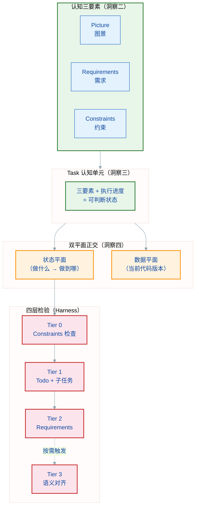

## 2. 核心洞察 (Core Insights)

mem0ress 的设计基于四个洞察。这些洞察源自记忆研究、认知科学和任务管理领域的交叉经验。它们共同构成了整个规范的认知科学基础，也为其他认知架构（如 MetaDev）提供了可独立引用的理论锚点。

**洞察之间的关系：** 四个洞察并非完全独立，而是存在一条隐含的推导链。洞察一（目标属性）是整个体系的起点——它否定了"存储优先"的记忆架构，确立了"目标锚定"的方向。洞察二（PRC 框架）在这一方向上进一步细化：目标锚定需要可判断的完成标准，因此提出 Picture/Requirements/Constraints 三要素。洞察三（Task 锚点）和洞察四（双平面正交）从洞察二独立推导而来——三要素需要一个载体（Task），而"做什么"和"做到哪"恰好是两个相互独立的观察维度。这种推导关系意味着：单独引用洞察一是安全的；单独引用洞察三或四，可能需要同时引用洞察二作为前提。

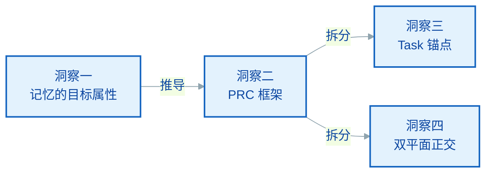

### 2.1 根源：记忆的目标属性 (Root: Target Attribute of Memory)

**洞察一：上下文是被发现的，而非被维持的。**

人类记忆不是被动的记录仪。同一段经历，在不同目标下被提取的内容截然不同——不是因为记忆被篡改了，而是因为提取的线索（目标）不同。这说明记忆的组织方式天然以目标为锚，而非以时间为锚。

这一洞察是 mem0ress 所有设计决策的起点：它否定了"存储优先"的记忆架构，转向"目标锚定的认知架构"。

### 2.2 核心：PRC 框架 (Core: PRC Framework)

**洞察二：目标需要一个可判断的完成标准，否则执行无法被检验。**

仅有目标是不够的。目标"实现一个安全认证模块"无法回答三个关键问题：什么样的成果算成功？需要满足什么可验证的条件？什么是绝对不能做的？

这三个问题分别对应三个认知要素：

**Picture（图景）** 是语义层面的终极成功状态，由利益相关者定义，回答"做成什么样"。它不是功能清单，而是利益相关者眼中可感知的结果——即使所有代码都写完了、测试都通过了，只要用户感知到"还是不能登录"，Picture 即未达成。

**Requirements（需求）** 是 Picture 的客观可达条件，回答"怎么证明成功了"。每一个 Requirement 都必须可独立验证：要么通过，要么不通过，没有灰色地带。例如"支持 Google Workspace SSO"、"登录失败错误提示不超过 3 秒"，这些是可自动化检验的指标。Requirements 是 Picture 的必要条件——达成 Picture 必须首先满足所有 Requirements。

**Constraints（约束）** 是执行时绝对不可逾越的底线，回答"什么绝对不能做"。Constraints 不是"尽量遵守"，而是"一旦违反系统必须阻断"。例如"不许存储明文密码"、"Access Token 有效期不得超过 1 小时"。Constraints 与 Requirements 可能产生冲突——"需支持离线使用"与"数据不得离开设备"在某些场景下不可兼得。这种冲突必须在任务构建阶段被发现并标记，而非等到执行阶段才暴露。

三个要素的构建顺序是：**先定义 Requirements，再定义 Constraints，最后由 Requirements 和 Constraints 共同约束和推导出 Picture**。这是因为 Picture 处于最高层，是目标的核心语义表达；Requirements 是 Picture 的客观化路径；Constraints 则是这条路径上的红线。三者共同构成判断未来动作是否偏离的绝对标准。

PRC 框架的认知科学来源是目标导向行为理论（Goal-Directed Behavior）和约束满足网络（Constraint Satisfaction Networks）——两者的共同点在于：目标的达成不是路径上所有步骤的累加，而是同时满足目标状态、可验证条件和不可违反边界的多重约束解。

**为什么 Picture 不可缺席**

传统的软件工程以测试用例通过作为完成标准。但测试用例通过只说明符合预定需求，不等于达成目标——需求是利益相关者对"如何解决问题"的假设，而 Picture 是利益相关者对"问题是否被真正解决"的最终判断。

AI Agent 具备语义理解能力，能够理解自然语言描绘的图景。这意味着可以用少量检验点配合语义理解来判定任务是否完成，不必为每个细节编写测试用例。Picture 提供了语义判断的锚点——它允许 AI 或人做出高阶的、整体性的完成判断，而不仅仅依赖于可枚举的检验项。

因此，所有任务都需要 Picture，只是模糊程度不同。传统软件开发认为"测试用例通过即合格"，这只说明符合预定需求，不能认为是达到了目标。即使所有 Requirements 满足，Picture 未对齐则任务未完成。

### 2.3 锚点：任务作为认知单元 (Anchor: Task as Cognitive Unit)

**洞察三：任务是人类和 AI 共同的工作记忆单元。**

人类长期记忆以事件（Event）为单位组织，而非以知识点为单位。"上周的架构评审会议"比"分布式系统一致性原理"更容易被记忆和回忆。事件封装了目标、行动、结果和上下文——这种封装使得记忆具有天然的边界和检索线索。

任务（Task）作为信息的组织单元，恰好对应了这个认知模型。每个 Task 包含 Picture（目标）、Requirements（可验证条件）、Constraints（不可逾越边界）和执行进度——这四者的组合使得一个 Task 在任意时刻都有一个可判断的状态：正在推进、已完成、或已偏离。

Task 作为认知锚点的意义在于：它同时服务于 Agent 和人。对 Agent 而言，Task 是唯一的解析对象——无论任务是"实现登录模块"还是"修复安全漏洞"，系统使用完全相同的解析逻辑，不需要为不同类型的节点设计不同的处理机制。对人而言，Task 的分形树状结构使得整个认知空间可以通过目录深度直观表达——父子关系就是依赖关系，不需要额外的状态聚合查询。

Task 锚点还解决了目标模糊性的问题。当一个目标过于宏观时（如"优化系统性能"），Agent 可以通过将目标转化为 Task 并定义其 Picture 来使目标变得可判断。Picture 定义了"足够好的性能"是什么样子——这不是一个数字，而是一个利益相关者认可的语义状态。

### 2.4 正交：双平面对偶性 (Orthogonality: Dual-Plane Duality)

**洞察四：认知可以沿两个相互独立的维度切分——做什么和做到哪了。**

对任意一个任务的执行状态，都可以沿两个维度观察：

**数据平面**（Data Plane）回答"当前操作的是什么版本的代码和文档"。它记录相关仓库的当前 commit ID 快照、长篇文档的版本指针。当 Agent 被重新唤醒时，它需要知道上次操作的是哪一行代码——而不是从会话历史中大海捞针。

**状态平面**（Status Plane）回答"当前任务推进到什么阶段了"。它聚合任务树结构、每个 Task 的 TODO 完成度、任务状态（CREATED / IN_PROGRESS / COMPLETED / ABANDONED）和偏差记录（Gotchas）。

两个平面之所以必须正交互斥，有认知效率的原因：如果每次获取状态都要同时加载数据版本和执行进度，认知负载翻倍；如果混合在一起，Agent 无法独立判断"我现在应该看数据还是看进度"。

正交互斥的实现是：Agent 主动按需展开数据平面，而不是默认加载。状态平面在每次唤醒时强制挂载（因为它回答的是"我在哪"），数据平面则在 Agent 需要操作具体数据时才展开（通过 commit ID 快照按需挂载）。两个平面都是时间切片——某一时刻的快照——而非组件或服务。

这种正交设计的认知收益是：Agent 可以独立思考进度问题或数据问题，而不需要同时处理两个维度的干扰。数据平面变化时，Agent 知道这是数据问题；任务状态变化时，Agent 知道这是进度问题。两种问题的处理策略不同，分开思考避免了认知混淆。

---

## 3. 设计理念

mem0ress 的诞生，源于对当前 AI Agent 发展路径的底层反思。我们拒绝将 RAG（检索增强生成）等同于 AI 的大脑，摒弃传统的“被动记忆检索”理念。mem0ress 的架构设计并非为了优化数据的存储与查询，而是为了给自主 Agent 构建一个具备前瞻性（Forward-looking）的心智模型（Mental Model）。

系统的运转建立在以下四大核心理念之上：

### 3.1 目标锚定：目的论认知

**源自洞察一（2.1）：上下文是被发现的，而非被维持的。**

在传统基于向量的记忆设计中，信息是游离的，系统通过算力去大海捞针。但在 mem0ress 中，认知遵循严格的"目的论（Teleology）"。任何被引入平面的信息必须有明确的目的。系统不存储无关的零散数据，仅记录与任务目标直接相关的认知增量。失去目标指向的信息被视为噪音，不予投影到当前平面。

### 3.2 认知而非记忆：记录"状态突变"

**源自洞察一（2.1）：记忆的目标属性决定了认知应以任务为中心，只记录与目标相关的状态变化。**

人类的大脑之所以高效，是因为它懂得遗忘过程，只铭记结果。系统不记录 Agent 执行过程中的所有流水账，仅记录导致目标推进或路径修正的"状态突变（Delta）"。通过记录状态突变而非过程录像，有效控制上下文规模。

### 3.3 同构的认知单元：分形树状结构

**源自洞察三（2.3）：任务是将模糊意图转化为可判断状态的认知锚点。同构单元确保任意粒度下解析逻辑一致。**

任务被拆解为同构的单元（Task）。每个子任务都拥有独立的清单文件（Manifest），物理上通过目录深度表达依赖关系。父任务的完成必须以所有子任务的对齐为前提。

这种同构设计解决了复杂意图管理中的三个核心问题：

**解析一致性：** 认知网关只需处理一种类型的节点（Task）。无论任务是"实现登录模块"还是"修复安全漏洞"，系统使用完全相同的解析逻辑。这比异构结构（不同节点类型需要不同处理逻辑）大大降低了复杂度。

**分形扩展：** 分形意味着自相似——树的每一层节点拥有与顶层相同的结构，只是粒度不同。"用户认证"任务的 Manifest 与"实现 OAuth 提供商"子任务的 Manifest 结构完全一致。这使得任务分解不需要额外的结构设计工作，分解过程本身是机械的。

**依赖表达的物理化：** 父任务目录下嵌套子任务目录，通过目录深度而非数据库外键表达依赖关系。这使得依赖的可见性不需要查询——`ls` 即是最直接的展示。"父任务是否完成"等价于"子任务目录是否全部关闭"，无需额外的状态聚合查询。

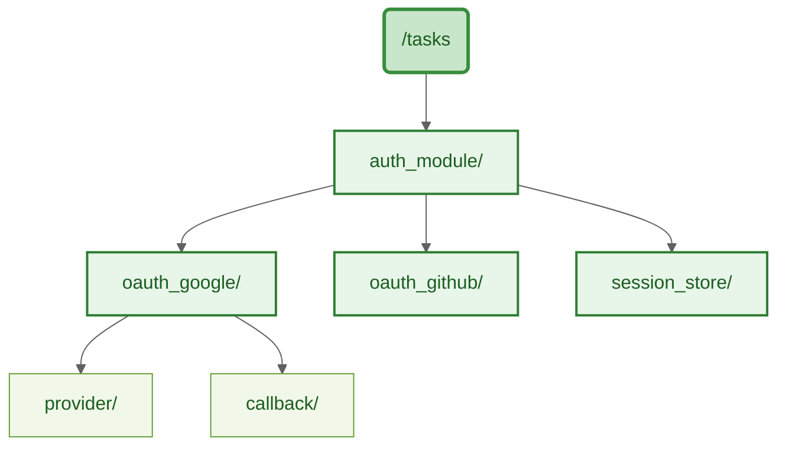

### 3.4 认知平面的数据流架构

**源自洞察四（2.4）：状态平面与数据平面正交互斥，避免状态与数据之间的维度捆绑——即每次获取状态时被迫同时加载数据版本，或混合后 Agent 无法独立判断当前该关注哪个维度。**

mem0ress 的认知数据来自会话本身，而非外部知识库。系统从会话流中 **hook** 出构建认知所需的信息，这是与外部数据完全独立的并行过程——外部知识（向量数据库、API 文档、全网搜索）属于 Agent 的背景知识，mem0ress 不感知、不管理，也不依赖它们。

**认知数据的来源与流向：**

会话流承载了 Agent 的所有执行动作与中间产物。mem0ress 在会话中 hook 出与任务目标相关的数据，将其组织为两个时间切片：

* **状态平面：** 从会话中提取任务执行状态（Todo 进度、代码产出、文档进度、组件状态），聚合成某一时刻的执行快照。Agent 唤醒时强制挂载（因为它回答的是"我在哪"）。
* **数据平面：** 从会话中提取相关数据的 commit ID 快照，记录代码和文档在某一时刻的版本。Agent 需要操作具体数据时才按需挂载。

两个平面都来源于会话，按需挂载。Agent 获取平面后，在其 LLM 的认知工作区中完成目标推理与决策。

> **注：** 状态平面和数据平面都是时间切片，不是组件。图中的状态平面 / 数据平面指的是"某一时刻的快照"，而非独立的进程或服务。mem0ress 的认知工作区与 Agent 的 LLM 处于同一层，两者共享会话上下文。

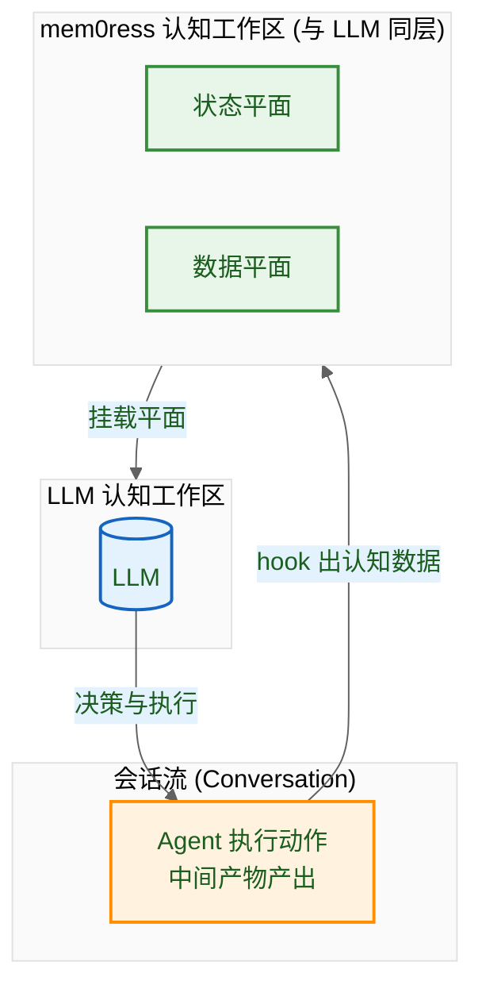

以上四大理念，共同构成了 mem0ress 的设计哲学。以下工程准则，是将上述理念落实为具体约束的实践规范——违反这些准则，即等同于违反第二章（核心洞察）的设计初衷。

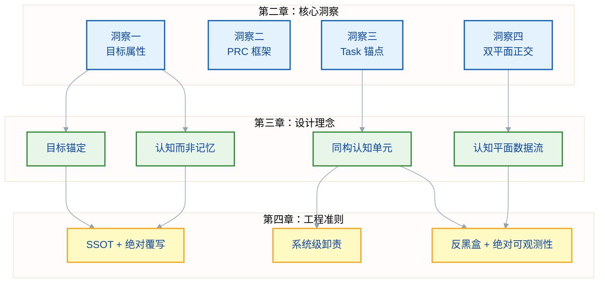

## 4. 工程准则

### 4.1 单一事实来源与绝对覆写 (SSOT & Absolute Overwrite)

拒绝模糊的认知合并。**运行时工作区**（LLM 的认知空间）内产生新认知时，直接覆写旧认知——这是避免认知歧义的核心机制。系统在覆写前提供严格的冲突检查机制，确保认知的确定性。覆写发生在运行时，持久化仍遵循「不要存储要按需发现」原则。

### 4.2 系统级卸责 (System-Level Offloading)

mem0ress 只专注一件事：认知的生命周期管理，即任务的创建、检验与认知态势的构建。大模型沙箱隔离、并发控制等底层复杂性，均交由宿主操作系统解决。

### 4.3 反黑盒与绝对可观测性 (Anti-Blackbox & Absolute Observability)

可观测性（Observability）不仅仅是"能看到日志"，而是"从输出推断内部状态"的能力。传统记忆系统是黑盒：Agent 无法直接知道系统内部的认知状态，只能通过 API 返回的结果猜测——而这些结果往往已经过蒸馏和裁剪，失去了原始上下文。

mem0ress 的解法是**零中介**：系统完全建立在"目录树 + 纯文本（Markdown/YAML）"之上，没有任何私有格式或隐藏状态。

这带来三个具体优势：

- **直接读取，无损透明：** Agent 可以直接 `cat` 任意清单文件，看到的与系统存储的完全一致。没有任何 API 层对内容做截断或改写。
- **版本控制，原生可审计：** 所有认知产物（Manifest、Session、Gotchas）均在 Git 版本控制之下，任何变更均可追溯到具体的人和轮次。
- **结构即语义，工具无绑定：** 目录深度表达依赖关系，文件名承载类型语义。Agent 不需要特殊工具就能理解和导航整个认知空间。

这与传统的"向量数据库 + 检索"模式形成鲜明对比：后者将原始信息编码为高维向量，检索时再解码——这个过程本身就是信息损失。而 mem0ress 的认知数据（Manifest、Session、Gotchas）永远保持人类可读和机器可解析的双重 fidelity。

## 5. 概念：认知与态势感知

### 5.1 认知三要素：定义与使用指南

第二章（洞察二）已完整阐述了认知三要素的理论基础——Picture/Requirements/Constraints 三者共同构成判断未来动作是否偏离的绝对标准。本节聚焦于实际使用时的操作指南。

**谁来定义：**

| 要素 | 主要定义者 | 参与者 |
|------|-----------|--------|
| Picture | 利益相关者（用户、业务负责人） | Agent 辅助提炼 |
| Requirements | Agent（基于 Picture 推导） | 利益相关者确认 |
| Constraints | Agent + 领域知识 | 利益相关者确认 |

**什么时候定义：**

三要素的填写时机有严格顺序。先定义 Requirements，再定义 Constraints，最后由前两者共同推导出 Picture。这个顺序不是随意的——它是冲突检测的关键：若 Requirements 与 Constraints 在定义阶段就相互矛盾，系统立即标记任务为"不可行"，而非等到执行阶段才发现。

Picture 定义于最后，因为它是前两者约束下的语义综合，而非先入为主的愿景。

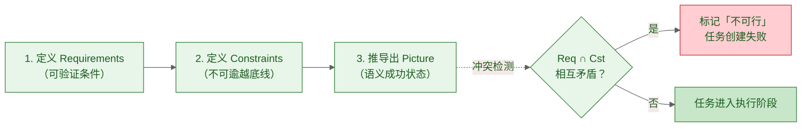

**如何判断填写质量：**

Picture 的质量判断标准是"是否可感知"：能否向利益相关者描述一个他们能想象的成功状态？若 Picture 描述的是实现路径（"使用 OAuth 2.0 实现登录"），而非成功状态（"用户无需输入密码即可登录"），说明 Picture 需要重新提炼。

Requirements 的质量判断标准是"是否可自动化检验"：每个 Requirement 都必须有明确的通过/失败判定语句。若 Requirement 依赖主观判断（"界面美观大方"），它就不是有效的 Requirements。

Constraints 的质量判断标准是"是否可阻断"：违反时系统能否检测并阻止？若 Constraint 无法被系统感知（"代码要有良好可读性"），它就不适合作为 Constraints，应移至 Requirements。

**Picture / Requirements / Constraints 的从 Manifest 获取，不重复记录。** 清单文件中统一存放，状态平面仅展示其摘要，不展开全文。

### 5.2 状态平面与数据平面

mem0ress 的认知系统由两个核心平面构成，它们都是**时间切片**（某一时刻的快照），不是组件。

**状态平面 (Status Plane)：** 任务相关的所有执行状态的聚合快照。包括：
- 任务树结构（父子关系）
- 每个任务的 todo 完成度（如 "2/3 Todos 完成"）
- 任务状态（CREATED / IN_PROGRESS / COMPLETED / ABANDONED）
- 偏差记录（Gotchas，指针）
- Session 最近变化指针（指向 Session 中最近的状态快照位置，供 Agent 按需追溯）

Agent 唤醒时强制挂载，**纯展示，不做诊断**。

**数据平面 (Data Plane)：** 所有相关数据的 commit ID 快照。包括：
- 各仓库当前 commit ID 映射
- 长篇文档（PRD、设计稿等）的版本指针

顺着状态平面的指针**按需展开挂载**，不默认加载。

**Session 作为数据来源：** Session 是每个 Task 的私有历史，记录每个轮次的状态快照。版本快照模型，只追加不覆盖。它是状态平面内容的数据来源之一，但不等于平面本身——平面是某一时刻的聚合快照，Session 是快照的时间序列。

Session 记录执行进度（代码写到哪、文档完成多少、TODO 状态），不记录 Picture/Requirements/Constraints（这些从 TaskManifest 获取，不重复记录）。

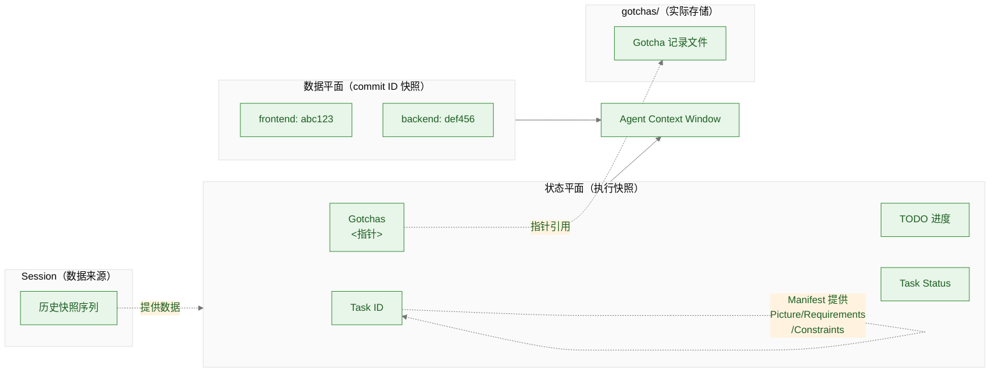

## 6. 物理文档模型 (Document Model)
系统使用文件树表达认知的从属关系与上下文边界。

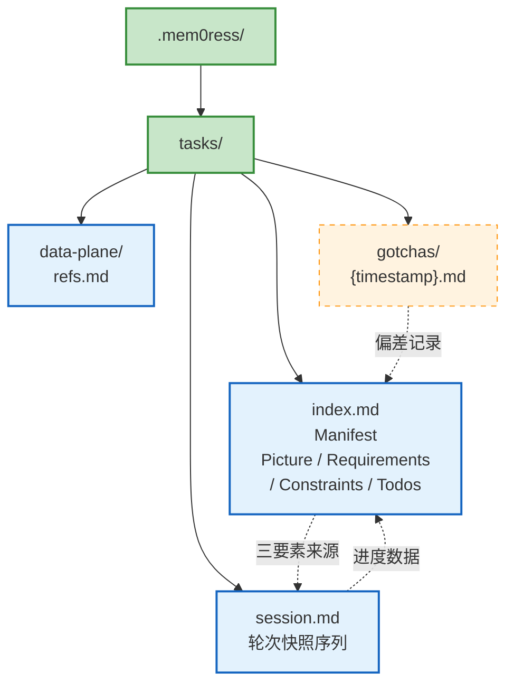

```plaintext
.mem0ress/
└── tasks/
    └── auth_module/
        ├── index.md         # The Manifest (包含图景、需求与 Todo)
        ├── session.md       # 每个轮次的状态快照（Session 历史）
        ├── data-plane/      # Data Plane 引用（仓库 → commit ID 映射）
        └── gotchas/         # 该任务独享的认知增量与偏差修正记录
```

`index.md`扮演了声明式清单（Manifest）。Session 记录每个轮次的执行进度，Picture/Requirements/Constraints 从 Manifest 获取，不重复记录。

**Data Plane 关联表：**

Data Plane 通过仓库名 → commit ID 的映射来记录代码状态：

```markdown
data_plane:
  frontend-repo: abc123
  backend-repo: def456
  docs-repo: ghi789
```

每个 Turn 的 Session 快照中包含当时的 data_plane 状态，用于追踪多仓库开发环境。

### 6.1 Task 模板

**index.md 模板：**

````markdown
---
id: {task_id}
type: task
status: created
cognitive_triad:
  picture: {描述任务完成后的终极成功状态}
  requirements: []
  constraints: []
data_plane: {}
gotcha_refs: []
todos:
  - [ ] {第一步}
---
# {task_id}

## Picture
{picture}

## Requirements
- ...

## Constraints
- ...

## Todos
- [ ] ...

> **模板参考：** Session 模板、Gotcha 模板、Data Plane 模板见附录 B。
>
> **双重格式说明：** Manifest 存在两种等价的语义表达方式。Frontmatter 中的 `cognitive_triad` 字段（YAML 格式）是机器可解析的标准格式，供 mem0ress 内部 API 读取；Body 中的 `## Picture / ## Requirements / ## Constraints` 是人类可读的展示格式，供 Agent 和利益相关者直接查阅。两者内容必须完全一致——Agent 写入 body 后必须同步更新 frontmatter，或由工具自动维护一致性。规范本身不强制要求同时维护两套格式，二选一即可，但一旦混用则必须保持同步。
````

## 7. 逻辑与流程设计 (Logic & Workflow Design)
在 mem0ress 中，整个系统的运转不再是机械的文件读写，而是围绕任务目标的动态生命周期：任务创建、任务检验、认知构建。这是一个不断前向对齐的闭环。

### 7.1 任务创建
任务的创建是确立认知边界的起点。系统通过声明式的方式，逐步逼近任务的核心。

逐步完善三要素： Agent 在创建任务或子任务时，首要目标不是写代码，而是明确定义任务的 Picture、Requirements 和 Constraints。这三个要素的填写有严格顺序——**先定义 Requirements，再定义 Constraints，最后由前两者共同推导出 Picture**。这个顺序是冲突检测的关键：若 Requirements 与 Constraints 在定义阶段就相互矛盾，系统立即标记任务为"不可行"，而非等到执行阶段才发现。

Todo 步进拆解： 在锚定三要素后，Agent 将任务拆解为具体的机械步（Todo）。这些 Todo 构成了后续检验进度的基准线。

### 7.2 任务检验

任务检验采用四层关卡模型。

**四层关卡（Tiers）：**

* **Tier 0: Constraints 约束检查：** 检查当前 Task 的所有 Constraints 是否满足。若有违反，尝试自动修复；若无法修复，按权限让度给人（L1/L2 立即让度，L3/L4 失败后让度）。修复成功后重跑 Tier 0 确认，通过后进入 Tier 1。
* **Tier 1: Todo 完成检查 + 直接子任务完成检查：** 检查两个独立的前置条件——(1) 所有 Todo 步是否已被标记为完成；(2) 所有直接子任务是否状态为 COMPLETED。若存在未完成的 Todo 或未关闭的子任务，直接阻断，不进入 Tier 2。
* **Tier 2: Requirements 满足检查 (Requirements Check)：** 在沙箱中执行 Requirements 对应的脚本或测试，验证每个 Requirement 是否达标。若存在未满足的 Requirement，直接阻断，不进入 Tier 3。
* **Tier 3: 语义对齐检查 (Semantic Alignment Check)：** Judge Agent 读取任务的 Picture 与实际产出，执行语义对齐判断。只有当 Picture 中包含无法自动化验证的指标（如"用户感到满意"）时才需要触发。

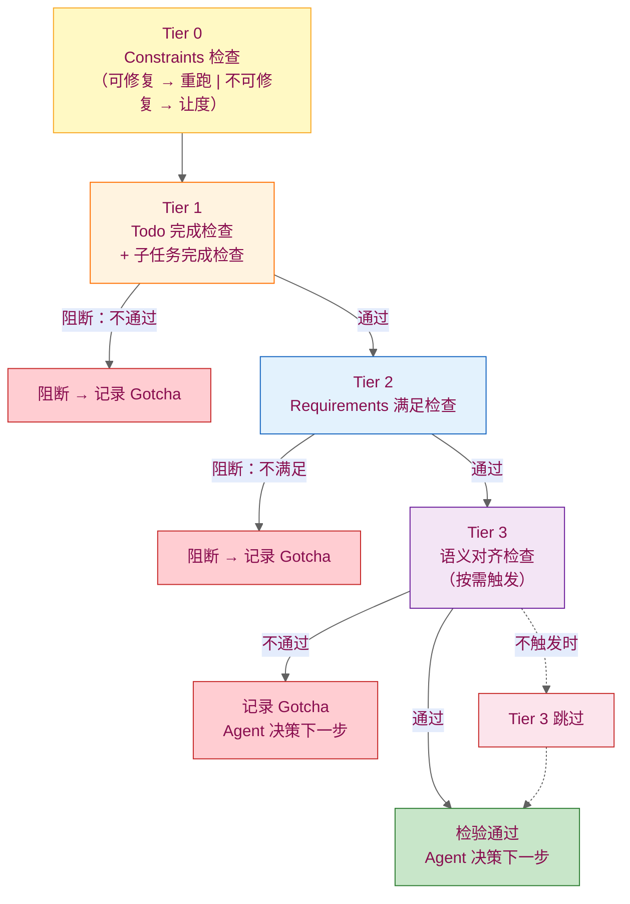

**关卡通过关系：** Tier 1 失败不阻断 Tier 2（因为 Todo 完成与 Requirements 满足可能不同步），但 Tier 2 失败阻断 Tier 3。Tier 3 是最后一关，Tier 1 + Tier 2 全部通过才进入。

**Tier 2 的验证模式：** Tier 2 根据 Tier 1 的状态决定验证范围：若 Tier 1 未完成，则只检查所有未通过的 Requirements（效率优先）；若 Tier 1 完成，则重新全部检查所有 Requirements（最终确认）。Tier 1 与 Tier 2 之间不存在 Todo 与 Requirements 的映射关系。

**Tier 0 与 Tier 1/2/3 的本质区别：** Tier 1/2/3 是纯检验，不做数据变更；Tier 0 的约束检查可能涉及数据修复。两者分属不同性质，因此不合并为同一关卡。

**Tier 3 的触发条件：**

Tier 3 不是每次 `verify_task()` 都自动进入的常规关卡。它由 Agent 根据任务属性主动决定是否触发。触发条件包括：

- **Picture 涉及主观判断或利益相关者感知**：若 Picture 包含"用户感到满意"、"界面美观"等无法自动化验证的指标，Tier 1/2 无法覆盖，需要 Tier 3 的语义对齐。
- **Constraints 与 Picture 之间存在语义歧义**：Tier 2 验证了"功能可用"，但 Tier 1/2 无法判断"是否做了不该做的事"——这属于 Constraints 与 Picture 的跨平面对齐。
- **任务风险等级为 L1/L2（高危）**：权限分级中高危任务（L1/L2）的完成检验强制触发 Tier 3，无论 Tier 1/2 结果如何。
- **Agent 或利益相关者显式请求**：在任务 Manifest 中预设 `require_tier3_verification: true`，或在任务执行过程中 Agent 主动调用 `verify_task(tier3=true)`。

**决策执行规则：**

检验结果（aligned / deviation）由 Agent 接收。任务完成后是否调用 `complete_task()`，由 Agent 基于危险性判断自主决定，或按权限设定让度给人。ABANDONED 由 Agent 主动触发，与检验结果无关。

**任务状态与检验的关系：**

- Tier 1/2/3 全部通过 → 检验通过，任务状态保持不变，Agent 自行决定是否调用 `complete_task()`
- 检验未通过 → 偏差记录写入 gotcha_refs，Agent 决定下一步（修正、重试或标记 ABANDONED）
- `complete_task()` 的调用权属于决策权，可由 AI Agent 自主行使，或按权限分级让度给人

### 7.3 认知构建

这是贯穿生命周期始终的核心动作。在任何节点（刚启动时、执行中、或检验失败后），系统都需要为 Agent 构建当前任务的状态平面。

**状态平面（状态平面快照）：**

* 纯展示，无诊断：只呈现当前状态，不做偏差判断
* 实时扫描：每次调用直接读文件系统，不缓存
* 全面覆盖：显示所有任务，不隐藏任何节点
* 非侵入：只读不写，不修改任何状态

**状态平面显示内容：**

- 任务树结构（父子关系）
- 每个任务的 todo 完成度（如 "2/3 Todos 完成"）
- 任务状态（CREATED / IN_PROGRESS / COMPLETED / ABANDONED）
- 偏差记录（Gotchas）
- Session 最近变化指针（指向 Session 中最近的状态快照位置，供 Agent 按需追溯）

状态平面**纯展示**，不展开 Session 详情。Picture/Requirements/Constraints 从 TaskManifest 获取，不显示在状态平面中。

**Session 触发规则：**

mem0ress 作为一个被动式的状态管理层，自身没有后台守护进程。Session 快照的触发通过以下方式完成：

**系统自动触发：** 每交互轮次结束时，系统自动记录当前快照，无需 Agent 显式调用。

**Session 记录内容：** 每个轮次的状态快照，包括 code_progress、docs_progress、todos 和 status。Session 采用版本快照模型，只追加不覆盖，用于理解演进，暂不主动访问。

**Picture / Requirements / Constraints 从 TaskManifest 获取，不显示在状态平面中。**

### 7.4 决策执行：Agent 是所有决策的起点与终点

mem0ress 中，人和 Agent 不存在分工——本质上都以 Agent 形态存在。决策权统一归属 Agent，Agent 按权限设定和危险性判断，自主行使或主动让度给人。

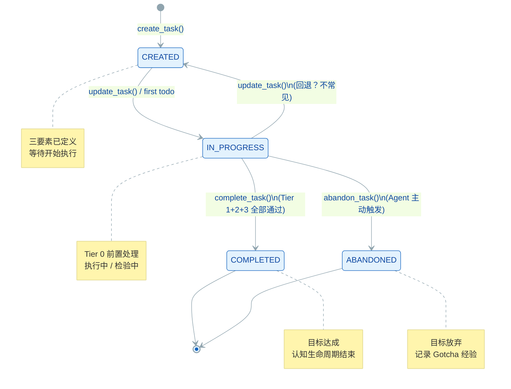

**Agent 负责的决策：**
- 任务创建时三要素的定义与完善
- 是否触发 Tier 1/2 检验，以及按需触发 Tier 3（Tier 0 为自动前置处理，不在决策范围内）
- 检验通过后是否调用 `complete_task()`
- 是否标记任务为 ABANDONED
- 下一步行动（修正、重试、或推进其他任务）

**决策让度的触发条件：**

Agent 按危险性阈值和权限设定，判断是否需要让人介入。危险性的判断维度包括：

| 维度 | 低危 | 高危 |
|------|------|------|
| **影响范围** | 单任务内部 | 跨任务/跨模块 |
| **可逆性** | 可随时回退 | 不可逆或代价高昂 |
| **外部依赖** | 无外部依赖 | 依赖外部服务/人员 |
| **决策后果** | 局部优化 | 全局目标偏离 |

**让度的形式：**

Agent 通过 spawn 人机协作任务实现让度——在任务 TODO 中标记"待人确认"，人在确认后 Agent 继续执行。让度是 Agent 的主动行为，不是系统强制中断。

### 7.5 权限与让度配置

通过权限分级控制让度边界。典型配置：

| 权限等级 | 适用场景 | 可自主决策 | 需让度给人 |
|----------|----------|------------|------------|
| **L4 完全自主** | 探索性任务 | 全部 | 无 |
| **L3 检验后自主** | 一般开发任务 | Tier 1/2/3 通过后自主完成标记 | `complete_task` |
| **L2 高危审批** | 生产环境变更 | `add_todo`、`update_todo` | `complete_task`、`abandon_task` |
| **L1 完全让度** | 高风险操作 | 无 | 所有状态变更 |

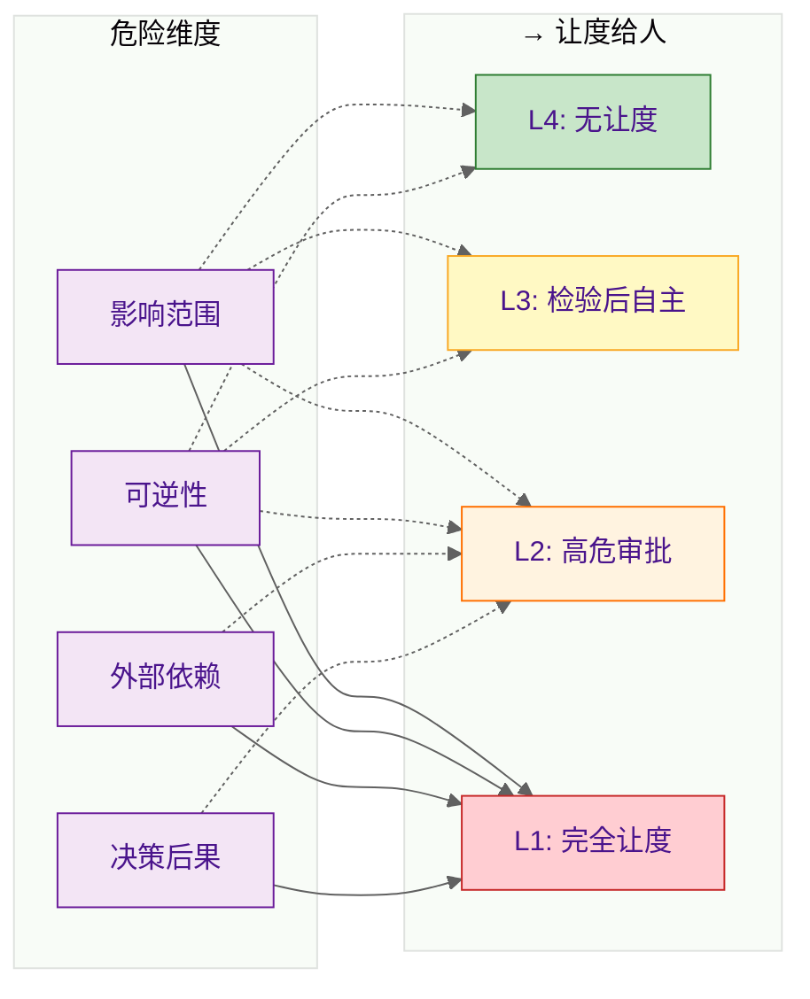

权限等级在任务创建时由 Agent 判定，或由人工在任务 Manifest 中预设。

## 8. 技术方案 (Technical Implementation)


mem0ress 是认知对齐平面, 并非独立运行的任务引擎，而是以 **“认知中间件”** 的形式注入到 Agent 的执行循环中。

* **非编排原则：** mem0ress 不决定 Agent 下一步该调用哪个 API，也不负责复杂的 ReAct 推理逻辑。
* **生命周期挂钩 (Lifecycle Hook)：** mem0ress 必须参与 Event Loop 的关键节点。通过“拦截”每轮会话的输入与输出，实现自动化的：
    1. **投射 (Before Turn)：** 在 LLM 思考前，将最新的状态平面注入上下文。
    2. **快照 (After Turn)：** 在 LLM 响应后，自动对比数据平面变化并记录 Session 序列。
    
### 8.1 系统架构设计

它专注于认知状态管理，不执行工具或做决策。其内部划分为三个职责分明的模块：

**Plane Assembler（平面组装器）：认知构建的执行单元。**

职责是**实时编译**当前任务的状态平面。每次 Agent 调用 `get_status_plane()` 时，Plane Assembler 直接扫描文件系统，聚合所有 Task 节点的 Manifest 和 Session，写入状态平面输出。设计上它是纯展示层——不缓存、不诊断、不决策，只做文件系统扫描和文本聚合。

**Tool Interface（工具接口）：认知操作的写入入口。**
mem0ress 暴露给 Agent 的不是一套通用编程接口，而是一组有限的任务操作工具（`create_task`、`update_todo`、`complete_task` 等）。Tool Interface **只管理认知状态的写入**，不执行业务逻辑。
**操作前校验：**
- **乐观锁比对（文件哈希）：** 执行写操作时比对文件快照哈希。若遭外部修改，抛出 ConflictError，强制 Agent 重新获取状态平面后再决策。
- **状态转换合法性：** 校验状态转换是否符合规范（如 IN_PROGRESS → CREATED 非法）。

**Harness Engine（检验引擎）：任务检验逻辑的承载。**

当 Agent 调用 `verify_task()` 时，Harness Engine 驱动四层验证流程：
- **Tier 0（前置处理）：** Constraints 约束检查，独立于 Harness 之外的前置处理器。检查当前 Task 的所有 Constraints 是否满足。若有违反，尝试自动修复；若无法修复，按权限让度给人（L1/L2 立即让度，L3/L4 失败后让度）。修复成功后重跑 Tier 0 确认，通过后进入 Tier 1。
- **Tier 1：** Todo 完成检查 + 直接子任务完成检查。检查两个独立的前置条件——(1) 所有 Todo 步是否已被标记为完成；(2) 所有直接子任务是否状态为 COMPLETED。若存在未完成的 Todo 或未关闭的子任务，直接阻断，不进入 Tier 2。
- **Tier 2：** Requirements 满足检查。在沙箱中执行 Requirements 对应的脚本或测试，验证每个 Requirement 是否达标。若存在未满足的 Requirement，直接阻断，不进入 Tier 3。
- **Tier 3：** 语义对齐检查。Judge Agent 读取任务的 Picture 与实际产出，执行语义对齐判断。只有当 Picture 中包含无法自动化验证的指标时才触发。

Harness Engine 本身**不是自主进程**——它没有主动触发能力，只能响应 Agent 的 `verify_task()` 调用。它是检验逻辑的**承载层**，而非检验决策者。

**三个模块的边界：** Plane Assembler 是只读的，Tool Interface 是写的入口，Harness Engine 是验证出口。三者共同构成认知网关，无跨越自身职责范围的操作。

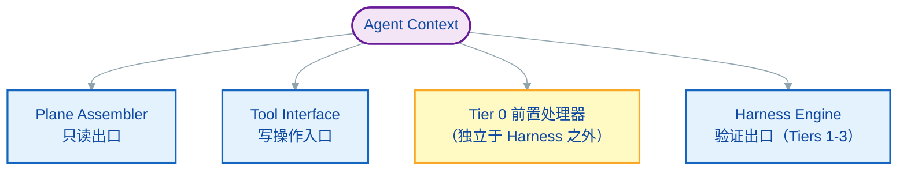

### 8.2 核心机制设计

  * 引用展开机制: 解析清单时，ref: 指针不默认加载。LLM 需主动调用工具将其展开并挂载到 Data Plane 中。
  * 乐观锁冲突感知 (Optimistic Locking): 执行写操作时比对文件哈希。若遭外部修改，抛出 409 Conflict，强制 LLM 重新进行认知构建后决断。
  * 原生 Git 数据回溯 (Git-Native Revert): 检验失败且路径报废时，LLM 调用工具回退数据平面，同时在状态平面生成 Gotcha 记录偏差经验，保持时间向前。
  * 带外约束检验 (Out-of-Band Verification): Tier 3 的语义对齐在独立沙箱中执行，通过 Judge Task 调用 LLM-as-a-Judge，杜绝与执行态 Agent 发生上下文污染。

### 8.3 技术流程：Agent 驱动的业务闭环

mem0ress 的核心业务流由 Agent 的三个主动决策构成：

  1. 认知构建: Agent 调用 `get_status_plane()`，了解当前状态（任务树、TODO 进度、任务状态、Gotchas、Session 指针）。Picture/Requirements/Constraints 从 Manifest 按需读取，不在状态平面中展开。
  2. 任务检验: Agent 调用 `verify_task()`，驱动 Harness 四层验证（约束检查 → 机械状态 → 客观规律 → 语义对齐）
  3. 状态更新: Agent 根据检验结果决策后续行动——更新 Todo、调用 `complete_task()`、标记 ABANDONED、或继续执行。状态更新通过 Tool Interface 执行写操作，支持 `update_todo`、`complete_task`、`abandon_task` 等。Gotcha 作为带外偏差记录，不影响状态，不阻断执行。

**系统自动机制（不属于业务流）：**

每轮次结束时，系统自动触发 Session 快照，记录本轮状态变化，供后续追溯使用。Agent 无需显式调用 `snapshot_session()`。

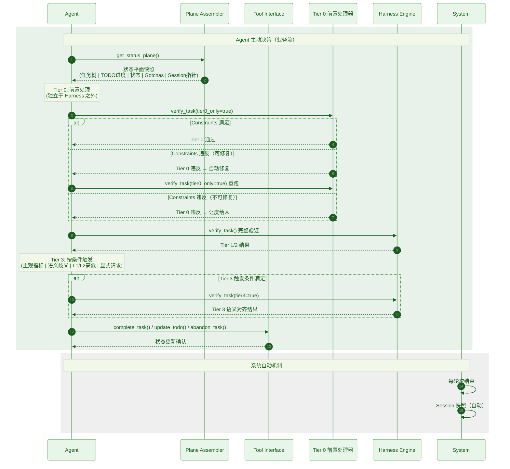

## 附录 A: 动作、状态与节点表

> **说明：** 本附录记录所有认知操作动作。其中"**（系统自动）**"标注的动作由系统在生命周期中自动触发，Agent 无需显式调用；其余动作为 Agent 可调用的工具接口。

#### 动作表 (Action Table)

##### Agent 可调用动作（Tool Interface）

| Action | 模块 | 说明 |
|--------|------|------|
| `create_task` | gateway/actions.py | 创建新任务，定义三要素（Picture/Requirements/Constraints）和 Todo 步 |
| `get_task` | gateway/actions.py | 读取任务详情，返回 Manifest 中的完整三要素和执行状态 |
| `update_task` | gateway/actions.py | 更新任务属性（三要素、权限等级等），校验状态转换合法性 |
| `complete_task` | gateway/actions.py | 标记任务完成。调用权归属决策权，Agent 可自主行使或按权限让度给人 |
| `abandon_task` | gateway/actions.py | 标记任务废弃，由 Agent 主动触发（与检验结果无关） |
| `add_todo` | gateway/actions.py | 添加执行步骤到任务清单 |
| `update_todo` | gateway/actions.py | 更新步骤状态（done: true/false） |
| `remove_todo` | gateway/actions.py | 删除执行步骤 |
| `add_gotcha` | gateway/actions.py | 记录检验中发现的偏差，带外写入 gotchas/ 目录，不影响任务状态 |
| `get_status_plane` | gateway/plane.py | 获取状态平面快照（任务树/TODO 进度/状态/Gotchas/Session 指针）。**纯展示，不做诊断**，不展开 Picture/Requirements/Constraints |
| `get_session` | gateway/plane.py | 按需获取指定任务的 Session 历史快照序列 |
| `verify_task` | harness/ | 触发 Harness 验证流程 |
| `link_data_plane` | substrate/git_ops.py | 关联仓库 commit ID 到数据平面，建立数据版本指针 |

##### Agent 可调用动作（Tiers 验证）

| Action | 模块 | 说明 |
|--------|------|------|
| `verify_task(tier0_only=true)` | harness/runner.py | **Tier 0 前置处理**：Constraints 约束检查。自动触发，不在 Agent 决策范围内。若违反：可修复 → 自动修复后重跑；不可修复 → 按权限让度给人 |
| `verify_task(tier1_only=true)` | harness/runner.py | **Tier 1**：Todo 完成检查 + 直接子任务完成检查。Agent 按需调用 |
| `verify_task(tier2_only=true)` | harness/runner.py | **Tier 2**：Requirements 满足检查。在沙箱中执行脚本或测试。Agent 按需调用 |
| `verify_task(tier3=true)` | harness/judge.py | **Tier 3**：语义对齐检查。通过独立 Judge LLM 执行，与执行态 Agent 上下文隔离。**按需触发**（Picture 涉及主观判断 / Constraints 与 Picture 存在语义歧义 / L1/L2 高危任务 / 显式请求） |

##### 系统自动机制（无需 Agent 调用）

| Action | 触发时机 | 说明 |
|--------|----------|------|
| `snapshot_session` | **每轮次结束时自动触发** | 拦截器（gateway/intercept.py）的 `__exit__` 中自动计算 Delta，追加记录到 session.md。记录内容：code_progress/docs_progress/todos/status。**不含 Picture/Requirements/Constraints**（从 Manifest 获取，不重复记录） |

> **注意：** Tier 0 虽由 `harness/runner.py` 承载，但作为独立于 Harness Engine 的前置处理器，其触发逻辑与 Tier 1/2/3 不同。Tier 1/2/3 属纯检验，Tier 0 可能涉及数据修复。详见第 7.2 节"四层关卡"和第 8.1 节"系统架构设计"中 Tier 0 的定位说明。

#### 状态表 (State Table)

| State | 说明 |
|-------|------|
| `CREATED` | 任务已创建 |
| `IN_PROGRESS` | 任务进行中 |
| `COMPLETED` | 任务完成 |
| `ABANDONED` | 任务废弃 |

#### 节点表 (Node Table)

| Node | 说明 |
|------|------|
| `Turn N` | 轮次节点（1.1, 1.2, 2.1...），每个轮次记录状态快照（code_progress/docs_progress/todos/status）。**不含 Picture/Requirements/Constraints**（从 Manifest 获取）。轮次快照由系统在每轮次结束时自动追加记录 |
| `Task` | 任务节点，代表一个独立的认知单元。包含 Manifest（index.md）、Session（session.md）、Data Plane（data-plane/refs.md）、Gotchas（gotchas/）四个物理子节点 |
| `Subtask` | 子任务节点，嵌套于父任务目录下。通过目录深度表达依赖关系，父任务完成以其所有子任务完成为绝对前提 |

#### 轮次与动作对应关系

````markdown
Turn N 的典型流程：

1. 开始轮次
   └── get_status_plane() → 了解当前状态（纯展示，不展开 PRC 三要素）

2. 执行动作（可能多个）
   ├── create_task(...)     # 新任务（含三要素定义）
   ├── get_task(...)        # 读取任务详情
   ├── update_task(...)     # 更新任务属性
   ├── update_todo(...)     # 推进步骤
   ├── add_todo(...)        # 添加步骤
   ├── remove_todo(...)     # 删除步骤
   ├── add_gotcha(...)      # 记录偏差
   ├── verify_task(...)     # 触发 Harness 验证（Tier 0 自动前置，Tier 1/2/3 按需）
   ├── complete_task(...)   # 标记完成（决策权）
   ├── abandon_task(...)    # 标记废弃（Agent 主动触发）
   ├── get_session(...)     # 按需获取 Session 历史
   └── link_data_plane(...) # 关联数据平面 commit ID

3. 结束轮次
   └── （系统自动）snapshot_session → Delta 追加到 session.md
       记录内容：code_progress / docs_progress / todos / status
       不含 Picture / Requirements / Constraints
````

## 附录 B: 模板参考

### B.1 Session 模板 (session.md)

Session 由拦截器（`gateway/intercept.py`）的 `__exit__` 在每轮次结束时**自动写入**，`substrate/fs.py` 负责 Markdown ↔ Pydantic 双向解析。Agent 无需手动调用写入。

**模板格式：**

````markdown
# Session: {task_id}

## Turn {N.M}
date: {YYYY-MM-DDTHH:MM:SS}
code_progress: "{本轮代码产出摘要}"
data_plane:
  {repository}: {commit_id}
todos:
  - {text: "...", done: true|false}
status: {CREATED|IN_PROGRESS}
````

**字段说明：**

| 字段 | 类型 | 说明 |
|------|------|------|
| `code_progress` | string | 本轮次代码产出摘要，描述性文本 |
| `data_plane` | map | 仓库名 → commit ID 映射，由 `substrate/git_ops.py` 维护 |
| `todos` | list | `{text, done}` 结构，done 为 boolean |
| `status` | enum | CREATED / IN_PROGRESS / COMPLETED / ABANDONED |

**写入约定：**
- Turn 编号格式为 `{parent_turn}.{child_turn}`，如 1.1、1.2、2.1，体现嵌套关系
- 每轮次结束时**追加**写入，不覆盖历史快照（版本快照模型）
- **不记录 Picture / Requirements / Constraints**（这些从 Manifest 获取，不重复记录）

**触发时机：** 系统在每轮次 `__exit__` 时自动计算 Delta 并追加，无需 Agent 显式调用 `snapshot_session()`。

---

### B.2 Gotcha 模板 (gotchas/{timestamp}.md)

Gotcha 是带外偏差记录，写入路径为 `gotchas/{timestamp}.md`（文件名即时间戳，隐含任务归属，无需在内容中重复标注 task_id）。

**模板格式：**

````markdown
# Gotcha

## 偏离描述
{具体偏离了什么（Picture / Requirements / Constraints）}

## 原因分析
{为什么偏离}

## 经验总结
{下次如何避免}

## 关联检验
- 时间: {timestamp}
- 检验 Tier: {Tier 0/1/2/3}
- 任务: {task_id}
````

**写入约定：**
- 由 Agent 调用 `add_gotcha()` 时写入，`gateway/actions.py` 处理写入逻辑
- 不参与主流程，不影响任务状态，不阻断 Agent 继续执行
- 属于带外记录，供后续复盘和追溯使用

---

### B.3 Data Plane 模板 (data-plane/refs.md)

Data Plane 由 `substrate/git_ops.py` 管理，记录当前任务关联的仓库 commit ID 快照。Session 快照中的 `data_plane` 字段引用此处维护的映射。

**模板格式：**

````markdown
# Data Plane: {task_id}

## Repositories

| Repository | Commit ID | Last Updated | Description |
|------------|-----------|-------------|-------------|
| {repo-name} | {commit-id} | {YYYY-MM-DD} | {简要说明} |

## Latest Commit Map

```yaml
repositories:
  {repo-name}: {commit-id}
```

## Change Log

| Date | Repository | From → To | Reason |
|------|------------|-----------|--------|
| {YYYY-MM-DD} | {repo-name} | {old-id} → {new-id} | {原因} |
````

**字段说明：**

| 字段 | 说明 |
|------|------|
| Repository | 仓库名称标识 |
| Commit ID | 当前指向的 commit SHA |
| Last Updated | 最近一次变更时间 |
| Description | 该仓库在当前任务中的用途说明 |

**维护约定：**
- 由 `link_data_plane()` 工具关联仓库时写入或更新
- 每个 Task 目录下维护独立的 `data-plane/refs.md`
- Change Log 由 `git_ops.py` 自动追加，记录版本变迁原因，供 Agent 按需回溯
- Data Plane 是**时间切片**，`repositories` 字段记录某一时刻的 commit ID 快照，Change Log 提供历史追溯通道

**与 Session 的关系：**
- 每轮 Session 快照中的 `data_plane` 字段引用当前 `data-plane/refs.md` 中的 commit map
- 不在 Session 中重复记录完整的 Data Plane 内容，只记录快照指针

## 9. FAQ

### Q: 为什么我们需要的是"认知"而不是"记忆"？
A: 记忆是向后看（Retrospective）、被动式的存储行为。mem0ress 不是检索过去对话的存储系统，而是**前向的认知系统**，维持 AI 对当前目标、进度和认知缺口的 awareness。核心区分：传统记忆问"我们之前讨论了什么"，认知框架问"我要达成什么目标？我离目标还有多远？我还需要做什么？"

### Q: 为什么采用任务模型，以及一切皆任务？
A: 任务模型（Task Model）是认知对齐平面的基本单元。将一切视为任务带来以下优势：
- **同构性**：所有认知单元（Task）拥有相同结构，降低解析复杂度
- **可分解性**：复杂目标拆解为子任务，物理上通过目录深度表达依赖关系
- **可验证性**：每个 Task 都有明确的完成标准（Picture），便于检验
- **无冲突设计**：父任务完成以其所有子任务完成为绝对前提，避免并发冲突

### Q: 为什么任务没有冲突协调机制？
A: mem0ress 的设计遵循**冲突只能避免，无法解决**的哲学原则（来自 MetaDev 规范的哲学四）。协调机制（锁、乐观锁、悲观锁、消息队列、共识协议）是试图在冲突发生后解决它，但更好的做法是通过设计使冲突根本不发生。

mem0ress 通过以下设计消除冲突：
- **物理隔离**：不同任务处于不同目录，父任务目录下嵌套子任务目录，通过目录深度表达依赖关系
- **顺序保障**：父任务必须等待所有子任务完成后才能完成
- **继续拆分原则**：当两个任务出现冲突时，正确的处理方式是继续拆分任务直到冲突消除，而非引入协调机制

冲突出现时，不是记录下来等待解决，而是追溯到任务定义层面，重新划分边界直到冲突消除。如果确实无法继续拆分，则让度给人确认。

### Q: 为什么使用状态平面与数据平面？
A: 双平面设计实现认知与数据的分离：
- **状态平面：** 任务执行状态的聚合快照（Todo 进度、代码产出、文档进度、组件状态等）
- **数据平面：** 所有相关数据的 commit ID 快照

两者都是时间切片，而非组件。这种分离让 Agent 始终以极低 Token 成本了解"现在在哪"和"离目标还有多远"。

### Q: 为什么状态平面没有回溯？
A: 状态平面是任一时刻的执行快照，不是历史记录。这是设计上的刻意选择：
- **认知效率：** Agent 每次获取的是当前真相，而非沉积的变更历史
- **绝对可观测性：** 基于纯文本和目录树，Agent 可直接读取，无需版本遍历

若需历史演进，Session 提供版本快照模型用于追踪。

### Q: 为什么 Picture（图景）是完成标准，而不是 Requirements、Constraints 或者子任务清单？
A: Picture 是语义层面的成功状态，Requirements 是可验证的指标，Constraints 是不可逾越的底线，子任务清单是执行路径：
- **Picture vs Requirements**：即使所有 Requirements 满足，Picture 可能未达成（如"用户说还是慢"）
- **Picture vs 子任务**：子任务是路径而非目的地，完成所有子任务不等于达成目标
- **Picture vs Constraints**：Constraints 是底线，Picture 是目标，两者维度不同

Picture 作为完成标准防止"勾选心态"——Agent 不会在完成所有条目后仍然错失实际需求。

### Q: 什么是"数据汤"困境，mem0ress 如何避免？
A: 数据汤（Data Soup）发生在记忆系统将所有信息存入无结构的池子时：信息失去边界、新旧混杂、无法区分当前与过时，导致上下文污染（Context Collapse）和熵增。

mem0ress 通过以下机制避免：
- **目标锚定**：信息仅在与活跃 Task 关联时才有意义，失去目标指向的信息视为噪音，不予投影到当前平面
- **认知来源隔离**：mem0ress 的认知数据来源于会话 hook，不管理也不依赖外部知识（向量数据库/API 文档/全网搜索）——外部知识属于 Agent 的背景知识，Agent 按需检索后体现在会话中，mem0ress 只从会话流提取切片
- **生命周期一致**：认知与任务关联，任务完成则认知生命周期结束
