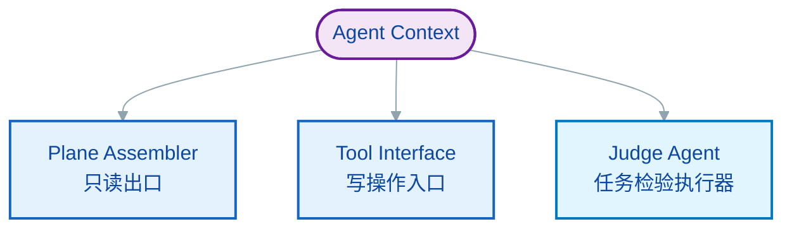
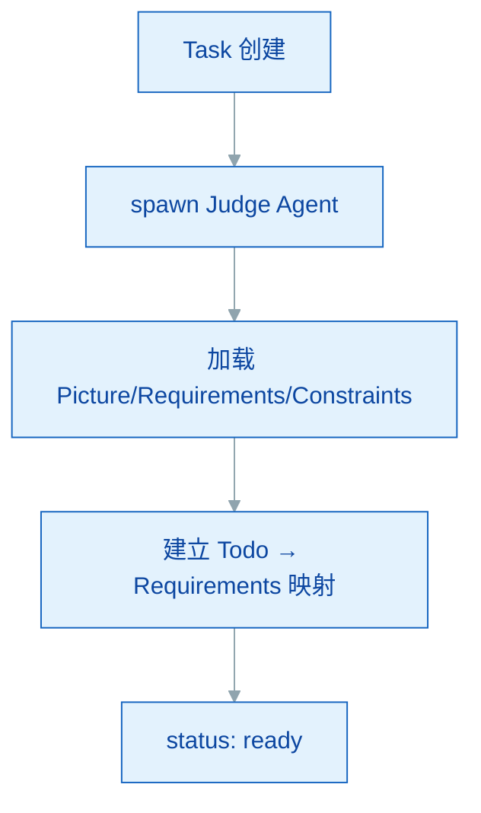
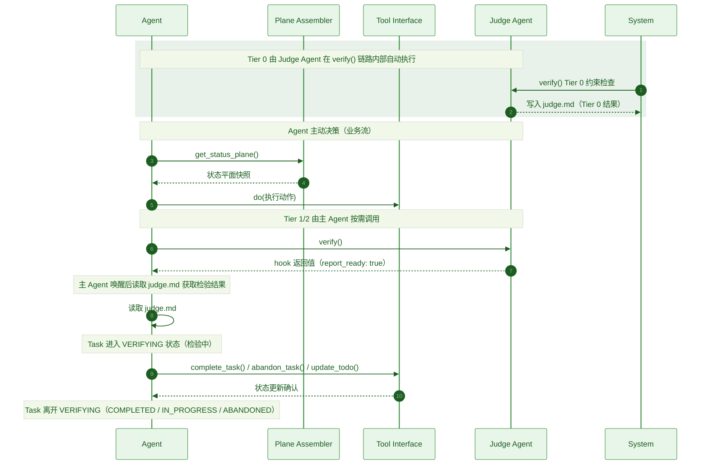
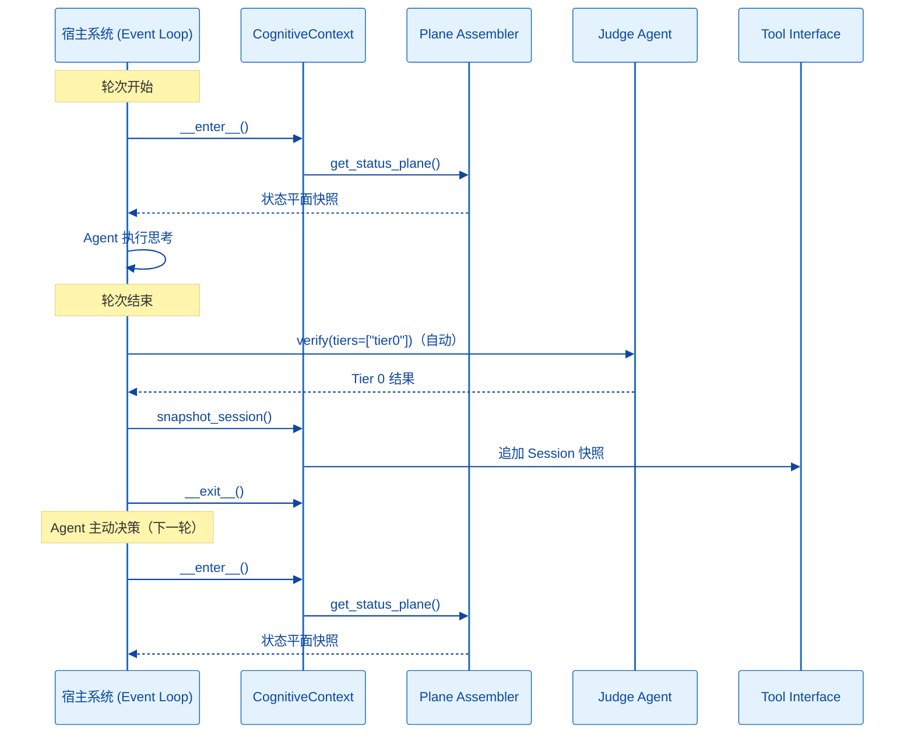

# mem0ress 实现设计

> **与规范的关系：** 本文档是 `docs/spec.md` 的实现承接文档。规范定义接口语义（做什么），本文档描述实现方案（如何做）。规范不引用本文档，依赖方向单一。

## 1. 项目目录结构

```
mem0ress/
├── pyproject.toml         # 核心项目配置 (基于 uv)
├── .python-version        # uv 固定的 Python 版本 (3.12+)
├── README.md
├── docs/
│   └── spec.md            # 接口语义规范（对外）
└── src/mem0ress/
    ├── __init__.py
    ├── cli.py             # 终端入口 mem0 status 态势可视化 (Rich)
    ├── core/
    │   ├── __init__.py
    │   └── schema.py      # 基于 Pydantic 的强类型模型 (PRC 三要素、Task、Judge Agent)
    ├── gateway/
    │   ├── __init__.py
    │   ├── plane.py       # Plane Assembler（状态平面组装）
    │   ├── actions.py     # Tool Interface（create_task, complete_task, abandon_task 等）
    │   └── intercept.py   # CognitiveContext 上下文管理器（Before Turn / After Turn 钩子）
    ├── substrate/
    │   ├── __init__.py
    │   ├── fs.py          # Markdown ↔ Pydantic，带 SHA-256 乐观锁
    │   └── git_ops.py     # Data Plane commit ID 管理（待实现）
    └── harness/
        ├── __init__.py    # Tier 1/2 机械检查，Tier 3 语义对齐上下文准备
        └── judge.py       # Tier 3 语义对齐判断上下文准备（由 Agent 执行）
```

### 核心配置文件 (pyproject.toml)

使用 uv 管理依赖，pydantic 处理严格的文档 Schema，pyyaml 处理 Frontmatter，typer 构建 CLI 外壳，rich 实现终端可视化。**不依赖任何外部 LLM 或向量库。**

```toml
[project]
name = "mem0ress"
version = "0.1.0"
description = "A Cognitive Alignment Plane (CAP) SDK with Lifecycle Hooking."
readme = "README.md"
requires-python = ">=3.12"
dependencies = [
    "typer>=0.12.0",    # CLI 外壳
    "pydantic>=2.10.0", # 强类型 Schema
    "pyyaml>=6.0.0",    # Markdown Frontmatter 解析
    "rich>=13.7.1",     # 终端态势投影
]

[project.optional-dependencies]
dev = [
    "pytest>=8.0.0",
    "ruff>=0.8.0",
]

[project.scripts]
mem0 = "mem0ress.cli:app"

[build-system]
requires = ["hatchling"]
build-backend = "hatchling.build"

[tool.ruff]
line-length = 100
target-version = "py312"

[tool.ruff.lint]
select = ["E", "F", "I", "UP"]
ignore = []

[tool.pytest.ini_options]
testpaths = ["tests"]
pythonpath = ["src"]
```

---

## 2. 概述

mem0ress 是认知对齐平面，以**认知中间件**的形式注入到 Agent 的执行循环中。它专注于认知状态管理，不执行工具或做决策。

### 2.1 注入模式

mem0ress 必须参与 Event Loop 的关键节点，通过生命周期钩子实现自动化：

1. **Before Turn（投射）：** 在 Agent 思考前，将最新的状态平面注入上下文
2. **After Turn（快照）：** 在 Agent 响应后，自动对比数据平面变化并记录 Session 序列

### 2.2 非编排原则

mem0ress 不决定 Agent 下一步该调用哪个 API，也不负责复杂的 ReAct 推理逻辑。

---

## 3. 模块架构

mem0ress 内部划分为三个职责分明的模块，共同构成认知网关。

### 3.1 模块划分



### 3.2 Plane Assembler（平面组装器）

**职责：** 认知构建的执行单元。实时编译当前任务的状态平面。

**行为：**
- 认知构建阶段时，直接扫描文件系统
- 按需聚合 Task 节点的任务定义、Session（历史切片）、Data Plane（版本指针）、Gotchas（偏差记录），组装为状态平面
- 只输出当前状态——不缓存、不诊断、不决策
- 不做持久化，只做文件系统扫描和文本聚合

### 3.3 Tool Interface（工具接口）

**职责：** 认知操作的写入入口。

**行为：**
- 暴露一组有限的任务操作工具（`create_task`、`complete_task`、`abandon_task`、`update_todo` 等）
- 只管理认知状态的写入，不执行业务逻辑
- **Upsert 语义：** `update_task` 在任务不存在时自动创建

### 3.4 Judge Agent（任务检验执行器）

**职责**：执行任务检验，只读数据。检验完成后，将结果写入 `judge.md`，通过 hook 返回值通知主 Agent。

**与 Task 的关系**：
- 每个 Task 伴生一个 Judge Agent
- 生命周期同步：Task 创建 → Judge Agent 创建；Task 完成/废弃 → Judge Agent 销毁
- Judge Agent 读取 Task 文件系统，不依赖主 Agent 的上下文

**文件存储**：

```text
.mem0ress/tasks/{task_id}/
├── task.md                    # Task 定义
├── session.md                  # Task Session（含 data_plane 快照）
├── gotchas.md                  # Gotcha 记录（追加式）
└── judge.md                  # Judge Agent 任务文件兼检验报告（每轮覆写）
```

Judge Agent 不创建独立目录。task 文件和 Session（验证历史追加到 task 文件的 `verification_history` 字段）都平铺在 Task 目录下。

**初始化流程**：



**交互接口**：

| 接口 | 说明 |
|------|------|
| `verify()` | 执行 Tier 0 → 1 → 2 → 3 完整检验链路，写入 `judge.md` |
| 返回 | 写入 `judge.md`，通过 hook 返回值通知主 Agent |

**状态变化**：

```
created → ready → verifying → completed → destroyed
```

| 状态 | 含义 |
|------|------|
| `created` | 刚创建，三要素未加载 |
| `ready` | 三要素已加载，等待检验 |
| `verifying` | 执行检验中 |
| `error` | 检验执行异常 |
| `destroyed` | Task 结束，Judge Agent 销毁 |

> **状态机区分：** Judge Agent 的 `verifying`（检验执行中）不等同于 Task 的 `VERIFYING` 状态。前者是 Judge Agent 内部执行态，后者是 Task 生命周期中的中间状态。Judge Agent 在 Task 进入 VERIFYING 时被唤起，检验完成后 Task 离开 VERIFYING，两者状态机独立但时序耦合。

**Tier 执行内容**：

| Tier | 检查内容 | 输入来源 |
|------|---------|---------|
| Tier 0 | Constraints 违反检查 | Constraints（task.md）、当前代码状态（文件系统） |
| Tier 1 | Todo 完成 + 子任务关闭 | todos（task.md）、Session 当前快照、子任务 task.md |
| Tier 2 | Requirements 满足检查 | Requirements（task.md）、实际产出（文件系统） |
| Tier 3 | 语义对齐判断 | Picture（task.md）、实际产出（文件系统） |

Judge Agent 在每次检验时实时读取上述信息，不在内存中维护中间状态。`verification_history` 字段记录检验历史摘要，供追溯使用。

#### 3.4.1 Judge 报告文件 (`judge.md`)

检验完成后，结果写入 `judge.md`，每轮覆写。主 Agent 唤醒时读取该文件获取本轮次检验结果。

**模板格式**：

```markdown
# Judge Agent: {task_id}

## Timestamp
{YYYY-MM-DDTHH:MM:SS}

## Tier Results

### Tier 0: Constraints
- **Result:** PASS / FAIL / NOT_RUN
- **Findings:** {违反事实或通过说明}

### Tier 1: Todo + Subtask Completion
- **Result:** PASS / FAIL / NOT_RUN
- **Findings:** {未完成的 Todo 或子任务}

### Tier 2: Requirements
- **Result:** PASS / FAIL / NOT_RUN
- **Findings:** {未满足的 Requirements}

### Tier 3: Semantic Alignment
- **Result:** PASS / FAIL / NOT_TRIGGERED
- **Findings:** {语义偏差描述}

## Summary
- **Highest Tier Reached:** Tier {0/1/2/3}
- **Verdict:** aligned / deviation
- **Next Action:** {主 Agent 的下一步建议}
```

**字段说明**：

| 字段 | 说明 |
|------|------|
| Timestamp | 报告生成时间 |
| Tier Results | 每一层的结果（PASS/FAIL/NOT_RUN），以及具体发现 |
| Highest Tier Reached | 本轮次检验走到的最深层级 |
| Verdict | aligned（全部通过）/ deviation（存在未通过项） |
| Next Action | 主 Agent 的下一步建议，由 Judge Agent 根据检验结果给出 |

**写入约定：**
- 检验结束时一次性生成，写入 `judge.md`
- 每轮覆写，不追加
- 主 Agent 通过 hook 返回值感知报告已生成，唤醒时读取

### 3.5 模块边界

| 模块 | 类型 | 职责 |
|------|------|------|
| Plane Assembler | 只读出口 | 状态平面编译与展示 |
| Tool Interface | 写操作入口 | 认知状态写入 |
| Judge Agent | 验证执行器 | 任务检验执行 |

三者共同构成认知网关，无跨越自身职责范围的操作。

---

## 4. 核心机制设计

### 4.1 引用展开机制

解析清单时，ref: 指针不默认加载。Agent 需主动调用工具将其展开并挂载到 Data Plane 中。

**设计意图：** 按需加载，避免不必要的上下文膨胀。

### 4.2 原生 Git 数据回溯

检验失败且路径报废时，Agent 调用工具回退数据平面，同时在状态平面生成 Gotcha 记录偏差经验，保持时间向前。

**设计意图：** 利用 Git 的原生版本控制能力实现无痕回退，Gotcha 记录经验而非状态。

### 4.3 带外约束检验

Tier 3 的语义对齐与执行态 Agent 上下文隔离，避免检验过程污染任务执行。

**设计意图：** Tier 3 执行语义对齐判断时，读取 Picture 与实际产出，结论返回给 Agent——此过程不污染 Agent 的执行上下文。

### 4.4 认知拦截器 (Gateway Interceptor)

`gateway/intercept.py` 提供 `CognitiveContext` 上下文管理器，作为 SDK 参与 Agent 循环的唯一入口：

**enter (Before Turn)：**
- 启动 Plane Assembler 扫描物理基座。
- 构建 Status Plane 快照，供 Agent 按需注入到上下文。

**exit (After Turn)：**
- 宿主系统自动触发 Session 快照（`snapshot_session`），追加记录至 session.md。
- Tool Interface 的写操作（`update_todo`、`complete_task` 等）由 Agent 在轮次内主动调用，不在此处自动执行。

`CognitiveContext` 只负责生命周期钩子的编排，不做业务决策。

### 4.5 乐观锁机制 (Optimistic Locking)

`substrate/fs.py` 在写入任何文件前，必须比对内容 SHA-256 Hash。若基座在 Agent 思考期间被外部修改，抛出 `409 Conflict`，强制 Agent 重新投影平面后重试写入。

---

## 5. 技术流程

### 5.1 Agent 驱动的业务闭环

mem0ress 的核心业务流由 Agent 的三个主动决策构成：

1. **认知构建：** Agent 调用 `get_status_plane()`，了解当前状态（任务树、TODO 进度、任务状态、Gotchas、Session 指针）。Picture/Requirements/Constraints 从 task.md 按需读取，不在状态平面中展开。
2. **任务检验：** Agent 调用 `verify()`，驱动 Judge Agent 执行任务检验，生成一次性报告。Tier 0 在 verify() 链路内部由系统自动执行。
3. **状态更新：** Agent 根据检验结果决策后续行动——更新 Todo、调用 `complete_task()` 标记完成、`abandon_task()` 标记废弃、或继续执行。状态更新通过 Tool Interface 执行写操作，支持 `complete_task`、`abandon_task`、`update_todo` 等。Gotcha 作为带外偏差记录，不影响状态，不阻断执行。

**系统自动机制（不属于业务流）：**

每轮次结束时，系统自动触发 Session 快照，记录本轮状态变化，供后续追溯使用。Agent 无需显式调用 `snapshot_session()`。



### 5.2 宿主挂载方式

mem0ress 自身没有后台守护进程，通过以下方式挂载到宿主 Event Loop：



让度的持有点：Tier 0 检测到约束违反且主 Agent 无法自行修复时，Agent 发起让度请求并同步等待外部响应。此处 Agent 暂停执行，直至宿主持有响应。

---

## 6. 接口语义对照

规范（`docs/spec.md`）中的接口定义与本文档模块的对应关系：

| 规范接口 | arch 模块 | 说明 |
|----------|-----------|------|
| `get_status_plane` | Plane Assembler | 状态平面只读查询 |
| `create_task` / `update_task` / `complete_task` / `abandon_task` | Tool Interface | 认知状态写操作 |
| `add_todo` / `update_todo` / `remove_todo` | Tool Interface | Todo 写操作 |
| `add_gotcha` | Tool Interface | 偏差记录写操作 |
| `verify()` | Judge Agent | 执行任务检验完整链路，写入 judge.md |
| 任务检验 | Judge Agent | verify() 调用时统一执行，Tier 0 自动执行，Tier 3 按需启用 |
| `snapshot_session` | — | after-turn 宿主调用触发，mem0ress 内部自动追加 |

---

## 7. 文档结构与触发机制

### 7.1 文档结构

mem0ress 使用文件树表达认知的从属关系与上下文边界，对应 `docs/spec.md` 6.1 文档结构。

**文件树：**

```plaintext
.mem0ress/
└── tasks/
    └── {task_id}/
        ├── task.md              # task.md（Picture/Requirements/Constraints/Todo）
        ├── session.md            # 轮次快照序列（含 data_plane）
        ├── gotchas.md           # 偏差记录（追加式）
        └── judge.md   # Judge Agent task 文件（平铺）
```

**模块职责映射：**

| 物理组件 | 维护模块 |
|----------|----------|
| `task.md` | Tool Interface |
| `session.md` | mem0ress 暴露接口，被调用时自动写入 |
| `gotchas.md` | Tool Interface（`add_gotcha`） |
| `judge.md` | Judge Agent（验证历史追加） |

### 7.2 Session 快照

**触发链路：** mem0ress 在每轮次结束时暴露 Session 快照接口，被调用时自动追加记录到 session.md。写入内容由 `docs/templates/tasks/task/session.md` 定义。

### 7.3 Gotcha 偏差记录

**触发链路：** Agent 确认偏差后，通过 Tool Interface 的 `add_gotcha()` 追加到 `gotchas.md`。写入内容由 `docs/templates/tasks/task/gotchas.md` 定义。

### 7.4 Data Plane 快照

**说明：** Data Plane 不单独文件存储。各仓库 commit ID 快照记录在 Session 每轮快照的 `data_plane` 字段中，供回溯使用。

---

## 8. MVP 落地 Todo 清单

* [x] Phase 1: 物理契约与类型安全 (Substrate & Ty Check)
  * [x] 实现 `core/schema.py`：定义 PRC 三要素与分形 Task 模型（Pydantic）。
  * [x] 实现 `substrate/fs.py`：Markdown Frontmatter ↔ Pydantic 双向转换，含 Hash 乐观锁。
* [x] Phase 2: 拦截器与态势投影 (Interception & Projection)
  * [x] 实现 `gateway/plane.py`：递归目录树生成带层级缩进的 Status Plane 文本（纯展示，不缓存）。
  * [x] 实现 `gateway/intercept.py`：`CognitiveContext` 上下文管理器，封装 Before Turn / After Turn 钩子。
* [x] Phase 3: 动作网关与版本锚定 (Tools & GitOps)
  * [x] 实现 `gateway/actions.py`：`create_task`、`update_todo`、`complete_task`、`abandon_task` 等工具。
  * [ ] 实现 `substrate/git_ops.py`：Data Plane 的 commit ID 自动管理与关联。
* [x] Phase 4: 属性对齐验证 (Verification Engine)
  * [x] 实现 `harness/__init__.py`：Tier 1（Todo + 子任务关闭检查）与 Tier 2（Requirements 满足检查）。
  * [x] 实现 `harness/judge.py`：Tier 3 语义对齐判断上下文准备（由 Agent 执行）。
* [x] Phase 5: CLI 可观测性 (CLI Observability)
  * [x] 实现 `cli.py`：利用 Rich 实现 `mem0 status`，在终端展示高亮、分形的认知地图。